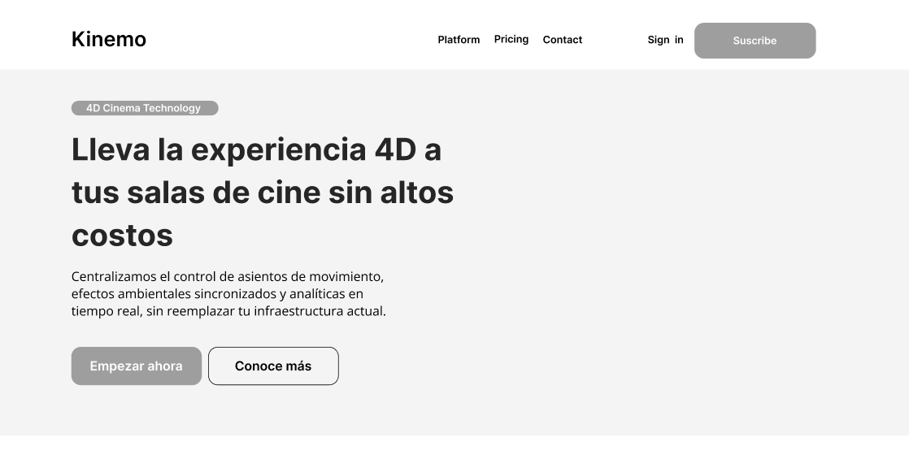
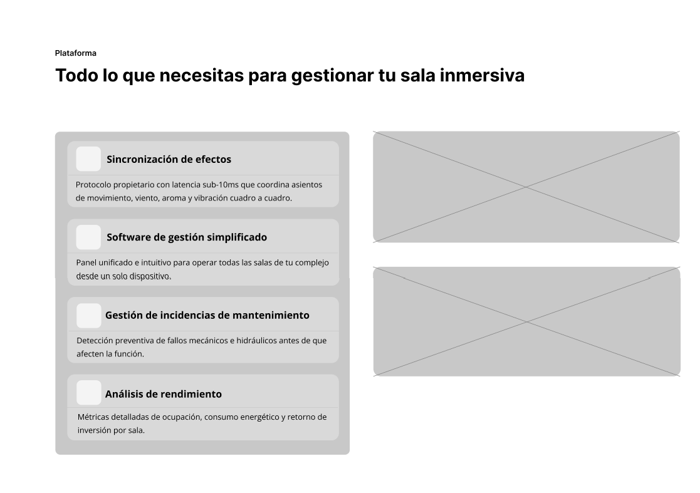
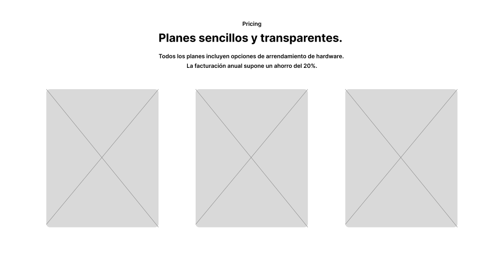
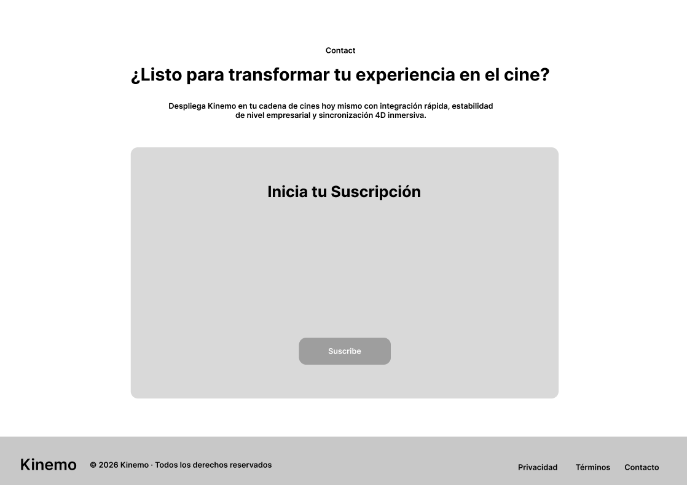
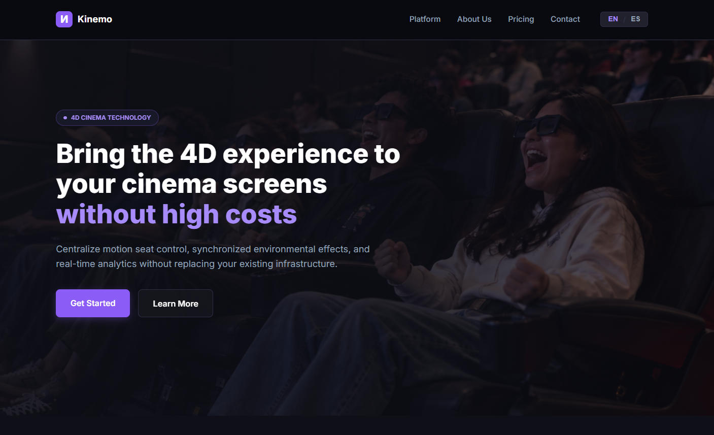
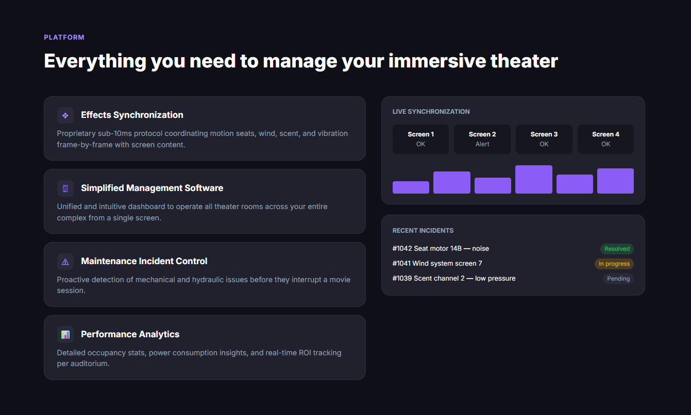
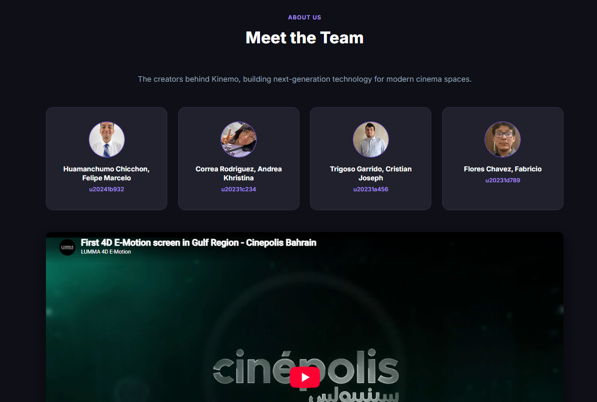
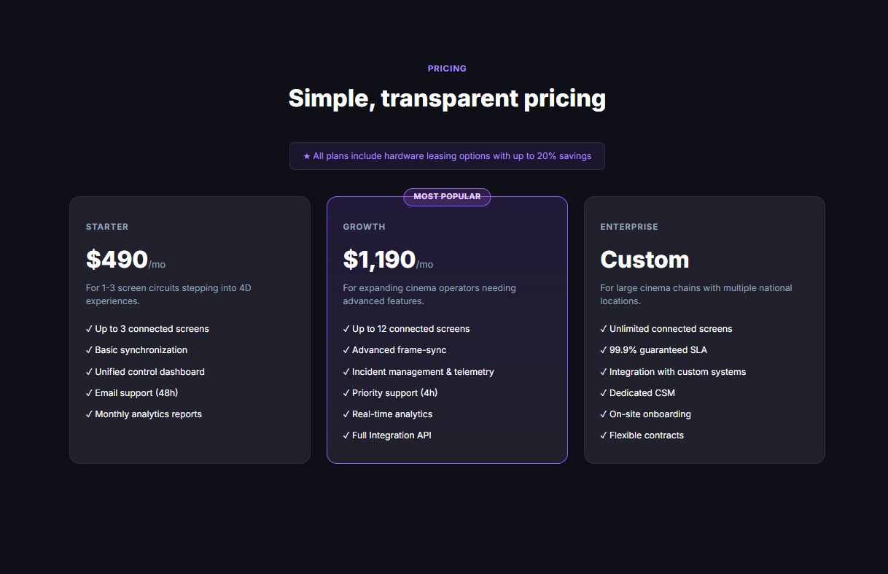
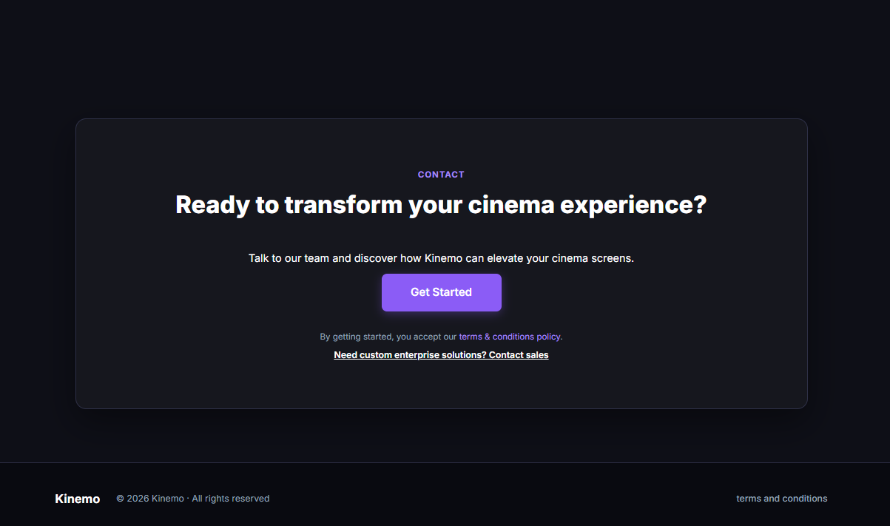

## Capítulo IV: Product Design

### 4.1 Style Guidelines

#### 4.1.1 General Style Guidelines

> _Pendiente — completar en `feature/style-guidelines`._

#### 4.1.2 Web Style Guidelines

> _Pendiente — completar en `feature/style-guidelines`._

### 4.2 Information Architecture

#### 4.2.1 Organization Systems

> _Pendiente — completar en `feature/information-architecture`._

#### 4.2.2 Labeling Systems

> _Pendiente — completar en `feature/information-architecture`._

#### 4.2.3 SEO Tags and Meta Tags

> _Pendiente — completar en `feature/information-architecture`._

#### 4.2.4 Searching Systems

> _Pendiente — completar en `feature/information-architecture`._

#### 4.2.5 Navigation Systems

> _Pendiente — completar en `feature/information-architecture`._

### 4.3 Landing Page UI Design

##### 4.3.1. Landing Page Wireframe

[Click here for Figma](https://www.figma.com/design/h8gZ1ryldnIq3f485Vx13T/Landing-Page?node-id=0-1&t=MqyMHgKjflZ9zmfu-1)

Los wireframes de la Landing Page de Kinemo definen la estructura fundamental de la interfaz, priorizando la organización del contenido y la jerarquía visual antes de aplicar elementos de diseño detallados. Se diseñaron utilizando elementos esquemáticos en escala de grises para facilitar la evaluación de la arquitectura de información sin distracciones visuales.

**1. Home (Hero Section)**

La interfaz del wireframe Home presenta una estructura en Z que guía la vista del usuario de manera natural. En la parte superior, un header fijo contiene el logotipo de Kinemo alineado a la izquierda, seguido de un menú de navegación principal con enlaces a "Platform", "Pricing" y "Contact". A la derecha del header se ubica un enlace de "Sign in" y un botón de llamado a la acción "Suscribe" con mayor énfasis visual.

El hero section ocupa aproximadamente el 60% del viewport inicial, dividido en dos columnas asimétricas. La columna izquierda contiene el kicker pequeño "4D Cinema Technology", seguido del titular principal "Lleva la experiencia 4D a tus salas de cine sin altos costos" en tipografía de gran tamaño, y un subtítulo descriptivo que indica: "Centralizamos el control de asientos de movimiento, efectos ambientales sincronizados y analíticas en tiempo real, sin reemplazar tu infraestructura actual." Debajo se posicionan dos botones CTA: uno primario "Empezar ahora" con tratamiento destacado y uno secundario "Conoce más".

El diseño es limpio, escaneable y enfocado en la conversión, guiando al usuario de manera natural desde el primer contacto hacia la acción principal.

---

**2. Plataforma (Platform Section)**

Inmediatamente debajo del hero, la sección de plataforma presenta el título principal "Todo lo que necesitas para gestionar tu sala inmersiva", acompañado de un layout de dos columnas. La columna izquierda muestra una tarjeta contenedora con cuatro ítems verticales estructurados con un icono cuadrado superior y texto descriptivo:

- **Sincronización de efectos:** Protocolo propietario con latencia sub-10ms que coordina asientos de movimiento, viento, aroma y vibración cuadro a cuadro.
- **Software de gestión simplificado:** Panel unificado e intuitivo para operar todas las salas de tu complejo desde un solo dispositivo.
- **Gestión de incidencias de mantenimiento:** Detección preventiva de fallos mecánicos e hidráulicos antes de que afecten la función.
- **Análisis de rendimiento:** Métricas detalladas de ocupación, consumo energético y retorno de inversión por sala.

La columna derecha reserva espacio para dos contenedores de imagen superpuestos en vertical (placeholders indicados con diagonales cruzadas) que ilustrarán el software y los dashboards de la plataforma.

---

**3. Planes (Pricing Section)**

La sección de "Pricing" adopta un layout centrado que facilita la comparación visual entre opciones de suscripción. El wireframe muestra una etiqueta superior pequeña "Pricing", seguido del titular principal "Planes sencillos y transparentes." y un párrafo descriptivo: "Todos los planes incluyen opciones de arrendamiento de hardware. La facturación anual supone un ahorro del 20%."

Debajo se presenta una grilla de tres columnas equitativas, cada una representada por una tarjeta de plan con un placeholder de imagen cuadrada (indicado con diagonales cruzadas) de aproximadamente 200×200px. Esta estructura permite al usuario escanear rápidamente las opciones disponibles y comparar las alternativas de suscripción para su cadena de cines con un espaciado generoso que facilita la legibilidad.

---

**4. Contacto / Sección Final (Call to Action y Suscripción)**

El wireframe de la sección de contacto y conversión presenta una etiqueta superior "Contact" y el título principal centrado: "¿Listo para transformar tu experiencia en el cine?", acompañado de un texto descriptivo: "Despliega Kinemo en tu cadena de cines hoy mismo con integración rápida, estabilidad de nivel empresarial y sincronización 4D inmersiva."

Incluye un bloque contenedor central destacado titulado "Inicia tu Suscripción" que integra un botón de acción principal ("Suscribe") centrado en la parte inferior del bloque.

El footer de la página incluye a la izquierda el logotipo "Kinemo" acompañado del texto de derechos de autor "© 2026 Kinemo - Todos los derechos reservados", y hacia la derecha los enlaces de navegación "Privacidad", "Términos" y "Contacto", estableciendo el cierre visual de la landing page sobre una franja horizontal de fondo sólido.

##### 4.3.2. Landing Page Mock-up

[Link de Landing Page Mock-up](https://www.figma.com/design/2kl9zH6WgBNDCJAPYMhC0v/Landing-Page-Mock-up?node-id=0-1&t=01NT4lXX92lQUrnf-1)

Los mockups de alta fidelidad de la Landing Page de **Kinemo** fueron desarrollados siguiendo el sistema de diseño definido para la plataforma. La propuesta utiliza una estética oscura y tecnológica, orientada al sector del entretenimiento inmersivo 4D. Se emplea la tipografía **Inter**, una paleta basada en tonos oscuros y morados, bordes sutiles, tarjetas con esquinas redondeadas e indicadores visuales para representar estados y métricas del sistema.

La interfaz utiliza como colores principales el fondo oscuro **#0E0F17**, las tarjetas **#16171E** y **#20212C**, el morado principal **#8B5CF6**, el morado claro **#A78BFA**, el texto blanco **#FFFFFF** y el texto secundario **#94A3B8**.

---

### 1. Home (Hero Section)

El mockup de la sección **Home** presenta la propuesta principal de Kinemo mediante una composición visual relacionada con la experiencia cinematográfica 4D. La imagen utilizada como fondo permite contextualizar el servicio desde el primer contacto con la Landing Page, mientras que un overlay oscuro facilita la lectura del contenido.

#### Header

- Fondo oscuro **#090A10** con una línea inferior sutil.
- Logotipo de **Kinemo** ubicado en la parte izquierda, compuesto por el símbolo de la marca y el nombre en color blanco.
- Menú de navegación con las opciones **Platform, About Us, Pricing** y **Contact**.
- Selector de idioma **EN / ES** ubicado en la parte derecha.
- Los enlaces mantienen una apariencia simple para facilitar el acceso directo a las principales secciones de la Landing Page.

#### Hero Section

- Imagen de fondo relacionada con una sala de cine equipada con asientos para una experiencia 4D.
- Overlay oscuro aplicado sobre la imagen para mejorar el contraste y la legibilidad.
- Etiqueta superior **"4D CINEMA TECHNOLOGY"**, presentada con un fondo oscuro y detalles en morado.
- Titular principal **"Bring the 4D experience to your cinema screens without high costs"**.
- La frase **"without high costs"** utiliza el color morado claro **#A78BFA** para generar énfasis visual.
- Descripción **"Centralize motion seat control, synchronized environmental effects, and real-time analytics without replacing your existing infrastructure."**
- Botón principal **"Get Started"**, utilizando el morado principal de Kinemo.
- Botón secundario **"Learn More"**, utilizando un fondo oscuro y borde sutil.

La sección busca comunicar desde el primer momento la propuesta de valor de Kinemo, destacando la posibilidad de incorporar y gestionar experiencias 4D sin necesidad de reemplazar completamente la infraestructura existente.

---

### 2. Plataforma (Platform Section)

La sección **Platform** presenta las principales funcionalidades de Kinemo mediante una estructura de dos columnas. Esta distribución permite mostrar las capacidades principales del sistema junto con una representación visual de información operativa.

#### Encabezado de sección

- Etiqueta **"PLATFORM"** en color morado claro.
- Título principal **"Everything you need to manage your immersive theater"**.
- Fondo oscuro que mantiene continuidad con el resto de la Landing Page.

#### Columna izquierda

La columna izquierda presenta cuatro tarjetas funcionales con fondo oscuro, bordes sutiles y esquinas redondeadas. Cada tarjeta representa una de las principales capacidades de Kinemo:

- **Effects Synchronization:** coordinación de los asientos de movimiento y efectos ambientales relacionados con la experiencia 4D.
- **Simplified Management Software:** panel centralizado orientado a facilitar la administración de las diferentes salas.
- **Maintenance Incident Control:** seguimiento de incidencias relacionadas con el funcionamiento de los equipos.
- **Performance Analytics:** presentación de información relacionada con ocupación, consumo y rendimiento de las salas.

Cada funcionalidad está acompañada por un icono que facilita su identificación visual.

#### Columna derecha

La columna derecha presenta dos módulos que representan información relacionada con la operación de la plataforma:

- **Live Synchronization:** muestra diferentes pantallas mediante indicadores como **OK** y **Alert**, acompañados por una representación gráfica de su actividad.
- **Recent Incidents:** muestra incidencias recientes junto con estados como **Resolved**, **In progress** y **Pending**.

Los estados utilizan diferentes colores acompañados por etiquetas textuales para facilitar su reconocimiento sin depender exclusivamente del color.

Esta organización permite representar cómo Kinemo centraliza diferentes funciones de supervisión y gestión dentro de una misma plataforma.

---

### 3. Nosotros / Equipo (About Us Section)

La sección **About Us** presenta a los integrantes responsables del desarrollo de Kinemo. Mantiene la misma identidad visual oscura y utiliza tarjetas individuales para organizar la información de cada miembro.

#### Encabezado

- Etiqueta superior **"ABOUT US"** en color morado claro.
- Título principal **"Meet the Team"**.
- Texto descriptivo **"The creators behind Kinemo, building next-generation technology for modern cinema spaces."**

#### Tarjetas del equipo

La sección utiliza una cuadrícula de cuatro tarjetas con fondo oscuro, bordes sutiles y esquinas redondeadas.

Cada tarjeta contiene:

- Fotografía circular del integrante.
- Borde morado alrededor de la fotografía.
- Nombre completo.
- Código de estudiante en color morado claro.

Los integrantes se distribuyen horizontalmente dentro de la sección, permitiendo identificar de forma clara a los miembros responsables del proyecto.

Las tarjetas mantienen una estructura visual uniforme para conservar la consistencia de la interfaz.

#### Video de presentación

Debajo de las tarjetas del equipo se incorpora un recurso audiovisual relacionado con la tecnología utilizada en experiencias cinematográficas con movimiento.

El video permite complementar la información presentada en la Landing Page mediante una referencia visual del funcionamiento de este tipo de tecnología en una sala de cine.

El recurso se integra dentro de un contenedor de gran tamaño alineado con las tarjetas superiores, manteniendo la organización visual de la sección.

---

### 4. Planes (Pricing Section)

La sección **Pricing** presenta los diferentes planes disponibles de Kinemo mediante tres tarjetas principales. La distribución permite comparar visualmente las características y precios de cada alternativa.

#### Encabezado de sección

- Etiqueta **"PRICING"** en color morado claro.
- Título principal **"Simple, transparent pricing"**.
- Banner informativo con el mensaje **"All plans include hardware leasing options with up to 20% savings"**.

#### Grid de planes

La información se organiza mediante una cuadrícula de tres columnas correspondiente a los planes **Starter**, **Growth** y **Enterprise**.

##### Starter — $490/mo

El plan **Starter** está orientado a operadores que comienzan a incorporar experiencias 4D y requieren las funciones principales de Kinemo.

Incluye:

- Hasta **3 pantallas conectadas**.
- Sincronización básica.
- Panel de control unificado.
- Soporte por correo electrónico.
- Reportes analíticos mensuales.

##### Growth — $1,190/mo

El plan **Growth** está orientado a operadores que requieren una mayor cantidad de pantallas y funcionalidades avanzadas.

Incluye:

- Hasta **12 pantallas conectadas**.
- Sincronización avanzada.
- Gestión de incidencias y telemetría.
- Soporte prioritario.
- Analítica en tiempo real.
- API de integración.

Este plan se diferencia visualmente mediante un borde morado y la etiqueta **"MOST POPULAR"**, permitiendo destacar la alternativa recomendada dentro de la sección.

##### Enterprise — Custom

El plan **Enterprise** está dirigido a grandes cadenas de cine que requieren una solución adaptada a una mayor cantidad de salas o ubicaciones.

Incluye:

- Pantallas conectadas ilimitadas.
- SLA garantizado del **99.9%**.
- Integración con sistemas personalizados.
- Customer Success Manager dedicado.
- On-site onboarding.
- Contratos flexibles.

Las tres tarjetas utilizan fondos oscuros, bordes sutiles, esquinas redondeadas y una jerarquía tipográfica que permite diferenciar el nombre del plan, precio, descripción y características incluidas.

---

### 5. Contacto / Call to Action y Footer

La sección final de la Landing Page funciona como un **Call to Action (CTA)** orientado a incentivar al usuario a establecer contacto con Kinemo y conocer las alternativas disponibles para implementar la solución.

#### Call to Action

La sección utiliza un contenedor central con fondo oscuro, borde sutil y esquinas redondeadas, manteniendo la identidad visual establecida en las secciones anteriores.

Está compuesta por:

- Etiqueta superior **"CONTACT"** en color morado claro.
- Título principal **"Ready to transform your cinema experience?"**.
- Texto descriptivo **"Talk to our team and discover how Kinemo can elevate your cinema screens."**
- Botón principal **"Get Started"**, utilizando el color morado **#8B5CF6**.
- Texto complementario relacionado con la aceptación de los **Terms & Conditions**.
- Enlace **"Need custom enterprise solutions? Contact sales"**, dirigido a clientes que requieren soluciones empresariales personalizadas.

La organización centralizada de estos elementos permite dirigir la atención hacia la acción principal sin agregar información innecesaria.

#### Footer

El footer mantiene un fondo oscuro similar al utilizado en la barra de navegación, proporcionando continuidad visual entre el inicio y el cierre de la Landing Page.

Incluye:

- Nombre y logotipo de **Kinemo** en la parte izquierda.
- Texto **"© 2026 Kinemo · All rights reserved"**.
- Enlace **"terms and conditions"** ubicado en la parte derecha.

De esta manera, la sección final cierra el recorrido de la Landing Page mediante una llamada a la acción clara y mantiene disponible el acceso a la información legal correspondiente.

---

### Consideraciones de Diseño Responsivo

La Landing Page utiliza una estructura adaptable para mantener la correcta visualización de sus componentes en diferentes tamaños de pantalla.

Las principales consideraciones son:

- El contenido se organiza mediante contenedores con un ancho máximo aproximado de **1200px**.
- Las secciones mantienen espacios amplios para diferenciar visualmente cada bloque de contenido.
- Las tarjetas de Platform, About Us y Pricing utilizan estructuras basadas en **CSS Grid** y **Flexbox**.
- Las estructuras de varias columnas pueden reorganizarse verticalmente cuando disminuye el espacio disponible.
- Los botones utilizan áreas de interacción amplias y estados *hover* para proporcionar retroalimentación visual.
- Las imágenes se adaptan al espacio disponible sin generar desplazamiento horizontal.
- Los elementos visuales mantienen bordes redondeados de aproximadamente **8px y 16px**, de acuerdo con el sistema de diseño.
- La interfaz utiliza texto blanco para la información principal y **#94A3B8** para la información secundaria.
- El color **#8B5CF6** y su variante **#A78BFA** se utilizan para destacar acciones, etiquetas y elementos importantes.

### Identidad Visual

La propuesta visual busca mantener una apariencia tecnológica y consistente con el concepto de **entretenimiento inmersivo 4D**.

El uso de fondos oscuros permite relacionar visualmente la interfaz con el ambiente de una sala de cine, mientras que los tonos morados funcionan como elementos de identidad y permiten destacar las principales acciones.

Las tarjetas, indicadores de estado, botones, módulos de información y recursos audiovisuales mantienen una composición uniforme durante todo el recorrido de la Landing Page.

De esta manera, el diseño mantiene una identidad visual consistente entre las secciones **Home, Platform, About Us, Pricing** y **Contact**, facilitando que el usuario reconozca la estructura y las acciones disponibles.
### 4.4 Web Applications UX/UI Design

#### 4.4.1 Web Applications Wireframes

> _Pendiente — completar en `feature/web-app-ux`._

#### 4.4.2 Web Applications Wireflow Diagrams

#### 4.4.4 Web Applications User Flow Diagrams

> _Pendiente — completar en `feature/web-app-ux`._

### 4.5 Web Applications Prototyping

> _Pendiente — completar en `feature/web-app-prototyping`._

### 4.6 Domain-Driven Software Architecture

#### 4.6.1 Design-Level EventStorming

> _Pendiente — completar en `feature/domain-driven-architecture`._

#### 4.6.2 Software Architecture Context Diagram

> _Pendiente — completar en `feature/domain-driven-architecture`._

#### 4.6.3 Software Architecture Container Diagrams

> _Pendiente — completar en `feature/domain-driven-architecture`._

#### 4.6.4 Software Architecture Component Diagrams

> _Pendiente — completar en `feature/domain-driven-architecture`._

### 4.7 Software Object-Oriented Design

#### 4.7.1 Class Diagrams

> _Pendiente — completar en `feature/class-diagrams`._

### 4.8 Database Design

#### 4.8.1 Database Diagrams

## 1. Movie Catalog Management

La base de datos del módulo **Movie Catalog Management** se encuentra estructurada alrededor del agregado principal `movies`, el cual representa y centraliza la información base de las películas 4D registradas en el sistema.

Este agregado almacena atributos fundamentales como `title` y `duration_minutes`, y utiliza el Value Object `status` para gestionar la transición de estados del flujo de *Desactivación de Contenido*, permitiendo clasificar la disponibilidad del recurso en estados como *Activo*, *Inactivo* o *Bloqueado para Programación*.

Para dar soporte a la operativa estructurada del catálogo, el modelo incorpora características y entidades complementarias:

*   **Trazabilidad Autorreferencial:** El agregado `movies` implementa una relación recursiva mediante el atributo `original_movie_id`. Esta estructura da soporte directo al flujo de *Duplicación de Configuración*, permitiendo registrar y modificar copias de una cinta manteniendo intacta la trazabilidad histórica hacia la película de origen.
*   **Entidad `genres`:** Funciona como una entidad de soporte que normaliza la clasificación del contenido. Al separar los géneros en su propia estructura relacional, se elimina la redundancia de datos y se agiliza significativamente la ejecución del flujo de *Búsqueda de Película* mediante filtros estructurados.

> Las relaciones establecidas a través de las claves foráneas (`genre_id`, `original_movie_id`) garantizan la integridad referencial del esquema, asegurando que este Bounded Context administre su propia fuente de verdad de manera normalizada y desacoplada del resto de los módulos del sistema.

## 2. Sensory Content & Experience Management

La base de datos del módulo **Sensory Content & Experience Management** se encuentra estructurada alrededor del agregado principal `sensory_files`, el cual gestiona de manera centralizada la subida y administración del "Archivo de Efectos 4D".

Esta entidad utiliza el Value Object `validation_status` para administrar la transición de estados correspondiente al flujo de *Carga de Archivo de Efectos*, controlando etapas críticas como *Cargado*, *Rechazado* o *Vinculado*. Asimismo, integra el atributo `movie_id`, el cual actúa como clave foránea para establecer una conexión referencial con el catálogo de películas.

A partir de este agregado raíz, el modelo se expande en entidades especializadas para soportar el nivel granular de la experiencia sensorial:

*   **Entidad `sensory_tracks`:** Representa la "Pista Sensorial" individual, permitiendo que un mismo archivo agrupe múltiples pistas (ej. viento, movimiento, agua). Esta entidad emplea el atributo `track_status` para dirigir el ciclo de vida en el flujo de *Validación de Pista Sensorial* (*Validada*, *Rechazada*, *Habilitada para Ejecución*). Por su parte, el campo `intensity_level` da soporte directo al flujo de *Asignación de Intensidad*, almacenando el parámetro operativo validado por el técnico.
*   **Entidad `configuration_history`:** Funciona como una tabla de soporte y auditoría para el flujo de *Restablecimiento de Configuración*. Al almacenar un registro histórico de los cambios aplicados en los niveles de intensidad (`previous_intensity_level`), esta entidad provee al sistema la capacidad de emitir recomendaciones basadas en el uso y permite al técnico de mantenimiento revertir o restablecer la configuración a un estado anterior validado.

> Finalmente, las relaciones establecidas mediante las claves foráneas (`movie_id`, `sensory_file_id`, `sensory_track_id`) garantizan la estricta integridad referencial del modelo, asegurando un diseño normalizado que mantiene el desacoplamiento estructural frente a otros Bounded Contexts del sistema.

---

 

## 3. Scheduling & Calendar

La base de datos del módulo **Scheduling & Calendar** se estructura alrededor del agregado principal `shows`, el cual centraliza la programación y el ciclo de vida de las funciones 4D.

Esta entidad incorpora atributos fundamentales como `start_time` y `end_time`, los cuales permiten ejecutar consultas precisas para detectar conflictos y dar soporte directo a los flujos de *Creación de Función* y *Reprogramación de Función*. A través del Value Object `status`, el sistema gestiona la transición de estados operativos de la proyección (*Programada*, *Reprogramada*, *Cancelada* o *Bloqueada*). Asimismo, los campos `assigned_professional_id` y `cancellation_reason` respaldan la auditoría del flujo de *Cancelación de Función*, permitiendo documentar motivos operativos específicos, como la falta de personal y su reasignación a emergencias.

Para dar soporte a la logística de los espacios y la operatividad técnica, el modelo se expande mediante dos entidades complementarias:

*   **Entidad `rooms`:** Representa la infraestructura física del cine. Identificar unívocamente el espacio donde ocurre la función o el bloqueo es un componente crítico para evaluar correctamente las reglas del flujo de *Gestión de Disponibilidad*.
*   **Entidad `maintenance_blocks`:** Funciona como una tabla especializada para dar soporte exclusivo al flujo de *Bloqueo por Mantenimiento*. Al separar las restricciones técnicas de las proyecciones regulares, se mantiene un historial limpio y normalizado. Esta estructura permite bloquear una sala por periodos prolongados sin la necesidad de registrar funciones ficticias; el cálculo de disponibilidad se resuelve verificando que el intervalo solicitado no intersecte con registros activos en `shows` ni en `maintenance_blocks`.

> Finalmente, las relaciones establecidas a través de las claves foráneas (`room_id`, `movie_id`, `assigned_professional_id`) garantizan la estricta integridad referencial del esquema. De manera particular, el atributo `movie_id` actúa como el enlace lógico principal que vincula este contexto con el Bounded Context de *Movie Catalog Management*, asegurando el desacoplamiento estructural del sistema.

---
