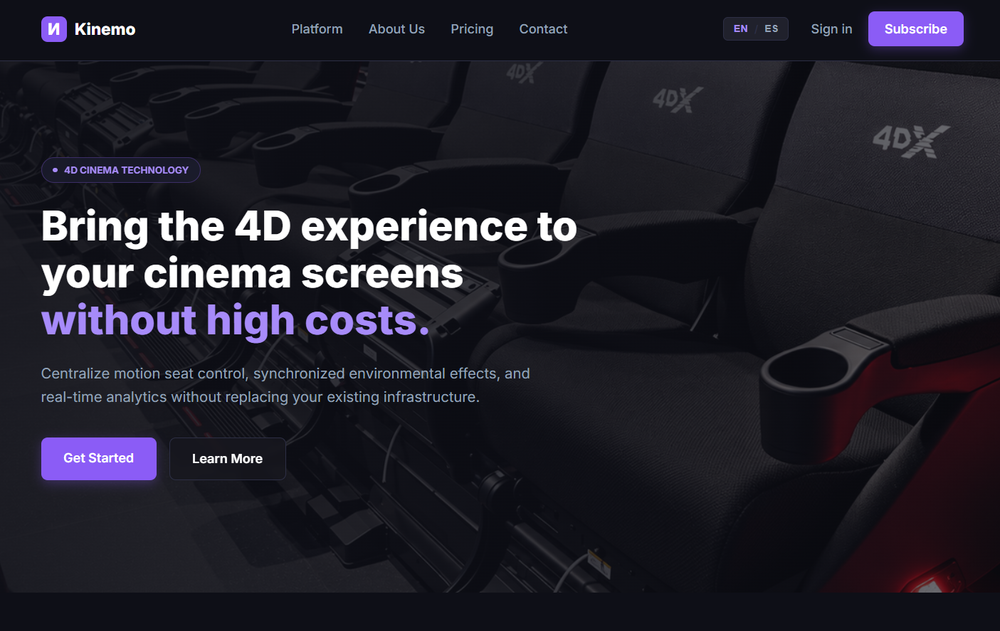
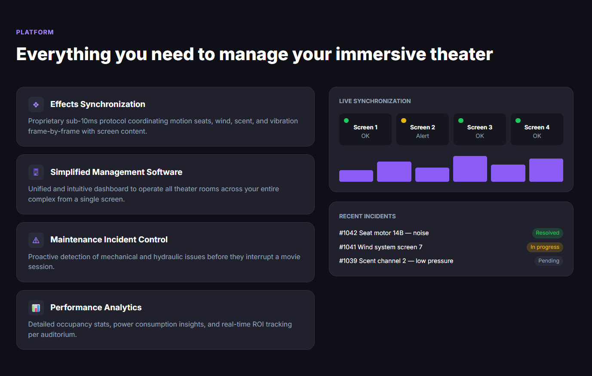
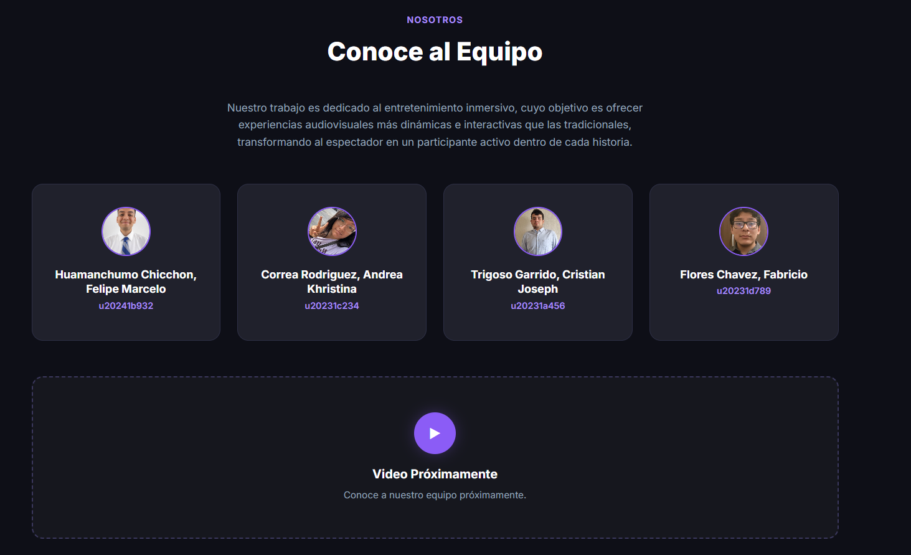
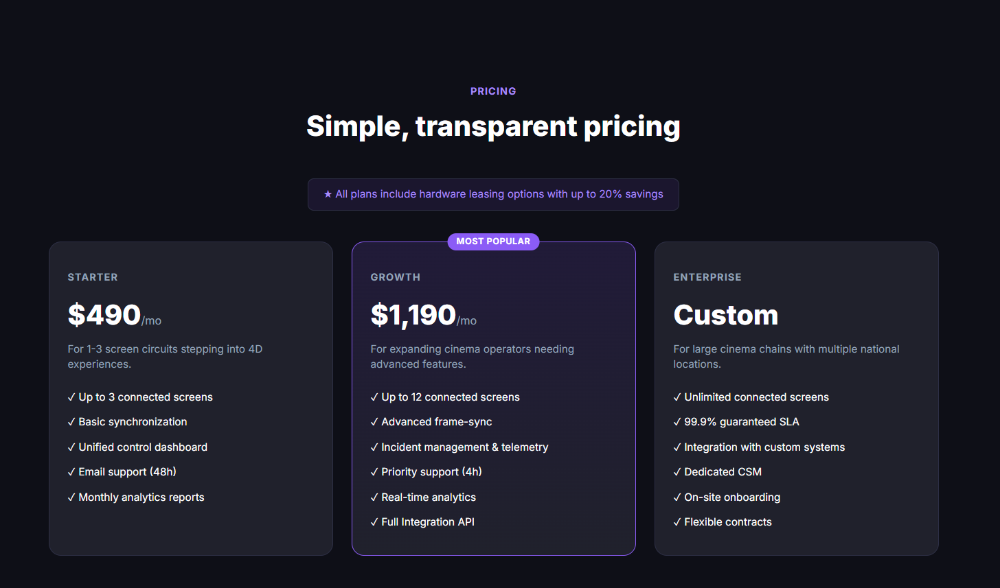
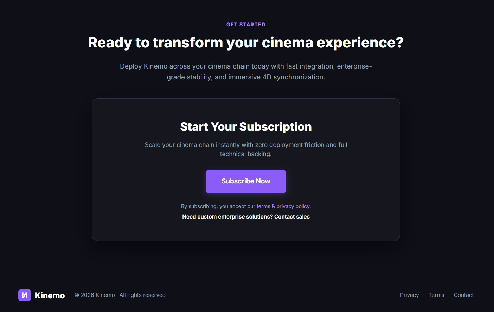

## Capítulo IV: Product Design

### 4.1 Style Guidelines

#### 4.1.1 General Style Guidelines

> _Pendiente — completar en `feature/style-guidelines`._

#### 4.1.2 Web Style Guidelines

> _Pendiente — completar en `feature/style-guidelines`._

### 4.2 Information Architecture

#### 4.2.1 Organization Systems

> _Pendiente — completar en `feature/information-architecture`._

#### 4.2.2 Labeling Systems

> _Pendiente — completar en `feature/information-architecture`._

#### 4.2.3 SEO Tags and Meta Tags

> _Pendiente — completar en `feature/information-architecture`._

#### 4.2.4 Searching Systems

> _Pendiente — completar en `feature/information-architecture`._

#### 4.2.5 Navigation Systems

> _Pendiente — completar en `feature/information-architecture`._

### 4.3 Landing Page UI Design

##### 4.3.1. Landing Page Wireframe

[Click here for Figma](https://www.figma.com/design/h8gZ1ryldnIq3f485Vx13T/Landing-Page?node-id=0-1&t=MqyMHgKjflZ9zmfu-1)

Los wireframes de la Landing Page de Kinemo definen la estructura fundamental de la interfaz, priorizando la organización del contenido y la jerarquía visual antes de aplicar elementos de diseño detallados. Se diseñaron utilizando elementos esquemáticos en escala de grises para facilitar la evaluación de la arquitectura de información sin distracciones visuales.

**1. Home (Hero Section)**

La interfaz del wireframe Home presenta una estructura en Z que guía la vista del usuario de manera natural. En la parte superior, un header fijo contiene el logotipo de Kinemo alineado a la izquierda, seguido de un menú de navegación principal con enlaces a "Platform", "Pricing" y "Contact". A la derecha del header se ubica un enlace de "Sign in" y un botón de llamado a la acción "Suscribe" con mayor énfasis visual.

El hero section ocupa aproximadamente el 60% del viewport inicial, dividido en dos columnas asimétricas. La columna izquierda contiene el kicker pequeño "4D Cinema Technology", seguido del titular principal "Lleva la experiencia 4D a tus salas de cine sin altos costos" en tipografía de gran tamaño, y un subtítulo descriptivo que indica: "Centralizamos el control de asientos de movimiento, efectos ambientales sincronizados y analíticas en tiempo real, sin reemplazar tu infraestructura actual." Debajo se posicionan dos botones CTA: uno primario "Empezar ahora" con tratamiento destacado y uno secundario "Conoce más".

El diseño es limpio, escaneable y enfocado en la conversión, guiando al usuario de manera natural desde el primer contacto hacia la acción principal.

---

**2. Plataforma (Platform Section)**

Inmediatamente debajo del hero, la sección de plataforma presenta el título principal "Todo lo que necesitas para gestionar tu sala inmersiva", acompañado de un layout de dos columnas. La columna izquierda muestra una tarjeta contenedora con cuatro ítems verticales estructurados con un icono cuadrado superior y texto descriptivo:

- **Sincronización de efectos:** Protocolo propietario con latencia sub-10ms que coordina asientos de movimiento, viento, aroma y vibración cuadro a cuadro.
- **Software de gestión simplificado:** Panel unificado e intuitivo para operar todas las salas de tu complejo desde un solo dispositivo.
- **Gestión de incidencias de mantenimiento:** Detección preventiva de fallos mecánicos e hidráulicos antes de que afecten la función.
- **Análisis de rendimiento:** Métricas detalladas de ocupación, consumo energético y retorno de inversión por sala.

La columna derecha reserva espacio para dos contenedores de imagen superpuestos en vertical (placeholders indicados con diagonales cruzadas) que ilustrarán el software y los dashboards de la plataforma.

---

**3. Planes (Pricing Section)**

La sección de "Pricing" adopta un layout centrado que facilita la comparación visual entre opciones de suscripción. El wireframe muestra una etiqueta superior pequeña "Pricing", seguido del titular principal "Planes sencillos y transparentes." y un párrafo descriptivo: "Todos los planes incluyen opciones de arrendamiento de hardware. La facturación anual supone un ahorro del 20%."

Debajo se presenta una grilla de tres columnas equitativas, cada una representada por una tarjeta de plan con un placeholder de imagen cuadrada (indicado con diagonales cruzadas) de aproximadamente 200×200px. Esta estructura permite al usuario escanear rápidamente las opciones disponibles y comparar las alternativas de suscripción para su cadena de cines con un espaciado generoso que facilita la legibilidad.

---

**4. Contacto / Sección Final (Call to Action y Suscripción)**

El wireframe de la sección de contacto y conversión presenta una etiqueta superior "Contact" y el título principal centrado: "¿Listo para transformar tu experiencia en el cine?", acompañado de un texto descriptivo: "Despliega Kinemo en tu cadena de cines hoy mismo con integración rápida, estabilidad de nivel empresarial y sincronización 4D inmersiva."

Incluye un bloque contenedor central destacado titulado "Inicia tu Suscripción" que integra un botón de acción principal ("Suscribe") centrado en la parte inferior del bloque.

El footer de la página incluye a la izquierda el logotipo "Kinemo" acompañado del texto de derechos de autor "© 2026 Kinemo - Todos los derechos reservados", y hacia la derecha los enlaces de navegación "Privacidad", "Términos" y "Contacto", estableciendo el cierre visual de la landing page sobre una franja horizontal de fondo sólido.

##### 4.3.2. Landing Page Mock-up

[Link de Landing Page Mock-up](https://www.figma.com/design/2kl9zH6WgBNDCJAPYMhC0v/Landing-Page-Mock-up?node-id=0-1&t=01NT4lXX92lQUrnf-1)

Los mockups de alta fidelidad de la Landing Page de **Kinemo** fueron desarrollados siguiendo el sistema de diseño definido para la plataforma. La propuesta utiliza una estética oscura y tecnológica, orientada al sector del entretenimiento inmersivo 4D. Se emplea la tipografía **Inter**, una paleta basada en tonos oscuros y morados, bordes sutiles, tarjetas con esquinas redondeadas e indicadores visuales para representar estados y métricas del sistema.

La interfaz utiliza como colores principales el fondo oscuro **#0E0F17**, las tarjetas **#16171E** y **#20212C**, el morado principal **#8B5CF6**, el morado claro **#A78BFA**, el texto blanco **#FFFFFF** y el texto secundario **#94A3B8**.

---

### 1. Home (Hero Section)

El mockup de la sección **Home** presenta la propuesta principal de Kinemo mediante una composición visual inmersiva relacionada con la experiencia cinematográfica 4D.

#### Header

- Fondo oscuro **#0E0F17** con una línea inferior sutil.
- Logotipo de **Kinemo** ubicado en la parte izquierda, compuesto por el símbolo de la marca y el nombre en color blanco.
- Menú de navegación con las opciones **Platform, About Us, Pricing** y **Contact**.
- Selector de idioma **EN / ES**.
- Enlace de **Sign in**.
- Botón principal **Subscribe**, utilizando el color morado **#8B5CF6**.

#### Hero Section

- Imagen de fondo relacionada con una sala de cine y los asientos de una experiencia 4D.
- Overlay oscuro mediante un degradado para mejorar la legibilidad del contenido.
- Etiqueta superior **"4D CINEMA TECHNOLOGY"**, presentada con un fondo oscuro translúcido y detalles en morado.
- Titular principal: **"Bring the 4D experience to your cinema screens without high costs."**
- La última parte del titular utiliza el color morado claro **#A78BFA** para generar énfasis visual.
- Descripción: **"Centralize motion seat control, synchronized environmental effects, and real-time analytics without replacing your existing infrastructure."**
- Botón principal **"Get Started"**, con fondo morado y efecto de elevación al pasar el cursor.
- Botón secundario **"Learn More"**, con fondo oscuro y borde sutil.

La sección busca comunicar desde el primer momento que Kinemo permite incorporar tecnología 4D a las salas de cine sin requerir una renovación completa de la infraestructura existente.

---

### 2. Plataforma (Platform Section)

La sección **Platform** presenta las principales funcionalidades de Kinemo mediante una estructura de dos columnas, permitiendo mostrar tanto las capacidades del sistema como información relacionada con su funcionamiento en tiempo real.

#### Encabezado de sección

- Etiqueta **"PLATFORM"** en color morado claro.
- Título principal **"Everything you need to manage your immersive theater"**.
- Fondo general oscuro para mantener la continuidad visual de la landing page.

#### Columna izquierda

Se presentan tarjetas funcionales con fondo **#20212C**, bordes sutiles y esquinas redondeadas. Cada tarjeta describe una capacidad principal de la plataforma:

- **Effects Synchronization:** coordinación de los asientos de movimiento y efectos ambientales de la experiencia 4D.
- **Simplified Management Software:** panel centralizado para administrar las diferentes salas de cine.
- **Maintenance Incident Control:** seguimiento de incidencias relacionadas con el funcionamiento del sistema.
- **Performance Analytics:** visualización de información relacionada con ocupación, consumo y rendimiento de las salas.

Las tarjetas incorporan estados *hover* que modifican ligeramente el fondo y el borde para proporcionar retroalimentación visual al usuario.

#### Columna derecha

Se presentan módulos visuales que representan información operativa de la plataforma:

- **Live Synchronization:** muestra el estado de las pantallas y su sincronización mediante indicadores como **OK** y **Alert**.
- **Recent Incidents:** presenta las incidencias recientes del sistema utilizando diferentes estados como **Resolved**, **In progress** y **Pending**.
- Paneles de métricas y gráficos para representar información de rendimiento en tiempo real.

Estos elementos permiten representar visualmente cómo Kinemo centraliza el monitoreo y control de una experiencia cinematográfica inmersiva.

---

### 3. Nosotros / Equipo (About Us Section)

La sección **About Us** presenta al equipo responsable del desarrollo de Kinemo y mantiene la identidad visual oscura utilizada en el resto de la landing page.

#### Encabezado

- Etiqueta superior **"NOSOTROS"** en color morado claro.
- Título principal **"Conoce al Equipo"**.
- Texto descriptivo centrado que explica el propósito del equipo y su enfoque en el entretenimiento inmersivo.

#### Tarjetas del equipo

La sección utiliza una cuadrícula de cuatro tarjetas con fondo **#16171E**, borde **#2D2F45** y esquinas redondeadas.

Cada tarjeta contiene:

- Fotografía circular del integrante.
- Borde morado de **2px** alrededor de la fotografía.
- Nombre completo.
- Código de estudiante en color morado claro.

Los integrantes mostrados son:

- **Huamanchumo Chicchon, Felipe Marcelo** — u20241b932
- **Correa Rodriguez, Andrea Khristina** — u20231c234
- **Trigoso Garrido, Cristian Joseph** — u20231a456
- **Flores Chavez, Fabricio** — u20231d789

Las tarjetas incorporan un efecto *hover* que modifica el borde y genera un ligero desplazamiento vertical para proporcionar mayor interacción visual.

#### Video de presentación

Debajo de las tarjetas se incorpora un contenedor de video con fondo oscuro, bordes morados discontinuos y un botón circular de reproducción. Actualmente muestra el mensaje **"Video Próximamente"**, acompañado de una breve descripción indicando que la presentación del equipo estará disponible próximamente.

---

### 4. Planes (Pricing Section)

La sección **Pricing** presenta los diferentes planes de suscripción de Kinemo mediante tres tarjetas diferenciadas, permitiendo visualizar las características incluidas en cada alternativa.

#### Encabezado de sección

- Etiqueta **"PRICING"** en color morado claro.
- Título principal **"Simple, transparent pricing"**.
- Banner informativo con el mensaje: *"All plans include hardware leasing options with up to 20% savings"*.

#### Grid de planes

##### Starter — $490/mes

Orientado a operadores que están comenzando a incorporar experiencias 4D en sus salas.

Incluye:

- Hasta **3 pantallas conectadas**.
- Sincronización básica.
- Panel de control unificado.
- Soporte por correo electrónico.
- Reportes analíticos mensuales.

##### Growth — $1,190/mes

Presentado visualmente como **"MOST POPULAR"** y orientado a operadores que requieren mayores capacidades de gestión y sincronización.

Incluye:

- Hasta **12 pantallas conectadas**.
- Sincronización avanzada de fotogramas.
- Gestión de incidencias y telemetría.
- Soporte prioritario.
- Analítica en tiempo real.
- API de integración completa.

##### Enterprise — Custom

Dirigido a grandes cadenas de cine con múltiples ubicaciones.

Incluye:

- Pantallas conectadas ilimitadas.
- SLA garantizado del **99.9%**.
- Integración con sistemas personalizados.
- Customer Success Manager dedicado.
- On-site onboarding.
- Contratos flexibles.

Las tarjetas utilizan fondos oscuros, bordes sutiles y esquinas redondeadas. El plan **Growth** se diferencia mediante un borde morado y una etiqueta superior que indica **"MOST POPULAR"**, reforzando visualmente su diferenciación dentro de la sección.

---

### 5. Contacto / Call to Action y Footer

La sección final funciona como un **Call to Action (CTA)** orientado a incentivar al usuario a iniciar la contratación del servicio.

#### Call to Action

- Etiqueta superior **"GET STARTED"**.
- Título principal **"¿Ready to transform your cinema experience?"**.
- Texto descriptivo relacionado con el despliegue rápido de Kinemo y su capacidad de adaptación a diferentes necesidades de los operadores de cine.
- Contenedor central con fondo oscuro y borde sutil.
- Título **"Start Your Subscription"**.
- Descripción relacionada con la escalabilidad de la plataforma.
- Botón principal **"Subscribe Now"**, utilizando el color morado **#8B5CF6**.
- Enlaces complementarios relacionados con los términos y la política de privacidad.

#### Footer

El footer mantiene la misma identidad visual oscura de la landing page e incluye:

- Logotipo de Kinemo en la parte izquierda.
- Texto **"© 2026 Kinemo - All rights reserved"**.
- Enlaces **Privacy**, **Terms** y **Contact**.

De esta manera, la sección final cierra el recorrido de la landing page mediante una llamada a la acción clara y mantiene los elementos institucionales y legales necesarios.

---

### Consideraciones de Diseño Responsivo

La landing page utiliza una estructura adaptable para mantener la correcta visualización de sus componentes en diferentes tamaños de pantalla.

Las principales consideraciones son:

- El contenido se organiza mediante contenedores con un ancho máximo de **1200px**.
- Las secciones mantienen espaciados amplios para separar visualmente cada bloque.
- Las tarjetas de plataforma, equipo y planes utilizan estructuras basadas en **CSS Grid y Flexbox**.
- Los botones utilizan áreas de interacción amplias y estados *hover* para proporcionar retroalimentación visual.
- Los elementos visuales mantienen bordes redondeados de **8px y 16px**, de acuerdo con el sistema de diseño.
- La interfaz utiliza una jerarquía basada en texto blanco para información principal y **#94A3B8** para información secundaria.
- El color **#8B5CF6** y su variante **#A78BFA** se utilizan para destacar acciones, estados y elementos importantes.

### Identidad Visual

La propuesta visual busca mantener una apariencia tecnológica y consistente con el concepto de **entretenimiento inmersivo 4D**. El uso de fondos oscuros, tarjetas diferenciadas, efectos de iluminación morada y componentes de monitoreo permite representar una plataforma orientada a la gestión y supervisión de tecnología cinematográfica.

### 4.4 Web Applications UX/UI Design

#### 4.4.1 Web Applications Wireframes

> _Pendiente — completar en `feature/web-app-ux`._

#### 4.4.2 Web Applications Wireflow Diagrams

#### 4.4.4 Web Applications User Flow Diagrams

> _Pendiente — completar en `feature/web-app-ux`._

### 4.5 Web Applications Prototyping

> _Pendiente — completar en `feature/web-app-prototyping`._

### 4.6 Domain-Driven Software Architecture

#### 4.6.1 Design-Level EventStorming

> _Pendiente — completar en `feature/domain-driven-architecture`._

#### 4.6.2 Software Architecture Context Diagram

> _Pendiente — completar en `feature/domain-driven-architecture`._

#### 4.6.3 Software Architecture Container Diagrams

> _Pendiente — completar en `feature/domain-driven-architecture`._

#### 4.6.4 Software Architecture Component Diagrams

> _Pendiente — completar en `feature/domain-driven-architecture`._

### 4.7 Software Object-Oriented Design

#### 4.7.1 Class Diagrams

> _Pendiente — completar en `feature/class-diagrams`._

### 4.8 Database Design

#### 4.8.1 Database Diagrams

## 1. Movie Catalog Management

La base de datos del módulo **Movie Catalog Management** se encuentra estructurada alrededor del agregado principal `movies`, el cual representa y centraliza la información base de las películas 4D registradas en el sistema.

Este agregado almacena atributos fundamentales como `title` y `duration_minutes`, y utiliza el Value Object `status` para gestionar la transición de estados del flujo de *Desactivación de Contenido*, permitiendo clasificar la disponibilidad del recurso en estados como *Activo*, *Inactivo* o *Bloqueado para Programación*.

Para dar soporte a la operativa estructurada del catálogo, el modelo incorpora características y entidades complementarias:

*   **Trazabilidad Autorreferencial:** El agregado `movies` implementa una relación recursiva mediante el atributo `original_movie_id`. Esta estructura da soporte directo al flujo de *Duplicación de Configuración*, permitiendo registrar y modificar copias de una cinta manteniendo intacta la trazabilidad histórica hacia la película de origen.
*   **Entidad `genres`:** Funciona como una entidad de soporte que normaliza la clasificación del contenido. Al separar los géneros en su propia estructura relacional, se elimina la redundancia de datos y se agiliza significativamente la ejecución del flujo de *Búsqueda de Película* mediante filtros estructurados.

> Las relaciones establecidas a través de las claves foráneas (`genre_id`, `original_movie_id`) garantizan la integridad referencial del esquema, asegurando que este Bounded Context administre su propia fuente de verdad de manera normalizada y desacoplada del resto de los módulos del sistema.

## 2. Sensory Content & Experience Management

La base de datos del módulo **Sensory Content & Experience Management** se encuentra estructurada alrededor del agregado principal `sensory_files`, el cual gestiona de manera centralizada la subida y administración del "Archivo de Efectos 4D".

Esta entidad utiliza el Value Object `validation_status` para administrar la transición de estados correspondiente al flujo de *Carga de Archivo de Efectos*, controlando etapas críticas como *Cargado*, *Rechazado* o *Vinculado*. Asimismo, integra el atributo `movie_id`, el cual actúa como clave foránea para establecer una conexión referencial con el catálogo de películas.

A partir de este agregado raíz, el modelo se expande en entidades especializadas para soportar el nivel granular de la experiencia sensorial:

*   **Entidad `sensory_tracks`:** Representa la "Pista Sensorial" individual, permitiendo que un mismo archivo agrupe múltiples pistas (ej. viento, movimiento, agua). Esta entidad emplea el atributo `track_status` para dirigir el ciclo de vida en el flujo de *Validación de Pista Sensorial* (*Validada*, *Rechazada*, *Habilitada para Ejecución*). Por su parte, el campo `intensity_level` da soporte directo al flujo de *Asignación de Intensidad*, almacenando el parámetro operativo validado por el técnico.
*   **Entidad `configuration_history`:** Funciona como una tabla de soporte y auditoría para el flujo de *Restablecimiento de Configuración*. Al almacenar un registro histórico de los cambios aplicados en los niveles de intensidad (`previous_intensity_level`), esta entidad provee al sistema la capacidad de emitir recomendaciones basadas en el uso y permite al técnico de mantenimiento revertir o restablecer la configuración a un estado anterior validado.

> Finalmente, las relaciones establecidas mediante las claves foráneas (`movie_id`, `sensory_file_id`, `sensory_track_id`) garantizan la estricta integridad referencial del modelo, asegurando un diseño normalizado que mantiene el desacoplamiento estructural frente a otros Bounded Contexts del sistema.

---

 

## 3. Scheduling & Calendar

La base de datos del módulo **Scheduling & Calendar** se estructura alrededor del agregado principal `shows`, el cual centraliza la programación y el ciclo de vida de las funciones 4D.

Esta entidad incorpora atributos fundamentales como `start_time` y `end_time`, los cuales permiten ejecutar consultas precisas para detectar conflictos y dar soporte directo a los flujos de *Creación de Función* y *Reprogramación de Función*. A través del Value Object `status`, el sistema gestiona la transición de estados operativos de la proyección (*Programada*, *Reprogramada*, *Cancelada* o *Bloqueada*). Asimismo, los campos `assigned_professional_id` y `cancellation_reason` respaldan la auditoría del flujo de *Cancelación de Función*, permitiendo documentar motivos operativos específicos, como la falta de personal y su reasignación a emergencias.

Para dar soporte a la logística de los espacios y la operatividad técnica, el modelo se expande mediante dos entidades complementarias:

*   **Entidad `rooms`:** Representa la infraestructura física del cine. Identificar unívocamente el espacio donde ocurre la función o el bloqueo es un componente crítico para evaluar correctamente las reglas del flujo de *Gestión de Disponibilidad*.
*   **Entidad `maintenance_blocks`:** Funciona como una tabla especializada para dar soporte exclusivo al flujo de *Bloqueo por Mantenimiento*. Al separar las restricciones técnicas de las proyecciones regulares, se mantiene un historial limpio y normalizado. Esta estructura permite bloquear una sala por periodos prolongados sin la necesidad de registrar funciones ficticias; el cálculo de disponibilidad se resuelve verificando que el intervalo solicitado no intersecte con registros activos en `shows` ni en `maintenance_blocks`.

> Finalmente, las relaciones establecidas a través de las claves foráneas (`room_id`, `movie_id`, `assigned_professional_id`) garantizan la estricta integridad referencial del esquema. De manera particular, el atributo `movie_id` actúa como el enlace lógico principal que vincula este contexto con el Bounded Context de *Movie Catalog Management*, asegurando el desacoplamiento estructural del sistema.

---
