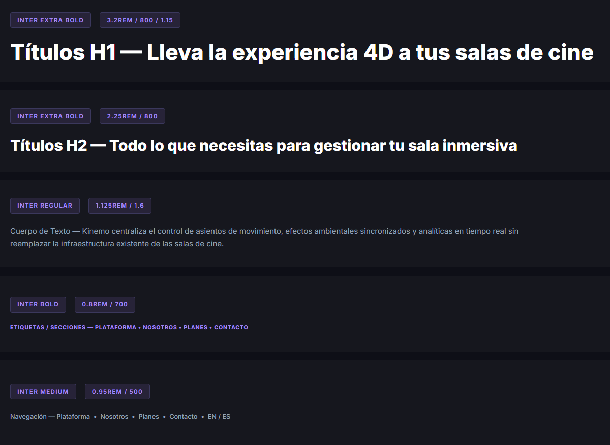
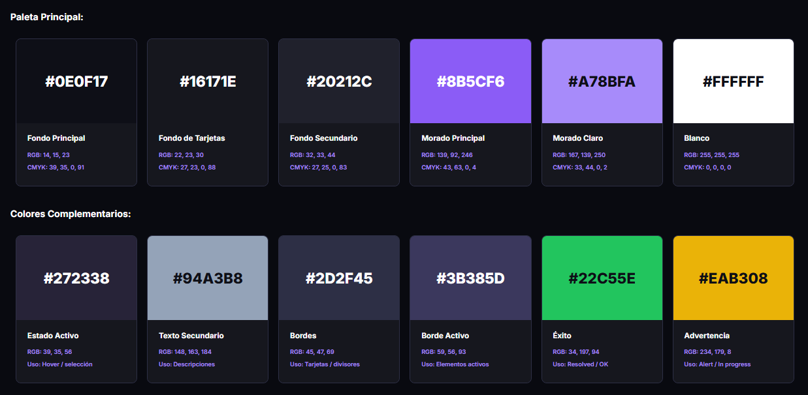

## Capítulo IV: Product Design

### 4.1. Style Guidelines

En esta sección se establecen los lineamientos visuales y de comunicación utilizados en Kinemo. Estos lineamientos permiten mantener una identidad consistente en los productos digitales del proyecto, definiendo criterios para el uso de la marca, tipografía y paleta de colores.

La propuesta visual de Kinemo busca transmitir innovación, tecnología y entretenimiento inmersivo. Para ello, se emplea una interfaz predominantemente oscura acompañada de tonos morados que permiten destacar los elementos principales y mantener una estética relacionada con la experiencia cinematográfica.

#### 4.1.1. General Style Guidelines

##### Branding

**Concepto de Marca**

Kinemo es una propuesta tecnológica orientada a mejorar la gestión de experiencias cinematográficas 4D. Su identidad visual busca representar conceptos como tecnología, movimiento, inmersión y modernidad mediante una estética minimalista y digital.

El sistema visual de la marca combina fondos oscuros con acentos morados, generando contraste entre el contenido y los principales elementos interactivos. Esta combinación permite mantener una apariencia moderna y coherente con el entorno cinematográfico en el que se desarrolla la propuesta.

**Logotipo Principal**


El logotipo de Kinemo está compuesto por un símbolo gráfico acompañado del nombre de la marca. Su diseño mantiene una composición simple y reconocible que facilita su integración dentro de las diferentes interfaces del proyecto.

El símbolo utiliza el color morado característico de Kinemo, mientras que el nombre emplea un tono claro para mantener un contraste adecuado sobre fondos oscuros. Esta combinación permite conservar la identidad visual utilizada en el resto de la interfaz.

---

##### Typography

Kinemo utiliza **Inter** como familia tipográfica principal en sus interfaces. Esta tipografía fue seleccionada por su legibilidad en entornos digitales y por su apariencia moderna, permitiendo mantener consistencia entre títulos, textos descriptivos, botones, etiquetas y elementos de navegación.

La jerarquía tipográfica utiliza diferentes pesos y tamaños de Inter dependiendo de la importancia del contenido. Los títulos principales emplean pesos elevados para generar mayor impacto visual, mientras que los textos descriptivos utilizan pesos regulares que facilitan la lectura.



| Uso | Familia | Peso | Aplicación |
| --- | --- | --- | --- |
| **Hero / Display** | Inter | 800 | Mensaje principal de la Landing Page |
| **H1** | Inter | 700-800 | Títulos principales |
| **H2** | Inter | 700-800 | Títulos de secciones |
| **H3** | Inter | 600-700 | Títulos de tarjetas y componentes |
| **Body** | Inter | 400 | Descripciones y contenido general |
| **Labels** | Inter | 600-700 | Etiquetas y categorías |
| **Navigation** | Inter | 500-600 | Opciones de navegación |
| **Buttons** | Inter | 600-700 | Llamados a la acción |

Esta jerarquía permite diferenciar visualmente los distintos niveles de información y facilita el recorrido del usuario a través de las interfaces de Kinemo.

---

##### Color Palette

La identidad visual de Kinemo utiliza una paleta predominantemente oscura con tonos morados como colores de acento. Los fondos oscuros permiten crear una apariencia asociada con el ambiente cinematográfico, mientras que los tonos morados destacan botones, etiquetas y otros elementos relevantes de la interfaz.



**Paleta Principal**

| Color | HEX | RGB | Uso Principal |
| --- | --- | --- | --- |
| **Fondo Principal** | `#0E0F17` | 14, 15, 23 | Fondo general de la interfaz |
| **Fondo de Tarjetas** | `#16171E` | 22, 23, 30 | Cards y contenedores |
| **Fondo Secundario** | `#20212C` | 32, 33, 44 | Elementos secundarios |
| **Morado Principal** | `#8B5CF6` | 139, 92, 246 | CTAs y elementos destacados |
| **Morado Claro** | `#A78BFA` | 167, 139, 250 | Acentos, etiquetas y estados activos |
| **Blanco** | `#FFFFFF` | 255, 255, 255 | Títulos y texto principal |

**Colores Complementarios**

| Color | HEX | Uso Principal |
| --- | --- | --- |
| **Estado Activo** | `#272338` | Fondos de elementos seleccionados o destacados |
| **Texto Secundario** | `#94A3B8` | Descripciones y contenido de menor jerarquía |
| **Bordes** | `#2D2F45` | Separadores y contornos de componentes |
| **Borde Activo** | `#3B385D` | Contornos de elementos activos |
| **Éxito** | `#22C55E` | Estados correctos o resueltos |
| **Advertencia** | `#EAB308` | Alertas y estados en progreso |

**Justificación Cromática**

La combinación de colores utilizada en Kinemo responde a las características visuales y funcionales de la plataforma:

- **Fondos oscuros:** permiten relacionar visualmente la interfaz con el ambiente de una sala de cine y ayudan a destacar el contenido principal.
- **Morado principal:** funciona como el color representativo de Kinemo y se utiliza para resaltar acciones, elementos interactivos y secciones importantes.
- **Morado claro:** complementa el color principal y permite generar diferentes niveles de énfasis.
- **Blanco:** se utiliza principalmente en títulos y textos que requieren alta visibilidad sobre fondos oscuros.
- **Gris azulado:** se emplea para información secundaria, evitando competir visualmente con los títulos y llamados a la acción.
- **Verde y amarillo:** permiten diferenciar estados funcionales dentro de los componentes de la plataforma.

El uso consistente de esta paleta permite mantener una identidad visual uniforme entre las diferentes secciones de Kinemo.

---

##### Communication Tone

La comunicación de Kinemo mantiene un tono profesional, tecnológico y directo. Los mensajes buscan explicar las capacidades de la plataforma de forma breve y comprensible, evitando descripciones excesivamente técnicas cuando no son necesarias.

La comunicación de la marca se centra principalmente en:

- La innovación aplicada a experiencias cinematográficas 4D.
- La facilidad de gestión de las salas.
- La sincronización de efectos y tecnología inmersiva.
- El monitoreo y análisis de información.
- La mejora de la experiencia cinematográfica.
- La presentación clara de los beneficios de la plataforma.

Los llamados a la acción utilizan expresiones breves y reconocibles, facilitando que el usuario comprenda rápidamente cuál es el siguiente paso dentro de la interfaz.

---

##### General Visual Identity

La identidad visual de Kinemo mantiene una composición moderna y minimalista. Las interfaces priorizan espacios amplios, tarjetas claramente diferenciadas, bordes sutiles y una jerarquía visual basada en contraste, tamaño y peso tipográfico.

Los elementos más importantes utilizan el morado principal para captar la atención del usuario, mientras que los fondos y elementos secundarios mantienen tonalidades oscuras. De esta manera, el diseño evita una saturación visual excesiva y conserva una apariencia uniforme en toda la experiencia.

Las decisiones generales de diseño siguen los siguientes criterios:

- Uso consistente de la familia tipográfica Inter.
- Fondos oscuros como base de la interfaz.
- Morado como principal color de identidad y acción.
- Uso de blanco para información de alta jerarquía.
- Uso de tonos secundarios para descripciones y contenido complementario.
- Bordes y contenedores sutiles para organizar la información.
- Diseño visual coherente con un producto tecnológico orientado al entretenimiento cinematográfico.

#### 4.1.2 Web Style Guidelines

Los Web Style Guidelines de Kinemo establecen los criterios visuales y de interacción utilizados en la Landing Page y la Web Application. Estos lineamientos complementan la identidad visual definida previamente y permiten mantener consistencia entre los diferentes componentes de la interfaz.

##### Layout and Spacing

Las interfaces de Kinemo utilizan una estructura basada principalmente en contenedores, CSS Grid y Flexbox. Esta organización permite distribuir los elementos de manera ordenada y adaptar el contenido a diferentes tamaños de pantalla.

Los principales criterios utilizados son:

- Uso de contenedores centrados para organizar el contenido principal.
- Ancho máximo aproximado de 1200px en las secciones principales de la Landing Page.
- Separación clara entre secciones para facilitar la lectura del contenido.
- Uso de Grid para estructuras formadas por tarjetas, como Platform, About Us y Pricing.
- Uso de Flexbox para elementos de navegación, botones y componentes alineados horizontalmente.
- Márgenes y espacios internos consistentes para evitar la saturación visual.

##### Buttons

Los botones de Kinemo permiten diferenciar las acciones principales y secundarias dentro de la interfaz.

**Primary Button**

Utiliza el color morado principal `#8B5CF6` y texto claro. Se emplea para destacar las acciones de mayor importancia, como **Get Started** o **Sign In**.

**Secondary Button**

Utiliza un fondo oscuro acompañado de un borde sutil. Se emplea para acciones complementarias, como **Learn More**, evitando competir visualmente con la acción principal.

Los botones utilizan bordes redondeados y estados visuales de interacción para proporcionar retroalimentación al usuario.

##### Cards

Las tarjetas permiten agrupar información relacionada dentro de un mismo bloque visual. Son utilizadas en diferentes secciones de Kinemo, incluyendo funcionalidades de la plataforma, integrantes del equipo, planes de suscripción y módulos de la Web Application.

Las tarjetas utilizan principalmente:

- Fondo `#16171E` o `#20212C`.
- Bordes sutiles `#2D2F45`.
- Esquinas redondeadas.
- Espaciado interno para separar correctamente los elementos.
- Títulos en color blanco.
- Información secundaria en `#94A3B8`.
- Morado `#8B5CF6` o `#A78BFA` para elementos destacados.

Esta estructura permite mantener una presentación uniforme de la información en las diferentes interfaces.

##### Navigation

La navegación mantiene una estructura sencilla que permite identificar rápidamente las principales opciones disponibles.

En la Landing Page, la barra de navegación proporciona acceso a:

- Platform.
- About Us.
- Pricing.
- Contact.
- Selector de idioma EN / ES.

En la Web Application, la navegación proporciona acceso a las principales áreas disponibles para el usuario, incluyendo el Dashboard y opciones relacionadas con Operations, Maintenance y Analytics. Asimismo, incorpora el selector de idioma y el acceso al perfil del usuario.

Las barras de navegación utilizan fondos oscuros y separadores sutiles para mantener continuidad con el resto de la interfaz.

##### Form Elements

Los formularios de la Web Application mantienen la misma identidad visual del sistema. Los campos utilizan fondos oscuros, bordes sutiles y etiquetas claras para facilitar la identificación de la información solicitada.

En interfaces como Sign In se utilizan:

- Labels visibles para identificar cada campo.
- Inputs con contraste respecto al fondo.
- Placeholders como información complementaria.
- Botones principales en morado.
- Enlaces secundarios para acciones adicionales.

La distribución mantiene una separación suficiente entre los campos para facilitar la lectura y la interacción.

##### Interaction States

Los componentes interactivos utilizan cambios visuales para comunicar su estado al usuario.

Entre los principales estados se consideran:

- **Default:** estado inicial del componente.
- **Hover:** cambio visual al posicionar el cursor sobre elementos interactivos.
- **Active:** utiliza fondos o bordes destacados para representar una opción seleccionada.
- **Success:** utiliza `#22C55E` para representar estados satisfactorios o completados.
- **Warning:** utiliza `#EAB308` para representar advertencias o procesos que requieren atención.

Además del color, se utilizan etiquetas textuales e iconos cuando es necesario para evitar que la interpretación de un estado dependa exclusivamente de su representación cromática.

##### Responsive Design

Kinemo utiliza una estructura adaptable para mantener la correcta visualización de la Landing Page y la Web Application en diferentes tamaños de pantalla.

Las estructuras de múltiples columnas pueden reorganizarse verticalmente cuando disminuye el espacio disponible. Asimismo, las imágenes, tarjetas, botones y contenedores se ajustan al ancho disponible para evitar desplazamientos horizontales innecesarios.

La combinación de Grid, Flexbox y unidades adaptables permite conservar la jerarquía visual y facilitar la interacción con la plataforma en diferentes resoluciones.

### 4.2. Information Architecture

La arquitectura de información de Kinemo define la forma en que el contenido y las funcionalidades se organizan, etiquetan y presentan dentro de sus productos digitales. Su objetivo es facilitar la comprensión de la plataforma y permitir que cada usuario encuentre las funcionalidades necesarias de acuerdo con el contexto en el que se encuentra.

Kinemo cuenta con dos interfaces principales: la **Landing Page**, orientada a presentar públicamente la propuesta de valor del producto, y la **Web Application**, orientada a la gestión y operación de las experiencias cinematográficas 4D.

La Landing Page utiliza una estructura principalmente lineal, donde el visitante puede conocer progresivamente la plataforma, el equipo, los planes disponibles y las alternativas de contacto. Por otro lado, la Web Application utiliza una organización modular, permitiendo acceder a diferentes funcionalidades relacionadas con la operación de las salas de cine.

#### 4.2.1. Organization Systems

Kinemo utiliza diferentes sistemas de organización dependiendo del producto digital y del tipo de información presentada.

##### Landing Page

La Landing Page emplea principalmente un **sistema de organización por tópicos**, donde cada sección agrupa información relacionada con un aspecto específico de Kinemo.

La estructura principal se organiza de la siguiente manera:

| Tópico | Descripción |
| --- | --- |
| **Home** | Presenta la propuesta de valor principal de Kinemo y las acciones iniciales disponibles para el visitante. |
| **Platform** | Expone las principales capacidades de la solución para la gestión de experiencias cinematográficas 4D. |
| **About Us** | Presenta al equipo responsable del desarrollo de Kinemo. |
| **Pricing** | Permite conocer y comparar los diferentes planes disponibles. |
| **Contact** | Presenta la llamada a la acción final para iniciar el contacto con Kinemo. |
| **Terms and Conditions** | Proporciona acceso a la información relacionada con las condiciones de uso del servicio. |

El contenido mantiene una organización jerárquica que comienza presentando qué es Kinemo, continúa explicando sus principales capacidades y finaliza con información comercial y de contacto.

**Home**

La sección inicial comunica de manera directa la propuesta de valor de Kinemo como tecnología orientada a experiencias cinematográficas 4D. Incluye los llamados a la acción **Get Started** y **Learn More**, permitiendo al visitante continuar su recorrido hacia las secciones principales.

**Platform**

Las capacidades principales de Kinemo se organizan en cuatro categorías:

- Effects Synchronization.
- Simplified Management Software.
- Maintenance Incident Control.
- Performance Analytics.

La sección complementa estas categorías mediante elementos visuales relacionados con la sincronización de salas y el seguimiento de incidencias.

**About Us**

Presenta a los integrantes responsables del desarrollo de Kinemo mediante tarjetas individuales que contienen fotografía, nombre e información de identificación académica.

**Pricing**

Organiza las alternativas comerciales de Kinemo en tres planes:

- Starter.
- Growth.
- Enterprise.

Esta estructura permite comparar visualmente las características y alcance de cada alternativa.

**Contact**

Representa el cierre del recorrido principal de la Landing Page. Su propósito es dirigir al visitante hacia una acción concreta relacionada con el inicio del servicio o contacto comercial.

##### Web Application

La Web Application utiliza un **sistema de organización jerárquico y modular**. Después de autenticarse, el usuario accede al Dashboard, desde donde puede ingresar a los diferentes módulos de la plataforma según las tareas que necesite realizar.

La estructura de navegación identificada en la aplicación se organiza mediante los siguientes módulos. Estas etiquetas representan accesos funcionales de la interfaz y no necesariamente corresponden de forma directa con los nombres arquitectónicos de los Bounded Contexts definidos posteriormente.

| Módulo | Propósito |
| --- | --- |
| **Sign In** | Permite autenticar al usuario mediante correo electrónico y contraseña. |
| **Dashboard** | Funciona como punto central de acceso a las funcionalidades de la aplicación. |
| **Catalog** | Agrupa funcionalidades relacionadas con el catálogo de contenido 4D. |
| **Scheduling** | Agrupa funcionalidades relacionadas con la programación de funciones. |
| **Room Readiness** | Permite acceder a funcionalidades relacionadas con la preparación y disponibilidad de las salas. |
| **Maintenance** | Agrupa funcionalidades relacionadas con el mantenimiento y seguimiento de incidencias. |
| **Subscription** | Permite acceder a funcionalidades relacionadas con planes y suscripciones. |
| **Profile** | Presenta información relacionada con el usuario y su rol dentro de la plataforma. |
| **About** | Proporciona información complementaria sobre Kinemo. |

El **Dashboard** funciona como el nivel principal de navegación después del inicio de sesión y proporciona acceso a las funcionalidades disponibles mediante diferentes módulos y tarjetas.

En la interfaz se distinguen funcionalidades destinadas a la administración y operación de Kinemo. Entre los accesos mostrados se encuentran módulos relacionados con catálogo, programación, salas, ticketing, analítica, suscripción, control de asientos, ejecución y mantenimiento.

De esta manera, a diferencia del recorrido principalmente lineal de la Landing Page, la Web Application permite que el usuario seleccione directamente el módulo correspondiente a la tarea que necesita realizar.

#### 4.2.2. Labeling Systems

El sistema de etiquetado de Kinemo utiliza términos breves y relacionados directamente con las funcionalidades que representan. Se busca evitar nombres ambiguos y mantener consistencia entre los enlaces de navegación, botones, módulos y secciones.

##### Landing Page

Las principales etiquetas utilizadas son:

| Etiqueta | Propósito |
| --- | --- |
| **Platform** | Identifica la sección donde se presentan las capacidades principales de Kinemo. |
| **About Us** | Identifica la sección donde se presenta el equipo del proyecto. |
| **Pricing** | Identifica la sección de planes y precios. |
| **Contact** | Identifica la sección destinada al contacto con Kinemo. |
| **Get Started** | CTA principal que dirige al visitante hacia el inicio del proceso de contacto. |
| **Learn More** | CTA secundario que permite conocer las funcionalidades de la plataforma. |
| **Most Popular** | Destaca visualmente el plan comercial recomendado. |
| **EN / ES** | Permite seleccionar el idioma de la interfaz. |
| **Terms and Conditions** | Permite acceder a las condiciones de uso correspondientes. |

##### Web Application

Dentro de la aplicación se utilizan etiquetas orientadas a las tareas que puede realizar el usuario.

| Etiqueta | Propósito |
| --- | --- |
| **Sign In** | Acción utilizada para iniciar sesión. |
| **Dashboard** | Identifica el punto principal de acceso a los módulos. |
| **Operations** | Agrupa accesos relacionados con las operaciones de las salas. |
| **Maintenance** | Identifica las funcionalidades relacionadas con mantenimiento. |
| **Analytics** | Identifica el acceso a información y análisis del funcionamiento de la plataforma. |
| **Catalog** | Identifica el módulo de gestión del catálogo 4D. |
| **Scheduling** | Identifica el módulo relacionado con programación. |
| **Room Readiness** | Identifica las funcionalidades de preparación de salas. |
| **Subscription** | Identifica la gestión de planes y suscripciones. |
| **Profile** | Identifica la información asociada al usuario autenticado. |
| **EN / ES** | Permite alternar el idioma de la aplicación. |

Las etiquetas mantienen una relación directa con las acciones y contenidos disponibles para reducir el esfuerzo necesario para comprender la interfaz.

Además, los módulos del Dashboard utilizan elementos visuales e iconos como apoyo a las etiquetas textuales, facilitando su reconocimiento.

#### 4.2.3. SEO Tags and Meta Tags

La estrategia SEO de Kinemo se aplica principalmente a la **Landing Page**, debido a que corresponde a la interfaz pública del producto y funciona como uno de los principales puntos de entrada para potenciales clientes interesados en soluciones tecnológicas para experiencias cinematográficas 4D.

Por otro lado, la **Web Application** posee un propósito principalmente operativo y requiere autenticación para acceder a sus funcionalidades. Por esta razón, su contenido interno no constituye el principal objetivo de posicionamiento en motores de búsqueda.

##### Landing Page

Para la Landing Page se consideran etiquetas orientadas a describir correctamente el contenido del sitio, facilitar su indexación y mejorar la forma en que Kinemo se presenta al compartir la página en plataformas externas.

Las principales etiquetas consideradas son:

- **Title:** identifica el sitio y comunica que Kinemo está relacionado con tecnología para cine 4D.
- **Description:** resume la propuesta de valor de Kinemo, incluyendo la gestión de asientos de movimiento, efectos sincronizados y analítica.
- **Keywords:** documenta términos relacionados con tecnología de cine 4D, gestión de salas y experiencias inmersivas.
- **Author:** identifica al equipo responsable del producto.
- **Robots:** establece las indicaciones de indexación y seguimiento para los motores de búsqueda.
- **Canonical:** identifica la URL principal de la Landing Page.
- **Open Graph:** define cómo se presenta Kinemo al compartir la página en plataformas compatibles.
- **Twitter Card:** proporciona información para generar una vista previa enriquecida al compartir el sitio en plataformas compatibles.

Una posible implementación dentro del `<head>` de la Landing Page es la siguiente. Los valores `LANDING_PAGE_URL` y `LANDING_PAGE_IMAGE_URL` representan placeholders que deberán ser reemplazados por las direcciones públicas correspondientes una vez que la Landing Page se encuentre desplegada en su entorno definitivo:

```html
<head>
    <!-- Basic Metadata -->
    <meta charset="UTF-8">
    <meta name="viewport" content="width=device-width, initial-scale=1.0">

    <title>Kinemo | 4D Cinema Technology</title>

    <!-- SEO Metadata -->
    <meta
        name="description"
        content="Kinemo centralizes motion seat control, synchronized environmental effects, maintenance monitoring and real-time analytics for immersive 4D cinema experiences."
    >
    <meta
        name="keywords"
        content="Kinemo, 4D cinema technology, 4D theater management, motion seats, synchronized cinema effects, immersive cinema technology"
    >
    <meta name="author" content="Kinemo Team">
    <meta name="robots" content="index, follow">

    <!-- Canonical -->
    <link rel="canonical" href="LANDING_PAGE_URL">

    <!-- Open Graph -->
    <meta property="og:title" content="Kinemo | 4D Cinema Technology">
    <meta
        property="og:description"
        content="Technology for managing immersive 4D cinema experiences."
    >
    <meta property="og:type" content="website">
    <meta property="og:url" content="LANDING_PAGE_URL">
    <meta property="og:image" content="LANDING_PAGE_IMAGE_URL">
    <meta property="og:site_name" content="Kinemo">
    <meta property="og:locale" content="en_US">

    <!-- Twitter / X Card -->
    <meta name="twitter:card" content="summary_large_image">
    <meta name="twitter:title" content="Kinemo | 4D Cinema Technology">
    <meta
        name="twitter:description"
        content="Technology for managing immersive 4D cinema experiences."
    >
    <meta name="twitter:image" content="LANDING_PAGE_IMAGE_URL">
</head>
```

#### 4.2.4. Searching Systems

La Landing Page de Kinemo no incorpora un sistema de búsqueda interno debido a que su contenido se encuentra organizado en un número reducido de secciones y puede recorrerse directamente mediante la barra de navegación.

El visitante puede acceder a **Platform, About Us, Pricing** y **Contact** sin necesidad de realizar búsquedas textuales. Esta decisión permite mantener una experiencia simple y evita incorporar un componente que no resulta necesario para la cantidad de información presentada.

En la Web Application, la localización de funcionalidades se realiza principalmente mediante la navegación por módulos y las opciones disponibles en el Dashboard. Cada funcionalidad se encuentra agrupada de acuerdo con su propósito dentro de la plataforma.

En aquellos módulos que manejan conjuntos de información más amplios, las búsquedas y filtros pueden implementarse dentro del contexto específico correspondiente, en lugar de utilizar un buscador global para toda la aplicación.

#### 4.2.5. Navigation Systems

Kinemo utiliza diferentes mecanismos de navegación dependiendo de la interfaz y del contexto del usuario.

##### Landing Page

La Landing Page utiliza una navegación principalmente global y contextual.

La **navegación global** se encuentra disponible mediante el header y permite acceder directamente a:

- Platform.
- About Us.
- Pricing.
- Contact.
- Selector de idioma EN / ES.

Asimismo, se utilizan llamados a la acción que permiten realizar desplazamientos contextuales dentro de la página:

- **Get Started:** dirige al usuario hacia la sección de contacto.
- **Learn More:** dirige al usuario hacia la sección Platform.

El footer complementa esta navegación proporcionando acceso a información legal mediante **Terms and Conditions**.

El recorrido principal puede representarse de la siguiente manera:

**Home → Platform → About Us → Pricing → Contact**

##### Web Application

La Web Application utiliza una navegación jerárquica y modular. El usuario inicia su recorrido en la pantalla de autenticación y, después de iniciar sesión, accede al Dashboard.

Desde el Dashboard puede dirigirse a los diferentes módulos disponibles según las tareas que necesite realizar. La barra superior mantiene accesos a áreas generales como **Dashboard, Operations, Maintenance** y **Analytics**, además de opciones relacionadas con el idioma y el perfil.

La navegación puede representarse de forma general de la siguiente manera:

**Sign In → Dashboard → Módulo seleccionado → Funcionalidad específica**

Esta estructura permite que el usuario acceda directamente a las funciones necesarias sin recorrer de forma secuencial toda la aplicación.

### 4.3 Landing Page UI Design

#### 4.3.1. Landing Page Wireframe

[Click here for Figma](https://www.figma.com/design/h8gZ1ryldnIq3f485Vx13T/Landing-Page?node-id=0-1&t=MqyMHgKjflZ9zmfu-1)

Los wireframes de la Landing Page de Kinemo definen la estructura fundamental de la interfaz, priorizando la organización del contenido y la jerarquía visual antes de aplicar elementos de diseño detallados. Se diseñaron utilizando elementos esquemáticos en escala de grises para facilitar la evaluación de la arquitectura de información sin distracciones visuales.

**1. Home (Hero Section)**

La propuesta inicial del wireframe Home presenta una estructura que guía la vista del usuario hacia la propuesta de valor y las principales acciones de la página. En la parte superior se ubica el logotipo de Kinemo acompañado de las principales opciones de navegación consideradas durante esta primera etapa del diseño.

El Hero Section presenta el mensaje principal **"Lleva la experiencia 4D a tus salas de cine sin altos costos"**, acompañado por una descripción relacionada con la centralización del control de asientos de movimiento, efectos ambientales sincronizados y analítica en tiempo real.

Debajo del mensaje principal se ubican los llamados a la acción **"Empezar ahora"** y **"Conoce más"**, permitiendo dirigir al usuario hacia las siguientes secciones de la Landing Page.


---

**2. Plataforma (Platform Section)**

La sección de plataforma presenta las principales capacidades de Kinemo mediante una distribución que combina información textual con espacios destinados a representaciones visuales de la solución.

Las principales funcionalidades consideradas son:

- **Sincronización de efectos:** coordinación de los asientos de movimiento y efectos ambientales para mantenerlos alineados con la experiencia cinematográfica.
- **Software de gestión simplificado:** panel centralizado que facilita la administración de las diferentes salas desde una misma plataforma.
- **Gestión de incidencias de mantenimiento:** seguimiento de incidencias relacionadas con el funcionamiento de los equipos y recursos 4D.
- **Análisis de rendimiento:** presentación de información relacionada con la ocupación, operación y rendimiento de las salas.

La sección reserva además espacios para recursos visuales relacionados con el software y la información operativa de la plataforma.


---

**3. Planes (Pricing Section)**

La sección de **Pricing** adopta un layout centrado que facilita la comparación visual entre las diferentes opciones de suscripción.

El wireframe organiza los planes mediante una cuadrícula de tres columnas, donde cada tarjeta representa una alternativa disponible. Esta distribución permite comparar de forma rápida las opciones comerciales de Kinemo y mantiene una separación suficiente entre los diferentes bloques de información.


---

**4. Contacto / Sección Final**

La sección final del wireframe funciona como un llamado a la acción orientado a que el visitante continúe con el proceso de contacto o contratación del servicio.

El bloque principal concentra el título, una descripción breve y la acción principal. El footer complementa esta sección mediante el logotipo de Kinemo, información de derechos reservados y accesos a información complementaria.


---

##### Evolución del Wireframe al Mock-up

Durante la evolución del diseño desde los wireframes hacia el mock-up de alta fidelidad se realizaron algunos ajustes en la estructura de la Landing Page con el objetivo de mejorar la navegación y adaptar la interfaz a la propuesta final de Kinemo.

Entre los principales cambios realizados se encuentra la incorporación de la sección **About Us**, destinada a presentar al equipo responsable del proyecto. Asimismo, la navegación fue refinada incorporando un acceso directo a esta nueva sección y el selector de idioma **EN / ES**.

Las acciones preliminares **Sign In** y **Suscribe**, consideradas durante la etapa inicial de wireframing, fueron retiradas de la navegación principal de la versión final de la Landing Page. En su lugar, la página utiliza llamados a la acción integrados en las secciones correspondientes, como **Get Started** y **Learn More**.

Como resultado, la estructura final utilizada en el mock-up se organiza de la siguiente manera:

**Home → Platform → About Us → Pricing → Contact**

Estos cambios representan la evolución del diseño entre una representación estructural de baja fidelidad y la propuesta visual definitiva presentada en el mock-up.

#### 4.3.2. Landing Page Mock-up

[Link de Landing Page Mock-up](https://www.figma.com/design/2kl9zH6WgBNDCJAPYMhC0v/Landing-Page-Mock-up?node-id=0-1&t=01NT4lXX92lQUrnf-1)

Los mockups de alta fidelidad de la Landing Page de **Kinemo** fueron desarrollados siguiendo el sistema de diseño definido para la plataforma. La propuesta utiliza una estética oscura y tecnológica, orientada al sector del entretenimiento inmersivo 4D. Se emplea la tipografía **Inter**, una paleta basada en tonos oscuros y morados, bordes sutiles, tarjetas con esquinas redondeadas e indicadores visuales para representar estados y métricas del sistema.

La interfaz utiliza como colores principales el fondo oscuro **#0E0F17**, las tarjetas **#16171E** y **#20212C**, el morado principal **#8B5CF6**, el morado claro **#A78BFA**, el texto blanco **#FFFFFF** y el texto secundario **#94A3B8**.

---

**1. Home (Hero Section)**

El mockup de la sección **Home** presenta la propuesta principal de Kinemo mediante una composición visual relacionada con la experiencia cinematográfica 4D. La imagen utilizada como fondo permite contextualizar el servicio desde el primer contacto con la Landing Page, mientras que un overlay oscuro facilita la lectura del contenido.

**Header**

- Fondo oscuro **#090A10** con una línea inferior sutil.
- Logotipo de **Kinemo** ubicado en la parte izquierda.
- Menú de navegación con las opciones **Platform, About Us, Pricing** y **Contact**.
- Selector de idioma **EN / ES** ubicado en la parte derecha.
- Los enlaces mantienen una apariencia simple para facilitar el acceso directo a las principales secciones de la Landing Page.

**Hero Section**

- Imagen de fondo relacionada con una sala de cine equipada con asientos para una experiencia 4D.
- Overlay oscuro aplicado sobre la imagen para mejorar el contraste y la legibilidad.
- Etiqueta superior **"4D CINEMA TECHNOLOGY"**.
- Titular principal **"Bring the 4D experience to your cinema screens without high costs"**.
- La frase **"without high costs"** utiliza el color morado claro **#A78BFA** para generar énfasis visual.
- Descripción **"Centralize motion seat control, synchronized environmental effects, and real-time analytics without replacing your existing infrastructure."**
- Botón principal **"Get Started"**.
- Botón secundario **"Learn More"**.

La sección busca comunicar desde el primer momento la propuesta de valor de Kinemo, destacando la posibilidad de incorporar y gestionar experiencias 4D sin necesidad de reemplazar completamente la infraestructura existente.


---

**2. Plataforma (Platform Section)**

La sección **Platform** presenta las principales funcionalidades de Kinemo mediante una estructura de dos columnas. Esta distribución permite mostrar las capacidades principales del sistema junto con una representación visual de información operativa.

**Encabezado de sección**

- Etiqueta **"PLATFORM"** en color morado claro.
- Título principal **"Everything you need to manage your immersive theater"**.
- Fondo oscuro que mantiene continuidad con el resto de la Landing Page.

**Columna izquierda**

La columna izquierda presenta cuatro tarjetas funcionales con fondo oscuro, bordes sutiles y esquinas redondeadas:

- **Effects Synchronization:** coordinación de los asientos de movimiento y efectos ambientales relacionados con la experiencia 4D.
- **Simplified Management Software:** panel centralizado orientado a facilitar la administración de las diferentes salas.
- **Maintenance Incident Control:** seguimiento de incidencias relacionadas con el funcionamiento de los equipos.
- **Performance Analytics:** presentación de información relacionada con ocupación, operación y rendimiento de las salas.

Cada funcionalidad está acompañada por un icono que facilita su identificación visual.

**Columna derecha**

La columna derecha presenta dos módulos relacionados con la operación de la plataforma:

- **Live Synchronization:** muestra diferentes pantallas mediante indicadores como **OK** y **Alert**, acompañados por una representación gráfica de su actividad.
- **Recent Incidents:** muestra incidencias recientes junto con estados como **Resolved**, **In progress** y **Pending**.

Los estados utilizan diferentes colores acompañados por etiquetas textuales para facilitar su reconocimiento sin depender exclusivamente del color.


---

**3. Nosotros / Equipo (About Us Section)**

La sección **About Us** presenta a los integrantes responsables del desarrollo de Kinemo. Mantiene la misma identidad visual oscura y utiliza tarjetas individuales para organizar la información de cada miembro.

**Encabezado**

- Etiqueta superior **"ABOUT US"** en color morado claro.
- Título principal **"Meet the Team"**.
- Texto descriptivo **"The creators behind Kinemo, building next-generation technology for modern cinema spaces."**

**Tarjetas del equipo**

La sección utiliza una cuadrícula de cuatro tarjetas con fondo oscuro, bordes sutiles y esquinas redondeadas.

Cada tarjeta contiene:

- Fotografía circular del integrante.
- Borde morado alrededor de la fotografía.
- Nombre completo.
- Código de estudiante en color morado claro.

Las tarjetas mantienen una estructura visual uniforme para conservar la consistencia de la interfaz.

**Video de presentación**

Debajo de las tarjetas del equipo se incorpora un recurso audiovisual relacionado con la tecnología utilizada en experiencias cinematográficas con movimiento.

El recurso complementa la información presentada en la Landing Page mediante una referencia visual de este tipo de tecnología y se integra dentro de un contenedor alineado con el resto de los elementos de la sección.


---

**4. Planes (Pricing Section)**

La sección **Pricing** presenta los diferentes planes disponibles de Kinemo mediante tres tarjetas principales. La distribución permite comparar visualmente las características y precios de cada alternativa.

**Encabezado de sección**

- Etiqueta **"PRICING"** en color morado claro.
- Título principal **"Simple, transparent pricing"**.
- Banner informativo con el mensaje **"All plans include hardware leasing options with up to 20% savings"**.

**Grid de planes**

La información se organiza mediante una cuadrícula de tres columnas correspondiente a los planes **Starter**, **Growth** y **Enterprise**.

**Starter — $490/mo**

Incluye:

- Hasta **3 pantallas conectadas**.
- Sincronización básica.
- Panel de control unificado.
- Soporte por correo electrónico.
- Reportes analíticos mensuales.

**Growth — $1,190/mo**

Incluye:

- Hasta **12 pantallas conectadas**.
- Sincronización avanzada.
- Gestión de incidencias y telemetría.
- Soporte prioritario.
- Analítica en tiempo real.
- API de integración.

Este plan se diferencia visualmente mediante un borde morado y la etiqueta **"MOST POPULAR"**.

**Enterprise — Custom**

Incluye:

- Pantallas conectadas ilimitadas.
- SLA garantizado del **99.9%**.
- Integración con sistemas personalizados.
- Customer Success Manager dedicado.
- On-site onboarding.
- Contratos flexibles.

Las tres tarjetas utilizan fondos oscuros, bordes sutiles, esquinas redondeadas y una jerarquía tipográfica que permite diferenciar el nombre del plan, precio, descripción y características incluidas.


---

**5. Contacto / Call to Action y Footer**

La sección final de la Landing Page funciona como un **Call to Action (CTA)** orientado a incentivar al usuario a establecer contacto con Kinemo y conocer las alternativas disponibles para implementar la solución.

**Call to Action**

Está compuesta por:

- Etiqueta superior **"CONTACT"** en color morado claro.
- Título principal **"Ready to transform your cinema experience?"**.
- Texto descriptivo **"Talk to our team and discover how Kinemo can elevate your cinema screens."**
- Botón principal **"Get Started"**.
- Texto complementario relacionado con la aceptación de los **Terms & Conditions**.
- Enlace **"Need custom enterprise solutions? Contact sales"**.

**Footer**

El footer mantiene un fondo oscuro similar al utilizado en la barra de navegación, proporcionando continuidad visual entre el inicio y el cierre de la Landing Page.

Incluye:

- Nombre y logotipo de **Kinemo**.
- Texto **"© 2026 Kinemo · All rights reserved"**.
- Enlace **"terms and conditions"**.


---

##### Consideraciones de Diseño Responsivo

La Landing Page utiliza una estructura adaptable para mantener la correcta visualización de sus componentes en diferentes tamaños de pantalla.

Las principales consideraciones son:

- El contenido se organiza mediante contenedores con un ancho máximo aproximado de **1200px**.
- Las secciones mantienen espacios amplios para diferenciar visualmente cada bloque.
- Las tarjetas utilizan estructuras basadas en **CSS Grid** y **Flexbox**.
- Las estructuras de varias columnas pueden reorganizarse verticalmente cuando disminuye el espacio disponible.
- Los botones utilizan áreas de interacción amplias y estados *hover*.
- Las imágenes se adaptan al espacio disponible.
- Los elementos visuales mantienen bordes redondeados de aproximadamente **8px y 16px**.
- La interfaz utiliza texto blanco para información principal y **#94A3B8** para información secundaria.
- **#8B5CF6** y **#A78BFA** se utilizan para destacar acciones y elementos importantes.

##### Identidad Visual

La propuesta visual busca mantener una apariencia tecnológica y consistente con el concepto de **entretenimiento inmersivo 4D**.

El uso de fondos oscuros permite relacionar visualmente la interfaz con el ambiente de una sala de cine, mientras que los tonos morados funcionan como elementos de identidad y permiten destacar las principales acciones.

Las tarjetas, indicadores de estado, botones, módulos de información y recursos audiovisuales mantienen una composición uniforme durante todo el recorrido de la Landing Page.

De esta manera, el diseño mantiene una identidad visual consistente entre las secciones **Home, Platform, About Us, Pricing** y **Contact**.

### 4.4 Web Applications UX/UI Design

#### 4.4.1 Web Applications Wireframes

> _Pendiente — completar en `feature/web-app-ux`._

#### 4.4.2 Web Applications Wireflow Diagrams

> _Pendiente — completar en `feature/web-app-ux`._

#### 4.4.3 Web Applications User Flow Diagrams

> _Pendiente — completar en `feature/web-app-ux`._

### 4.5 Web Applications Prototyping

> _Pendiente — completar en `feature/web-app-prototyping`._

### 4.6 Domain-Driven Software Architecture

#### 4.6.1. Design-Level EventStorming

El Design-Level EventStorming permitió al equipo refinar el modelo de dominio identificado durante el modelado inicial de Kinemo 4D. La sesión se enfocó en revisar las funcionalidades del dominio, agruparlas según sus responsabilidades y establecer límites claros entre las diferentes áreas del negocio.

Durante esta actividad se analizaron los eventos, comandos, consultas y responsabilidades asociadas a las principales funcionalidades de la solución. A partir de este refinamiento se identificaron y delimitaron los Bounded Contexts que representan las diferentes áreas del dominio de Kinemo 4D.

Como resultado del proceso de refinamiento, se identificaron los siguientes nueve Bounded Contexts:

1. **BC01 — Movie & Sensory Content Management**  
   Gestiona el registro y administración de las películas 4D y su contenido sensorial asociado, incluyendo la configuración de efectos, intensidades y archivos necesarios para su reproducción.

2. **BC02 — Scheduling & Calendar**  
   Gestiona la programación de las funciones 4D, considerando horarios, disponibilidad, conflictos de programación, reprogramación y cancelación de funciones.

3. **BC03 — Room & Resource Readiness**  
   Gestiona la preparación y disponibilidad de las salas para las funciones 4D, incluyendo el bloqueo de salas por mantenimiento y su posterior liberación.

4. **BC04 — Ticketing Integration**  
   Gestiona la integración con el sistema externo de boletería para sincronizar la información necesaria de las funciones y la ocupación de las salas.

5. **BC05 — Seat Allocation & Control**  
   Gestiona la asignación y control de las butacas asociadas a las funciones 4D, incluyendo la actualización de sus estados y la activación de las butacas vendidas.

6. **BC06 — 4D Execution & Synchronization**  
   Gestiona la ejecución de las funciones 4D y la sincronización de los efectos sensoriales con la película. También contempla la pausa, reanudación, desviaciones de sincronización y situaciones de emergencia durante la ejecución.

7. **BC07 — Resource Testing & Maintenance**  
   Gestiona las pruebas de los canales y componentes del sistema 4D, el registro de incidencias y las actividades de mantenimiento correctivo y preventivo de los recursos.

8. **BC08 — Operational Analytics & Reporting**  
   Gestiona la recopilación de métricas operativas y la generación de dashboards y reportes relacionados con la operación de las funciones y el mantenimiento.

9. **BC09 — Subscription & Service Management**  
   Gestiona los planes de suscripción del servicio, incluyendo la selección del plan, contratación, procesamiento del pago, activación, renovación y cambio de plan.

El refinamiento también permitió establecer las principales relaciones entre los Bounded Contexts mediante los eventos y comandos identificados durante la sesión. De esta manera, los cambios producidos en un contexto pueden desencadenar acciones en otro contexto cuando existe una dependencia dentro del dominio.

Por ejemplo, el evento **“Película 4D Registrada”** en el BC01 permite iniciar la programación de una función 4D en el BC02. Asimismo, el evento **“Función 4D Programada”** permite solicitar la verificación de la preparación de la sala en el BC03. De manera similar, la actualización de la ocupación proveniente del BC04 permite gestionar la activación de las butacas vendidas en el BC05.

En la ejecución de una función, el BC06 puede generar eventos relacionados con incidencias de hardware que son gestionados por el BC07. Posteriormente, los resultados de la ejecución y del mantenimiento pueden ser utilizados por el BC08 para generar métricas y reportes operativos. Finalmente, el BC09 permite gestionar la suscripción que habilita el acceso a los servicios de Kinemo 4D.

La siguiente imagen evidencia el resultado del Design-Level EventStorming realizado por el equipo:


#### 4.6.2. Software Architecture Context Diagram

El **Context Diagram** representa a **Kinemo 4D** como un único sistema central, mostrando los actores que interactúan con la solución y los sistemas externos con los que se integra. Este diagrama se elaboró aplicando la notación **C4 Model**, permitiendo visualizar el alcance de Kinemo 4D y sus principales relaciones con el entorno, sin mostrar todavía la estructura interna de la solución.

Los actores identificados son:

- **Gerente:** responsable de administrar la operación de Kinemo 4D, incluyendo la gestión de películas y contenido sensorial, programación de funciones, consulta de información operativa y gestión del servicio.
- **Técnico:** responsable de las actividades técnicas relacionadas con la preparación, pruebas, mantenimiento y atención de incidencias de los recursos 4D.

Asimismo, Kinemo 4D mantiene integración con los siguientes sistemas externos:

- **Sistema Externo de Boletería:** proporciona información relacionada con las funciones, ventas y ocupación de las salas.
- **Hardware 4D:** ejecuta los efectos sensoriales y las acciones físicas asociadas a las funciones 4D.
- **Pasarela de Pagos:** procesa los pagos asociados a las suscripciones del servicio.
- **Servicio de Facturación Electrónica:** permite gestionar la emisión de comprobantes relacionados con las suscripciones.
- **Almacenamiento de Archivos:** permite almacenar los archivos multimedia y contenido sensorial utilizados por las películas 4D.
- **Servicio de Notificaciones:** permite enviar alertas y notificaciones relacionadas con la operación, mantenimiento y suscripciones.


Como se observa en el diagrama, **Kinemo 4D centraliza la interacción entre el Gerente y el Técnico y los servicios externos necesarios para soportar la operación de la plataforma**. Esta vista permite identificar claramente el límite del sistema y sus principales dependencias externas, sin entrar todavía en el detalle de los Containers o Bounded Contexts que conforman la solución.

#### 4.6.3. Software Architecture Container Diagrams

El **Container Diagram** detalla los elementos de alto nivel que conforman la arquitectura de software de Kinemo 4D, las principales responsabilidades de cada container, las decisiones tecnológicas adoptadas y la manera en que estos containers se comunican entre sí.

La solución está compuesta por:

- **Landing Page B2B:** sitio de presentación de Kinemo 4D que comunica la propuesta de valor del servicio y permite consultar los planes disponibles.

- **Web Application:** aplicación web utilizada por el Gerente y el Técnico para acceder a las funcionalidades de gestión y operación de Kinemo 4D, según las responsabilidades de cada actor.

- **RESTful API:** punto de entrada para las solicitudes provenientes de la aplicación web y encargado de permitir el acceso a las funcionalidades proporcionadas por el backend.

- **9 Bounded Contexts:** áreas independientes encargadas de representar responsabilidades específicas del dominio de Kinemo 4D: **BC01 — Movie & Sensory Content Management**, **BC02 — Scheduling & Calendar**, **BC03 — Room & Resource Readiness**, **BC04 — Ticketing Integration**, **BC05 — Seat Allocation & Control**, **BC06 — 4D Execution & Synchronization**, **BC07 — Resource Testing & Maintenance**, **BC08 — Operational Analytics & Reporting** y **BC09 — Subscription & Service Management**.

- **Persistencia:** cada Bounded Context administra la información correspondiente a su responsabilidad, buscando reducir el acoplamiento entre las diferentes áreas del dominio.

- **Sistemas externos:** Kinemo 4D se integra con el **Sistema Externo de Boletería**, **Hardware 4D**, **Pasarela de Pagos**, **Servicio de Facturación Electrónica**, **Almacenamiento de Archivos** y **Servicio de Notificaciones**, según las necesidades de cada Bounded Context.


La interacción principal con la solución se realiza mediante la **Web Application**, mientras que la **Landing Page B2B** funciona como la interfaz pública destinada a presentar la propuesta de valor, características y planes de Kinemo.

A nivel interno, los Bounded Contexts encapsulan las responsabilidades correspondientes a cada área del dominio. Las relaciones entre ellos se basan en las interacciones identificadas durante el **Design-Level EventStorming**, permitiendo coordinar las diferentes funcionalidades necesarias para la operación de una experiencia 4D.

Por ejemplo, el **BC01 — Movie & Sensory Content Management** permite gestionar una película 4D y su contenido sensorial, mientras que el **BC02 — Scheduling & Calendar** gestiona la programación de las funciones. Una función programada puede requerir posteriormente que el **BC03 — Room & Resource Readiness** compruebe la preparación de la sala.

De manera similar, el **BC04 — Ticketing Integration** proporciona información relacionada con la ocupación que puede ser utilizada por el **BC05 — Seat Allocation & Control**. Durante una función, el **BC06 — 4D Execution & Synchronization** se encarga de la ejecución y sincronización de los efectos, mientras que las incidencias relacionadas con los recursos son gestionadas por el **BC07 — Resource Testing & Maintenance**.

Los resultados operativos pueden ser utilizados por el **BC08 — Operational Analytics & Reporting** para presentar métricas y reportes. Finalmente, el **BC09 — Subscription & Service Management** gestiona los planes y suscripciones relacionados con el servicio.

De esta manera, el Container Diagram permite visualizar la distribución general de responsabilidades, las relaciones entre las principales partes de Kinemo 4D y las dependencias externas necesarias para soportar la solución.

#### 4.6.4. Software Architecture Components Diagrams

Para cada uno de los **9 Bounded Contexts** identificados se elaboró el **Component Diagram** correspondiente. Cada diagrama representa la descomposición interna del contexto y muestra los componentes responsables de recibir solicitudes, ejecutar la lógica de aplicación, aplicar las reglas del dominio, administrar la persistencia e interactuar con servicios externos cuando corresponde.

A continuación se presenta el detalle de los componentes definidos para cada Bounded Context.

##### BC01 — Movie & Sensory Content Management

El **MovieSensoryController** expone las operaciones relacionadas con la gestión de películas y contenido sensorial. El **MovieCommandService** gestiona las operaciones de registro, actualización y desactivación de películas, mientras que el **MovieQueryService** permite realizar consultas y búsquedas sobre el catálogo. El **SensoryContentService** gestiona la carga, vinculación, validación y habilitación del contenido sensorial. El **MovieSensoryDomainService** aplica las reglas de negocio relacionadas con las películas y el contenido sensorial, y el **MovieSensoryRepository** gestiona la persistencia y recuperación de la información.


##### BC02 — Scheduling & Calendar

El **SchedulingController** expone las operaciones relacionadas con la programación de funciones 4D. El **SchedulingCommandService** gestiona las operaciones de programación, reprogramación y cancelación de funciones, mientras que el **AvailabilityService** permite consultar la disponibilidad necesaria para la programación. El **SchedulingDomainService** aplica las reglas de negocio relacionadas con horarios y disponibilidad, y el **SchedulingRepository** gestiona la persistencia de las funciones programadas.


##### BC03 — Room & Resource Readiness

El **RoomReadinessController** expone las operaciones relacionadas con la preparación y disponibilidad de las salas. El **RoomPreparationService** gestiona las actividades necesarias para verificar la preparación de una sala, mientras que el **RoomBlockingService** permite bloquear una sala cuando no se encuentra disponible. El **RoomReleaseService** gestiona la liberación de las salas una vez finalizadas las restricciones correspondientes. El **RoomReadinessRepository** gestiona la persistencia de la información relacionada con el estado y preparación de las salas.


##### BC04 — Ticketing Integration

El **TicketingController** expone las operaciones relacionadas con la integración con el sistema externo de boletería. El **TicketingSyncService** gestiona la sincronización de la información proveniente del sistema de boletería, mientras que el **TicketingConnectionMonitor** permite supervisar el estado de la conexión con dicho sistema. El **OccupancyService** procesa la información relacionada con la ocupación de las salas y el **TicketingRepository** gestiona la persistencia de la información de integración.

Como dependencia externa, el **Sistema Externo de Boletería** proporciona la información necesaria para mantener actualizada la ocupación de las funciones.


##### BC05 — Seat Allocation & Control

El **SeatController** expone las operaciones relacionadas con la asignación y control de las butacas. El **SeatAllocationService** gestiona la asignación de butacas para las funciones, mientras que el **SeatActivationService** permite activar las butacas que corresponden a los boletos vendidos. El **SeatControlService** gestiona el estado operativo de las butacas y el **SeatRepository** administra la persistencia de la información relacionada con su asignación y estado.


##### BC06 — 4D Execution & Synchronization

El **ExecutionController** expone las operaciones relacionadas con la ejecución de las funciones 4D. El **ExecutionService** gestiona el inicio, pausa, reanudación y finalización de la ejecución, mientras que el **SynchronizationService** controla la sincronización entre la película y los efectos sensoriales. El **EmergencyExecutionService** gestiona las situaciones de emergencia que pueden interrumpir la ejecución. El **Hardware4DGateway** encapsula la comunicación con el hardware encargado de ejecutar los efectos físicos y el **ExecutionRepository** gestiona la persistencia de la información relacionada con la ejecución.

Como sistema externo, el **Hardware 4D** recibe las instrucciones necesarias para ejecutar los efectos sensoriales durante una función.


##### BC07 — Resource Testing & Maintenance

El **MaintenanceController** expone las operaciones relacionadas con las pruebas, mantenimiento e incidencias de los recursos 4D. El **ChannelTestingService** gestiona las pruebas de los canales y componentes del sistema, mientras que el **IncidentService** permite registrar y gestionar las incidencias identificadas. El **MaintenanceService** gestiona las actividades de mantenimiento y el **EquipmentService** administra la información relacionada con los equipos. El **HardwareMaintenanceGateway** encapsula la comunicación con los recursos de hardware y el **MaintenanceRepository** gestiona la persistencia de las pruebas, incidencias y actividades de mantenimiento.

Como dependencia externa, el **Hardware 4D** permite realizar las pruebas y actividades técnicas necesarias sobre los recursos físicos.


##### BC08 — Operational Analytics & Reporting

El **AnalyticsController** expone las operaciones relacionadas con la consulta de información operativa y generación de reportes. El **OperationalMetricsService** gestiona el cálculo y consolidación de métricas relacionadas con la operación de las funciones y el mantenimiento. El **DashboardService** permite obtener la información necesaria para los dashboards, mientras que el **IncidentReportService** gestiona la información relacionada con las incidencias. El **DashboardExportService** permite generar y exportar reportes operativos y el **AnalyticsRepository** gestiona la persistencia y consulta de la información utilizada para los análisis.


##### BC09 — Subscription & Service Management

El **SubscriptionController** expone las operaciones relacionadas con la gestión de las suscripciones del servicio. El **SubscriptionPlanService** gestiona la información de los planes disponibles, mientras que el **SubscriptionService** administra la contratación, activación, renovación y cambio de plan. El **SubscriptionPaymentService** gestiona el procesamiento de los pagos asociados a las suscripciones. El **SubscriptionDomainService** aplica las reglas de negocio relacionadas con el ciclo de vida de las suscripciones y el **SubscriptionRepository** gestiona su persistencia.

Como dependencias externas, el **Payment Gateway Adapter** encapsula la comunicación con la **Pasarela de Pagos**, permitiendo procesar los pagos de las suscripciones. Asimismo, el contexto puede interactuar con el **Servicio de Facturación Electrónica** para gestionar los comprobantes correspondientes.


En conjunto, los Component Diagrams permiten visualizar cómo cada Bounded Context se descompone internamente en componentes con responsabilidades específicas, manteniendo una separación clara entre la exposición de operaciones, la lógica de aplicación, las reglas del dominio, la persistencia y las integraciones externas. Esta descomposición contribuye a mantener la autonomía de cada contexto y facilita su evolución.
