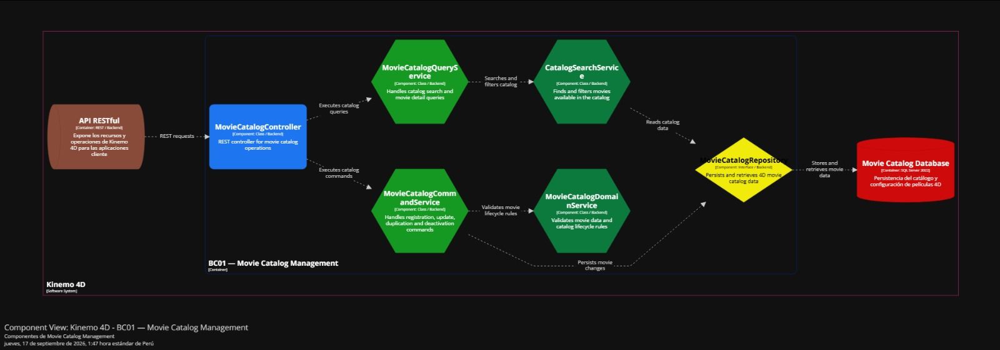
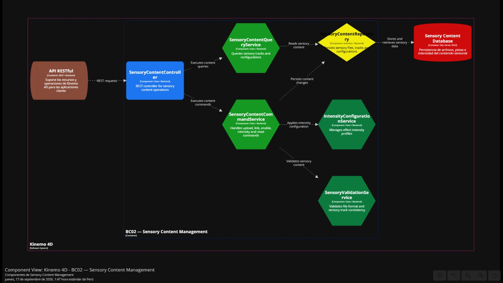
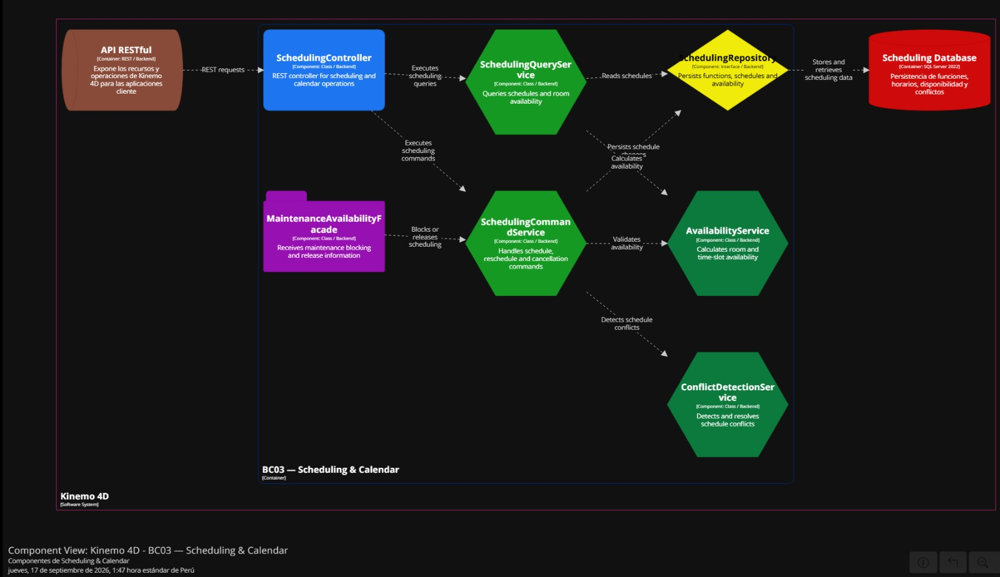
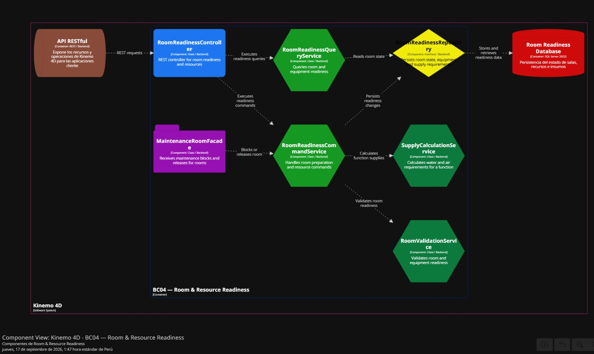
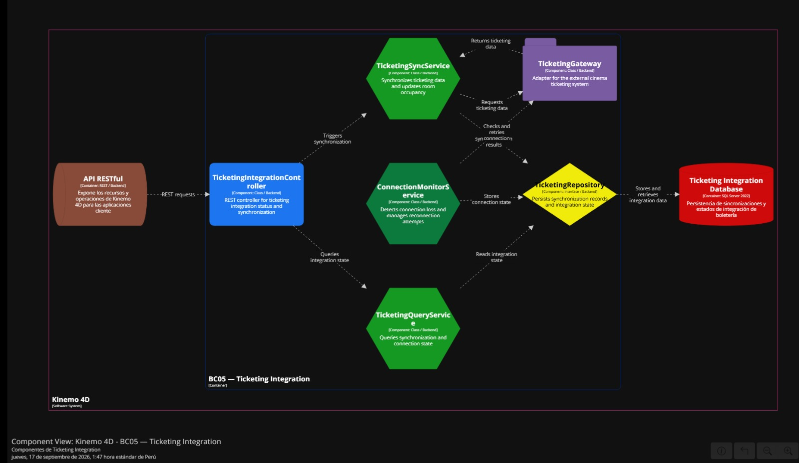
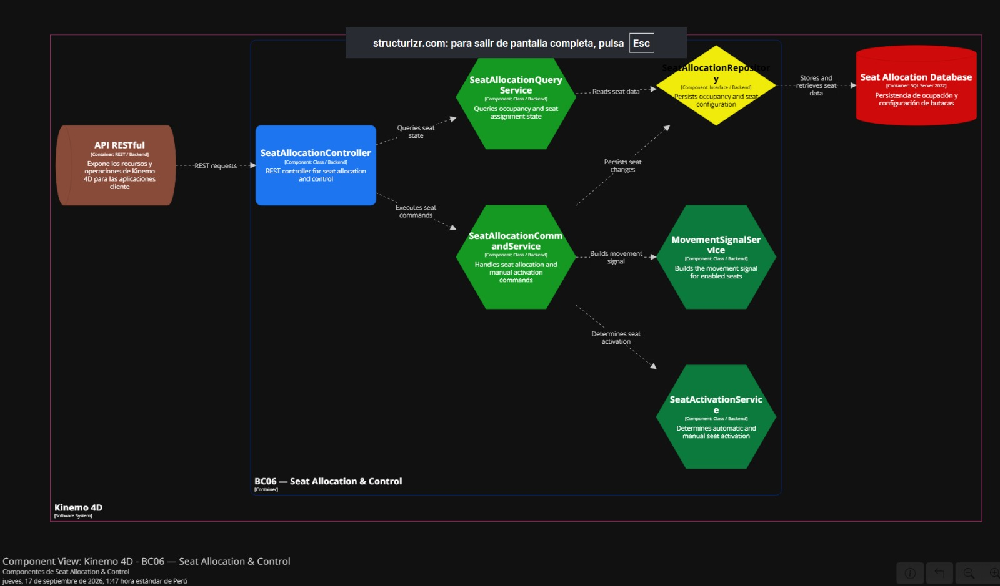
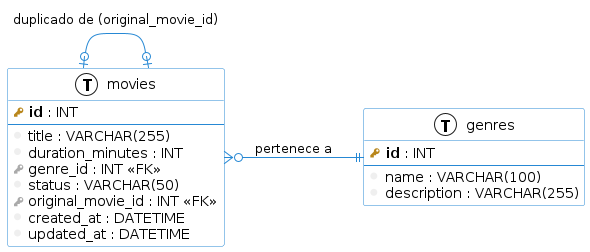
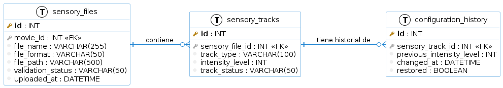
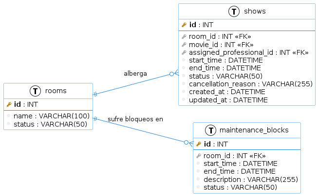

# Informe de Trabajo Final — Kinemo

## Carátula

| Campo | Valor                                           |
|---|-------------------------------------------------|
| Universidad | Universidad Peruana de Ciencias Aplicadas (UPC) |
| Carrera | Ingeniería de Software                          |
| Ciclo | 2026-20                                         |
| Código y Nombre del Curso | 1ASI0730 – Aplicaciones Web                     |
| NRC | 8155                                            |
| Profesor | Angel Augusto Velasquez Nuñez                   |
| Nombre del Startup | VonNeuman New Men                               |
| Nombre del Producto | Kinemo                                          |
| año | 2026                                            |

**Integrantes**

| Código      | Apellidos y Nombres                  |
|-------------|--------------------------------------|
| u202319398  | Llamozas Diaz, Edson Diego           |
| u202212327  | Flores Chavez, Fabricio              |
| u20241b932  | Huamanchumo Chicchon, Felipe Marcelo |
| u202318865  | Trigoso Garrido, Cristian Joseph     |
| u202412041  | Correa Rodriguez, Andrea Khristina   |

## Registro de Versiones del Informe

| Versión | Fecha | Autor | Descripción de modificación |
|---|---|---|---|
| 1.0 | |  |  |

## Project Report Collaboration Insights

Repositorio del Project Report: `https://github.com/kinemo-cinema/kinemo-cinema-report`

> _Pendiente — a partir de AV1, agregar explicación del proceso de elaboración del informe y capturas de los analíticos de colaboración/commits de GitHub._

## Contenido

- [Student Outcome](#student-outcome)
- [Capítulo I: Introducción](#capítulo-i-introducción)
    - [1.1 Startup Profile](#11-startup-profile)
        - [1.1.1 Descripción de la Startup](#111-descripción-de-la-startup)
        - [1.1.2 Perfiles de integrantes del equipo](#112-perfiles-de-integrantes-del-equipo)
    - [1.2 Solution Profile](#12-solution-profile)
        - [1.2.1 Antecedentes y problemática](#121-antecedentes-y-problemática)
        - [1.2.2 Lean UX Process](#122-lean-ux-process)
            - [1.2.2.1 Lean UX Problem Statements](#1221-lean-ux-problem-statements)
            - [1.2.2.2 Lean UX Assumptions](#1222-lean-ux-assumptions)
            - [1.2.2.3 Lean UX Hypothesis Statements](#1223-lean-ux-hypothesis-statements)
            - [1.2.2.4 Lean UX Canvas](#1224-lean-ux-canvas)
    - [1.3 Segmentos objetivo](#13-segmentos-objetivo)
- [Capítulo II: Requirements Elicitation & Analysis](#capítulo-ii-requirements-elicitation--analysis)
    - [2.1 Competidores](#21-competidores)
        - [2.1.1 Análisis competitivo](#211-análisis-competitivo)
        - [2.1.2 Estrategias y tácticas frente a competidores](#212-estrategias-y-tácticas-frente-a-competidores)
    - [2.2 Entrevistas](#22-entrevistas)
        - [2.2.1 Diseño de entrevistas](#221-diseño-de-entrevistas)
        - [2.2.2 Registro de entrevistas](#222-registro-de-entrevistas)
        - [2.2.3 Análisis de entrevistas](#223-análisis-de-entrevistas)
    - [2.3 Needfinding](#23-needfinding)
        - [2.3.1 User Personas](#231-user-personas)
        - [2.3.2 User Task Matrix](#232-user-task-matrix)
        - [2.3.3 User Journey Mapping](#233-user-journey-mapping)
        - [2.3.4 Empathy Mapping](#234-empathy-mapping)
    - [2.4 Big Picture EventStorming](#24-big-picture-eventstorming)
    - [2.5 Ubiquitous Language](#25-ubiquitous-language)
- [Capítulo III: Requirements Specification](#capítulo-iii-requirements-specification)
    - [3.1 User Stories](#31-user-stories)
    - [3.2 Impact Mapping](#32-impact-mapping)
    - [3.3 Product Backlog](#33-product-backlog)
- [Capítulo IV: Product Design](#capítulo-iv-product-design)
    - [4.1 Style Guidelines](#41-style-guidelines)
        - [4.1.1 General Style Guidelines](#411-general-style-guidelines)
        - [4.1.2 Web Style Guidelines](#412-web-style-guidelines)
    - [4.2 Information Architecture](#42-information-architecture)
        - [4.2.1 Organization Systems](#421-organization-systems)
        - [4.2.2 Labeling Systems](#422-labeling-systems)
        - [4.2.3 SEO Tags and Meta Tags](#423-seo-tags-and-meta-tags)
        - [4.2.4 Searching Systems](#424-searching-systems)
        - [4.2.5 Navigation Systems](#425-navigation-systems)
    - [4.3 Landing Page UI Design](#43-landing-page-ui-design)
        - [4.3.1 Landing Page Wireframe](#431-landing-page-wireframe)
        - [4.3.2 Landing Page Mock-up](#432-landing-page-mock-up)
    - [4.4 Web Applications UX/UI Design](#44-web-applications-uxui-design)
        - [4.4.1 Web Applications Wireframes](#441-web-applications-wireframes)
        - [4.4.2 Web Applications Wireflow Diagrams](#442-web-applications-wireflow-diagrams)
        - [4.4.3 Web Applications Mock-ups](#443-web-applications-mock-ups)
        - [4.4.4 Web Applications User Flow Diagrams](#444-web-applications-user-flow-diagrams)
    - [4.5 Web Applications Prototyping](#45-web-applications-prototyping)
    - [4.6 Domain-Driven Software Architecture](#46-domain-driven-software-architecture)
        - [4.6.1 Design-Level EventStorming](#461-design-level-eventstorming)
        - [4.6.2 Software Architecture Context Diagram](#462-software-architecture-context-diagram)
        - [4.6.3 Software Architecture Container Diagrams](#463-software-architecture-container-diagrams)
        - [4.6.4 Software Architecture Component Diagrams](#464-software-architecture-component-diagrams)
    - [4.7 Software Object-Oriented Design](#47-software-object-oriented-design)
        - [4.7.1 Class Diagrams](#471-class-diagrams)
    - [4.8 Database Design](#48-database-design)
        - [4.8.1 Database Diagrams](#481-database-diagrams)
- [Capítulo V: Product Implementation, Validation & Deployment](#capítulo-v-product-implementation-validation--deployment)
    - [5.1 Software Configuration Management](#51-software-configuration-management)
        - [5.1.1 Software Development Environment Configuration](#511-software-development-environment-configuration)
        - [5.1.2 Source Code Management](#512-source-code-management)
        - [5.1.3 Source Code Style Guide & Coding Conventions](#513-source-code-style-guide--coding-conventions)
        - [5.1.4 Software Deployment Configuration](#514-software-deployment-configuration)
    - [5.2 Landing Page, Services & Applications Implementation](#52-landing-page-services--applications-implementation)
        - [5.2.1 Sprint 1 (AV1)](#521-sprint-1-av1)
        - [5.2.2 Sprint 2 (TB1)](#522-sprint-2-tb1)
        - [5.2.3 Sprint 3 (AV2)](#523-sprint-3-av2)
        - [5.2.4 Sprint 4 (TB2)](#524-sprint-4-tb2)
    - [5.3 Validation Interviews](#53-validation-interviews)
        - [5.3.1 Diseño de Entrevistas](#531-diseño-de-entrevistas)
        - [5.3.2 Registro de Entrevistas](#532-registro-de-entrevistas)
        - [5.3.3 Evaluaciones según heurísticas](#533-evaluaciones-según-heurísticas)
    - [5.4 Video About-the-Product](#54-video-about-the-product)
- [Conclusiones](#conclusiones)
    - [Conclusiones y recomendaciones](#conclusiones-y-recomendaciones)
    - [Video About-the-Team](#video-about-the-team)
- [Bibliografía](#bibliografía)
- [Anexos](#anexos)
    - [Anexo A. Videos de Exposiciones](#anexo-a-videos-de-exposiciones)

## Student Outcome

El curso contribuye al cumplimiento del Student Outcome ABET:

**ABET – EAC - Student Outcome 5**

Criterio: La capacidad de funcionar efectivamente en un equipo cuyos miembros juntos proporcionan liderazgo, crean un entorno de colaboración e inclusivo, establecen objetivos, planifican tareas y cumplen objetivos.

En el siguiente cuadro se describe las acciones realizadas y enunciados de conclusiones por parte del grupo, que permiten sustentar el haber alcanzado el logro del ABET – EAC - Student Outcome 5.

| Criterio específico | Acciones realizadas | Conclusiones |
|--|---|---|
|  |  |  |

## Capítulo I: Introducción

### 1.1 Startup Profile

#### 1.1.1 Descripción de la Startup

Kinemo es una startup de tecnología para entretenimiento cinematográfico que provee a cadenas de cine pequeñas y medianas una solución integral de experiencias inmersivas: butacas con movimiento y efectos físicos sincronizados (viento, vibración, entre otros), servicio de mantenimiento especializado y un software propio de gestión operativa.

Kinemo nace para cerrar la brecha entre las grandes cadenas de cine —que ya cuentan con tecnología inmersiva propietaria como 4DX o D-BOX— y las cadenas pequeñas y medianas, que hoy no pueden competir en experiencia de usuario debido al alto costo de inversión y a la falta de conocimiento técnico especializado para operar y mantener este tipo de tecnología por cuenta propia.

Tagline: "Cine que se siente."

Misión: Democratizar el acceso a experiencias cinematográficas inmersivas, permitiendo que cadenas de cine de cualquier tamaño ofrezcan a sus espectadores sensaciones físicas sincronizadas con el contenido, a través de una solución accesible de hardware, mantenimiento y software de gestión.

#### 1.1.2 Perfiles de integrantes del equipo

> _Pendiente — completar en `feature/startup-profile` (foto, nombres, código, carrera, conocimientos técnicos por integrante)._

### 1.2 Solution Profile

#### 1.2.1 Antecedentes y problemática

Análisis 5W2H

Who (¿Quién?): cadenas de cine pequeñas y medianas —operadas de forma independiente o familiar, con un número reducido de complejos— y su personal operativo/técnico, que hoy no cuentan con tecnología de entretenimiento inmersivo en sus salas.
What (¿Qué?): la imposibilidad de ofrecer experiencias de cine inmersivo (butacas con movimiento, efectos físicos sincronizados) comparables a las de las grandes cadenas, debido al alto costo de inversión y a la falta de conocimiento técnico especializado para operar y mantener este tipo de tecnología por cuenta propia.
Where (¿Dónde?): mercados donde conviven pocas cadenas dominantes de gran escala con varias cadenas regionales más pequeñas; inicialmente el proyecto se enfoca en el mercado peruano, con potencial de expansión a otros países de Latinoamérica.
When (¿Cuándo?): el problema se ha intensificado en los últimos años, conforme las cadenas líderes han adoptado formatos inmersivos propietarios (4DX, D-BOX) como diferenciador frente a la competencia, ampliando la brecha de experiencia frente a las cadenas más pequeñas.
Why (¿Por qué?): porque los proveedores actuales de tecnología inmersiva dirigen su modelo comercial principalmente a cadenas de gran escala, exigiendo una inversión de capital y una infraestructura técnica que las cadenas pequeñas y medianas no pueden asumir por sí solas.
How (¿Cómo?): actualmente estas cadenas continúan operando salas convencionales sin posibilidad de diferenciarse en experiencia, lo que las expone a perder espectadores frente a cadenas más grandes o a otras formas de entretenimiento en el hogar.
How Much (¿Cuánto?): el mercado de exhibición cinematográfica peruano está altamente concentrado en dos cadenas líderes, mientras que un conjunto de cadenas más pequeñas —como UVK Multicines (5 complejos a nivel nacional), Cinerama, Cine Star y Movie Time— compiten por una porción menor del mercado; dimensionar con precisión el impacto económico de esta brecha requiere profundizar con fuentes primarias (entrevistas) además de las fuentes secundarias consultadas.

**Enunciado del problema**

Las cadenas de cine pequeñas y medianas no pueden ofrecer experiencias de entretenimiento inmersivo comparables a las de las grandes cadenas, debido al alto costo de la tecnología propietaria existente en el mercado, a la falta de conocimiento técnico especializado para operarla y mantenerla, y a la ausencia de un software de gestión adecuado para su operación diaria. Esto las deja en desventaja competitiva frente a cadenas líderes que ya ofrecen este tipo de experiencia como diferenciador.

**Puntos más importantes que debe resolver la solución propuesta**

Reducir la barrera de inversión de capital necesaria para adoptar tecnología de entretenimiento inmersivo.
Suplir la falta de conocimiento técnico especializado del personal operativo mediante software de gestión simple y soporte de mantenimiento incluido.
Permitir que el personal operativo programe funciones y perfiles de efectos sin fricción, integrando esta gestión con la operación diaria de la sala.
Comunicar de forma clara la propuesta de valor a los tomadores de decisión de las cadenas de cine (Landing Page) y facilitar el paso de la evaluación a la contratación.

**Objetivos del proyecto**

Diseñar y desarrollar una solución de software (Landing Page, Web Application y RESTful API) que dé soporte al modelo de negocio de Kinemo, permitiendo gestionar la programación de funciones, la sincronización de efectos y el mantenimiento de las salas.
Validar la propuesta de valor y los Assumptions del modelo de negocio mediante entrevistas con gerentes/propietarios de cadenas de cine y con su personal operativo.
Desplegar progresivamente versiones funcionales del producto digital a lo largo del ciclo académico, cumpliendo con los hitos AV1, TB1, AV2 y TB2.

**Restricciones que delimitan el alcance del proyecto**

El alcance académico del proyecto se limita al desarrollo del software (Landing Page, Web Application, RESTful API); la fabricación física de butacas y actuadores de efectos se trata como un supuesto de negocio (Business Assumption), no como un entregable de ingeniería de software.
El desarrollo se realiza dentro del calendario académico del ciclo 2026-20 (15 semanas).
El backend debe implementarse en C# sobre ASP.NET Core, y el frontend en Vue, conforme a los lineamientos tecnológicos del curso.
Las entrevistas y validaciones se limitan a 3–5 participantes por segmento objetivo, dado el carácter académico del proyecto.

#### 1.2.2 Lean UX Process

#### 1.2.2 Lean UX Process

Para abordar el dominio del problema se aplicó el Lean UX Process, cuyo objetivo es validar de forma temprana y económica las creencias del equipo sobre el negocio, los usuarios y la solución antes de invertir en su construcción completa. A continuación se presenta el Problem Statement consolidado del proyecto, los Assumptions identificados por categoría, los Hypothesis Statements derivados de los Feature Assumptions, y finalmente el Lean UX Canvas que resume el proceso.

##### 1.2.2.1 Lean UX Problem Statements

El estado actual del dominio de **entretenimiento cinematográfico inmersivo** se ha enfocado principalmente en **cadenas de cine grandes**, que cuentan con el capital suficiente para adquirir tecnología propietaria de efectos sincronizados (butacas con movimiento, viento, aromas, entre otros), dejando de lado a las **cadenas de cine pequeñas y medianas**, cuyos puntos de dolor son la imposibilidad de competir en experiencia de usuario frente a las grandes cadenas, la falta de conocimiento técnico especializado para operar y mantener este tipo de tecnología, y flujos de trabajo de programación de funciones y mantenimiento de sala que siguen siendo manuales y desarticulados.

Lo que los productos y proveedores existentes de tecnología inmersiva (por ejemplo, soluciones propietarias de efectos 4D) no logran abordar es una **oferta integral y accesible** dirigida específicamente a cadenas pequeñas y medianas, que combine el hardware (butacas motorizadas y actuadores de efectos), el mantenimiento especializado y un software de gestión, bajo un modelo que no exija una inversión de capital equivalente a la de una gran cadena.

Nuestro producto/servicio abordará esta brecha ofreciendo una **solución llave en mano de entretenimiento inmersivo** —butacas con movimiento y efectos físicos sincronizados (viento, vibración, entre otros), servicio de mantenimiento y un software de gestión propio— bajo un modelo comercial más accesible que el de los proveedores tradicionales, permitiendo a cines pequeños y medianos ofrecer experiencias comparables a las de las grandes cadenas.

Nuestro enfoque inicial será las **cadenas de cine pequeñas y medianas que actualmente no cuentan con salas de experiencia inmersiva**, junto con el personal operativo/técnico de dichas salas, responsable de la programación de funciones y del mantenimiento del equipamiento.

Sabremos que somos exitosos cuando veamos que estas cadenas de cine **contratan el servicio, programan funciones de forma recurrente en las salas inmersivas instaladas, renuevan sus contratos de mantenimiento, y reportan un incremento medible en la venta de entradas premium** en las salas equipadas con nuestra solución.

##### 1.2.2.2 Lean UX Assumptions

**Business Assumptions**
- Creemos que el mercado de cadenas de cine pequeñas y medianas en la región representa una oportunidad desatendida por los proveedores actuales de tecnología de entretenimiento inmersivo.
- Creemos que un modelo de servicio (hardware + mantenimiento + software, en lugar de venta directa de equipos) reduce la barrera de inversión de capital para este segmento.
- Creemos que podemos generar ingresos recurrentes mediante contratos de mantenimiento y actualizaciones periódicas del software de gestión.
- Creemos que las cadenas de cine estarán dispuestas a firmar contratos de mediano/largo plazo a cambio de condiciones comerciales preferenciales.
- Creemos que contamos con la capacidad organizativa para fabricar o ensamblar el hardware de las butacas y ofrecer soporte técnico continuo a múltiples salas simultáneamente.

**Business Outcome Assumptions**
- Incremento en el número de contratos firmados con cadenas de cine (por ejemplo, de 0 a un número determinado de cadenas contratadas en un periodo de tiempo definido).
- Reducción del tiempo promedio de instalación y puesta en marcha de una sala inmersiva.
- Incremento en la tasa de renovación de los contratos de mantenimiento.
- Reducción del costo de adquisición de clientes mediante referidos de cadenas que ya cuentan con la solución instalada.
- Incremento del ingreso promedio por sala instalada gracias a servicios adicionales del software de gestión.

**User Assumptions**
- Gerentes de operaciones y/o propietarios de cadenas de cine pequeñas y medianas, con poder de decisión sobre inversión en tecnología para sus salas.
- Personal técnico/operativo de las salas de cine, responsable de configurar, programar y dar mantenimiento a las butacas y efectos.
- Espectadores finales de las salas de cine, que asisten buscando una experiencia audiovisual más dinámica.

**User Outcome and Benefit Assumptions**
- Los gerentes de cadenas de cine desean diferenciar su oferta frente a cadenas más grandes sin realizar una inversión de capital prohibitiva.
- El personal operativo desea contar con una herramienta simple para programar funciones y asignar perfiles de efectos sin requerir conocimiento técnico avanzado.
- El personal operativo desea poder reportar y dar seguimiento a incidencias de mantenimiento de forma centralizada.
- Los espectadores finales desean sentir que forman parte de la película mediante movimiento de butacas, viento y otras sensaciones físicas sincronizadas con el contenido.

**Feature Assumptions**
- Un panel de administración web que permita programar funciones y asignar perfiles de efectos a cada película.
- Un motor de sincronización entre el contenido audiovisual y los efectos físicos (movimiento de butacas, viento, entre otros).
- Un módulo de gestión de mantenimiento preventivo y correctivo del hardware instalado en cada sala.
- Un dashboard de analítica sobre el uso, desempeño y estado de las salas instaladas.
- Un Landing Page dirigido a cadenas de cine que comunique la propuesta de valor del negocio y permita solicitar una demostración o cotización.

##### 1.2.2.3 Lean UX Hypothesis Statements

**H1**
Creemos que lograremos incrementar el número de contratos firmados con cadenas de cine si los gerentes de operaciones de cadenas pequeñas y medianas logran evaluar y contratar el servicio de forma clara y rápida, con un panel de administración web que les permita programar funciones y asignar perfiles de efectos a cada película.

**H2**
Creemos que lograremos incrementar la retención de clientes y la venta de entradas premium si los espectadores finales logran sentir que forman parte de la película, mediante un motor de sincronización entre el contenido audiovisual y los efectos físicos de las butacas.

**H3**
Creemos que lograremos incrementar la tasa de renovación de los contratos de mantenimiento si el personal operativo de las salas logra reportar y resolver incidencias de forma centralizada, con un módulo de gestión de mantenimiento preventivo y correctivo.

**H4**
Creemos que lograremos incrementar el ingreso promedio por sala instalada si los gerentes de operaciones logran monitorear el desempeño de sus salas, con un dashboard de analítica sobre uso, desempeño y estado del hardware instalado.

**H5**
Creemos que lograremos reducir el costo de adquisición de clientes si los gerentes de cadenas de cine logran conocer la propuesta de valor del negocio y solicitar una demostración de forma sencilla, con un Landing Page claro y orientado a su segmento.

##### 1.2.2.4 Lean UX Canvas

| Bloque | Contenido |
|---|---|
| **1. Business Problem** | Las cadenas de cine pequeñas y medianas no pueden ofrecer experiencias de entretenimiento inmersivo comparables a las de las grandes cadenas, debido al alto costo de la tecnología propietaria, la falta de conocimiento técnico especializado y la ausencia de un software de gestión adecuado. |
| **2. Business Outcomes** | Incremento en el número de cadenas de cine contratadas; incremento en el ingreso promedio por sala instalada; incremento en la tasa de renovación de contratos de mantenimiento; reducción del costo de adquisición de clientes. |
| **3. Users** | Gerentes de operaciones/propietarios de cadenas de cine pequeñas y medianas; personal técnico/operativo de las salas de cine; espectadores finales de las salas de cine. |
| **4. User Outcomes & Benefits** | Diferenciación competitiva sin alta inversión de capital (gerentes); simplicidad operativa en la programación y mantenimiento de salas (personal operativo); mayor inmersión y disfrute de la experiencia (espectadores finales). |
| **5. Solutions** | Butacas con movimiento y efectos físicos sincronizados; servicio de mantenimiento especializado; software de gestión (panel de programación de funciones, motor de sincronización, módulo de mantenimiento, dashboard de analítica); Landing Page y Web Application. |
| **6. Hypotheses** | H1 a H5 (ver sección 1.2.2.3), priorizadas según su impacto en los Business Outcomes definidos. |
| **7. What's the most important thing we need to learn first?** | Si los gerentes de cadenas de cine pequeñas y medianas perciben la solución integral (hardware + mantenimiento + software) como suficientemente accesible y valiosa como para justificar la contratación frente a no invertir en tecnología inmersiva. |
| **8. What's the least amount of work we need to do to learn the next most important thing?** | Realizar entrevistas de validación con gerentes de cadenas de cine pequeñas/medianas presentando el concepto de la solución y un prototipo de baja fidelidad del panel de administración y del Landing Page, para medir su nivel de interés y disposición a contratar. |

### 1.3 Segmentos objetivo

El mercado de exhibición cinematográfica en Perú está altamente concentrado: dos cadenas líderes —Cineplanet y Cinemark— capturan en conjunto más de dos tercios de la cuota de mercado, mientras que un grupo de cadenas más pequeñas (UVK Multicines, Cinerama, Cine Star, Movie Time, entre otras) se reparten el resto. Kinemo se enfoca en este segundo grupo, que compite en un mercado dominado por actores de mayor escala sin contar con presupuesto propio para adoptar tecnología inmersiva por su cuenta.

**Segmento 1: Gerentes de Operaciones / Propietarios de cadenas de cine pequeñas y medianas**

**Perfil firmográfico**
- Cadenas peruanas independientes o familiares con entre 1 y 10 complejos a nivel nacional (ejemplo de referencia: UVK Multicines, con 5 complejos a nivel nacional).
- Cuota de mercado individual minoritaria frente a los líderes del sector, generalmente concentradas en Lima con posible presencia en provincias.
- Sin tecnología de entretenimiento inmersivo instalada actualmente en ninguno de sus complejos.

**Perfil demográfico del tomador de decisión**
- Edad aproximada: 35–55 años.
- Rol: Gerente General, Gerente de Operaciones o Propietario/Socio de la cadena.
- Nivel educativo: superior universitario, frecuentemente con formación en administración o gestión de negocios.
- Ubicación: principalmente Lima Metropolitana, con posibilidad de gerencias regionales en otras ciudades.

> Las motivaciones y frustraciones de este segmento se plantean como Assumptions en la sección 1.2.2.2 y se validarán con datos reales al construir el User Persona correspondiente en la sección 2.3.1, una vez realizadas las entrevistas.

**Segmento 2: Personal Operativo / Técnico de las salas de cine**

**Perfil demográfico**
- Edad aproximada: 20–40 años.
- Rol: Jefe de sala, coordinador de operaciones, técnico de mantenimiento o proyeccionista.
- Nivel educativo: variable, desde educación técnica hasta universitaria; no necesariamente con formación en tecnología.
- Ubicación: en el mismo complejo de cine donde trabaja, dentro del área de influencia de la cadena.

**Segmento 2: Personal Operativo / Técnico de las salas de cine**

## Capítulo II: Requirements Elicitation & Analysis

### 2.1 Competidores

Para el análisis de competencia se identificaron tres competidores indirectos con ofertas parcialmente similares a nuestro modelo de negocio. Se consideran indirectos porque, si bien ofrecen tecnología de entretenimiento inmersivo para salas de cine (motion seats y efectos físicos sincronizados), su modelo comercial está orientado principalmente a grandes cadenas internacionales, y no ofrecen de forma explícita un paquete integral accesible pensado para cadenas pequeñas y medianas como el que propone nuestra startup.

- **Competidor 1: 4DX (CJ 4DPLEX)** — Tecnología 4D desarrollada por CJ 4DPLEX, subsidiaria de la cadena surcoreana CJ CGV, que opera cientos de salas 4DX alrededor del mundo mediante alianzas con grandes cadenas (Cinépolis, Cineworld/Regal, AMC, Kinepolis, entre otras).
- **Competidor 2: D-BOX Technologies** — Empresa canadiense pionera en butacas con retroalimentación háptica (motion, vibración y textura), con despliegues masivos en cadenas grandes de Norteamérica como Cinemark.
- **Competidor 3: MediaMation (MX4D)** — Empresa estadounidense integradora de sistemas de butacas con efectos EFX (movimiento, viento, agua, aromas), que ofrece paquetes de teatro completos (butacas, audio, proyección, pantallas, instalación y mantenimiento) y que declara contar con un modelo de negocio más flexible, lo que le ha permitido trabajar también con cadenas familiares de tamaño medio en Estados Unidos.

#### 2.1.1 Análisis competitivo

**Competitive Analysis Landscape**

**¿Por qué llevar a cabo este análisis?** Buscamos comprender cómo los proveedores actuales de tecnología de entretenimiento inmersivo para cines abordan (o dejan de abordar) al segmento de cadenas pequeñas y medianas, para identificar la brecha de mercado que nuestra startup puede ocupar.

| | **Nuestra Startup** | **Competidor 1: 4DX (CJ 4DPLEX)** | **Competidor 2: D-BOX Technologies** | **Competidor 3: MediaMation (MX4D)** |
|---|---|---|---|---|
| **Overview** | Startup que ofrece una solución integral (butacas con movimiento, efectos físicos sincronizados, mantenimiento y software de gestión) dirigida específicamente a cadenas de cine pequeñas y medianas. | Formato de cine 4D con motion seats, viento, luces estroboscópicas, nieve simulada y aromas, operado bajo licencia en alianza con grandes cadenas internacionales. | Butacas con tecnología háptica patentada (movimiento, vibración, textura), reconocida por la precisión de su sincronización, con despliegues masivos en cadenas grandes de Norteamérica. | Integrador de sistemas de efectos EFX en butacas (movimiento, viento, agua, aromas), con paquetes de teatro completos y un modelo de negocio que declara ser flexible para distintos tamaños de cadena. |
| **Ventaja competitiva** | Enfoque exclusivo en el segmento desatendido de cadenas pequeñas/medianas, con menor barrera de inversión y soporte técnico especializado incluido. | Marca globalmente reconocida, respaldo de un conglomerado de medios (CJ Group) y alianzas con las cadenas más grandes del mundo. | Tecnología háptica de alta precisión, validada incluso fuera de la industria del cine (licenciada para simulación en automovilismo). | Flexibilidad de su modelo comercial y experiencia como integrador de sistemas completos (hardware + software + instalación). |
| **¿Qué valor ofrece a los clientes?** | Capacidad de ofrecer experiencias inmersivas comparables a las grandes cadenas, sin necesitar una inversión de capital ni un equipo técnico propio especializado. | Incremento comprobado en ingresos por entradas premium y diferenciación de marca a nivel global. | Incremento de asistencia y satisfacción del cliente, con la posibilidad de equipar solo algunas filas de un auditorio en lugar de la sala completa. | Paquete llave en mano adaptable al tamaño del auditorio, con mantenimiento simplificado gracias a su sistema neumático de bajo mantenimiento. |
| **Mercado objetivo** | Cadenas de cine pequeñas y medianas sin presencia de salas inmersivas, en mercados regionales desatendidos. | Grandes cadenas y multiplexes internacionales con alto volumen de espectadores. | Grandes cadenas norteamericanas y multiplexes con alta capacidad de inversión. | Cadenas de cine de diverso tamaño en Estados Unidos y mercados internacionales, incluyendo algunas cadenas familiares de tamaño medio. |
| **Estrategias de marketing** | Marketing directo B2B hacia gerentes de cadenas pequeñas/medianas, mostrando el retorno de inversión y la accesibilidad del modelo de servicio. | Marketing de marca a través de alianzas de alto perfil con cadenas líderes y campañas ligadas al estreno de blockbusters. | Testimonios de cadenas líderes y casos de éxito de incremento de ingresos por butaca instalada. | Casos de éxito con cadenas medianas/familiares, resaltando la adaptabilidad del sistema a distintos formatos de sala. |
| **Productos & Servicios** | Butacas con movimiento, efectos físicos sincronizados, mantenimiento especializado y software propio de gestión (programación, sincronización, mantenimiento, analítica). | Salas 4DX completas licenciadas, con catálogo de películas codificadas para el formato. | Butacas de movimiento háptico (por fila o auditorio completo) y catálogo de títulos codificados. | Paquetes de teatro EFX (butacas, audio, proyección, pantallas), software propietario de sincronización de contenido (ShowFlow/Vidshow). |
| **Precios & Costos** | Modelo de servicio con menor inversión inicial frente a la competencia; información exacta pendiente de definir en el modelo financiero del proyecto. | Recargo aproximado de USD 8 adicionales por entrada en mercados como Estados Unidos; inversión de instalación negociada directamente por sala/cadena, no pública. | Recargo histórico de aproximadamente USD 8 por entrada; costos de instalación negociados directamente con cada cadena, no públicos. | Costos de paquete negociados directamente con cada cadena; no se dispone de tarifas públicas. |
| **Canales de distribución (Web y/o Móvil)** | Landing Page B2B con solicitud de demo/cotización, integrado a una Web Application de gestión para el personal operativo de las salas contratantes. | Sitio web corporativo institucional (CJ 4DPLEX) y sitios de cada cadena aliada donde se promociona la cartelera 4DX. | Sitio web corporativo con blog informativo y sección de "ultimate guide"; presencia en sitios de cadenas aliadas. | Sitio web corporativo con información de producto por segmento (cines, atracciones, eSports). |

**Análisis SWOT**

**Nuestra Startup**
- Fortalezas: enfoque exclusivo en un segmento desatendido; propuesta integral (hardware + mantenimiento + software) en un solo proveedor; modelo de servicio con menor barrera de inversión.
- Debilidades: marca nueva sin trayectoria ni casos de éxito comprobados; escala de producción y soporte técnico aún por construir; menor músculo financiero frente a competidores establecidos.
- Oportunidades: mercado de cadenas pequeñas/medianas desatendido por los líderes actuales; posibilidad de posicionarse como el proveedor de referencia regional antes que los grandes jugadores globales lleguen a ese segmento.
- Amenazas: que un competidor grande (4DX, D-BOX o MediaMation) decida bajar su barrera de entrada y dirigirse también a cadenas pequeñas/medianas; posibles barreras regulatorias o de importación de hardware.

**Competidor 1: 4DX (CJ 4DPLEX)**
- Fortalezas: reconocimiento de marca global; respaldo financiero de un conglomerado; alianzas con las cadenas más grandes del mundo.
- Debilidades: modelo orientado a grandes volúmenes, lo que implica alta inversión de capital difícil de justificar para una cadena pequeña/mediana.
- Oportunidades: expansión hacia mercados emergentes donde aún no tiene presencia.
- Amenazas: proveedores más ágiles y accesibles que capturen al segmento de cadenas pequeñas/medianas antes que ellos.

**Competidor 2: D-BOX Technologies**
- Fortalezas: tecnología háptica de alta precisión, validada incluso en otras industrias; flexibilidad de instalar solo algunas filas.
- Debilidades: fuerte dependencia de cadenas grandes de Norteamérica como cliente principal; menor presencia en mercados de cadenas pequeñas/medianas fuera de esa región.
- Oportunidades: diversificar su cartera de clientes hacia cadenas más pequeñas mediante instalaciones parciales.
- Amenazas: nuevos proveedores que ofrezcan una propuesta de mantenimiento y gestión más completa (no solo hardware) dirigida a cadenas medianas.

**Competidor 3: MediaMation (MX4D)**
- Fortalezas: modelo de negocio flexible que ya ha demostrado funcionar con cadenas familiares de tamaño medio; oferta de paquete completo con mantenimiento simplificado.
- Debilidades: sigue estando enfocado principalmente en el mercado estadounidense; no ofrece explícitamente un software de gestión integral para el día a día operativo de la cadena (más allá de la sincronización de contenido).
- Oportunidades: expandirse hacia mercados de Latinoamérica con su modelo flexible.
- Amenazas: que un competidor regional (como nuestra startup) capture el mercado de cadenas pequeñas/medianas en Latinoamérica antes de que ellos expandan su presencia ahí.

#### 2.1.2 Estrategias y tácticas frente a competidores

- **Frente a la fortaleza de marca y respaldo financiero de 4DX**: en lugar de competir en reconocimiento global, la startup se posicionará como el proveedor especializado y cercano para cadenas pequeñas/medianas en el mercado regional, ofreciendo atención directa y personalizada que un proveedor global no prioriza para clientes de menor escala.
- **Frente a la precisión tecnológica de D-BOX**: la startup destacará que su propuesta no es solo hardware, sino una solución integral que incluye software de gestión y mantenimiento continuo, cubriendo una necesidad que D-BOX no resuelve directamente (la gestión operativa diaria de la sala).
- **Frente al modelo flexible de MediaMation**: dado que es el competidor más cercano en enfoque, la táctica principal será acelerar la presencia en el mercado regional/local antes de que MediaMation decida expandir su modelo flexible hacia esta región, y diferenciarse ofreciendo un dashboard de analítica y un módulo de mantenimiento como parte nativa del software, no como un servicio adicional.
- **Táctica general de precios**: aprovechar la debilidad compartida por los tres competidores (falta de un modelo de precios accesible y transparente para cadenas pequeñas/medianas) ofreciendo un modelo de servicio por suscripción/contrato que reduce la inversión inicial de capital.
- **Táctica de canal digital**: mientras los competidores mantienen sitios web mayormente institucionales, la startup usará su Landing Page como canal de conversión directo (solicitud de demo/cotización) enlazado a la Web Application, acortando el ciclo de ventas B2B.

### 2.2 Entrevistas

#### 2.2.1 Diseño de entrevistas

> _Pendiente — completar en `feature/interview-design`._

#### 2.2.2 Registro de entrevistas

> _Bloqueado — depende de realizar las entrevistas reales a ambos segmentos objetivo._

#### 2.2.3 Análisis de entrevistas

> _Bloqueado — depende de 2.2.2._

### 2.3 Needfinding

#### 2.3.1 User Personas

> _Pendiente — completar en `feature/user-personas`._

#### 2.3.2 User Task Matrix

> _Pendiente — completar en `feature/user-task-matrix`._

#### 2.3.3 User Journey Mapping

> _Pendiente — completar en `feature/journey-maps`._

#### 2.3.4 Empathy Mapping

> _Pendiente — completar en `feature/empathy-maps`._

### 2.4 Big Picture EventStorming

> _Pendiente — completar en `feature/event-storming-big-picture`._

### 2.5 Ubiquitous Language

> _Pendiente — completar en `feature/ubiquitous-language`._

## Capítulo III: Requirements Specification

### 3.1 User Stories

> _Pendiente — completar en `feature/user-stories`._

### 3.2 Impact Mapping

> _Pendiente — completar en `feature/impact-mapping`._

### 3.3 Product Backlog

> _Pendiente — completar en `feature/product-backlog`._

## Capítulo IV: Product Design

### 4.1 Style Guidelines

#### 4.1.1 General Style Guidelines

> _Pendiente — completar en `feature/style-guidelines`._

#### 4.1.2 Web Style Guidelines

> _Pendiente — completar en `feature/style-guidelines`._

### 4.2 Information Architecture

#### 4.2.1 Organization Systems

> _Pendiente — completar en `feature/information-architecture`._

#### 4.2.2 Labeling Systems

> _Pendiente — completar en `feature/information-architecture`._

#### 4.2.3 SEO Tags and Meta Tags

> _Pendiente — completar en `feature/information-architecture`._

#### 4.2.4 Searching Systems

> _Pendiente — completar en `feature/information-architecture`._

#### 4.2.5 Navigation Systems

> _Pendiente — completar en `feature/information-architecture`._

### 4.3 Landing Page UI Design

#### 4.3.1 Landing Page Wireframe

> _Pendiente — completar en `feature/landing-page-ui`._

#### 4.3.2 Landing Page Mock-up

> _Pendiente — completar en `feature/landing-page-ui`._

### 4.4 Web Applications UX/UI Design

#### 4.4.1 Web Applications Wireframes

> _Pendiente — completar en `feature/web-app-ux`._

#### 4.4.2 Web Applications Wireflow Diagrams

> _Pendiente — completar en `feature/web-app-ux`._

#### 4.4.3 Web Applications Mock-ups

> _Pendiente — completar en `feature/web-app-ux`._

#### 4.4.4 Web Applications User Flow Diagrams

> _Pendiente — completar en `feature/web-app-ux`._

### 4.5 Web Applications Prototyping

> _Pendiente — completar en `feature/web-app-prototyping`._

### 4.6 Domain-Driven Software Architecture

#### 4.6.1 Design-Level EventStorming

> _Pendiente — completar en `feature/domain-driven-architecture`._

#### 4.6.2 Software Architecture Context Diagram

> _Pendiente — completar en `feature/domain-driven-architecture`._

#### 4.6.3 Software Architecture Container Diagrams

> _Pendiente — completar en `feature/domain-driven-architecture`._

Para cada uno de los 12 Bounded Contexts identificados como containers, se elaboró el Component Diagram correspondiente, aplicando un patrón de descomposición interna consistente en todos los casos: un **Controller** que expone la API RESTful del Bounded Context, un grupo de **inboundservices** conformado por Context Facades que reciben solicitudes de otros Bounded Contexts, un grupo interno con las clases del propio dominio (**Repository**, **Query**, **Command**, **CommandService** y **QueryService**) que concentran la lógica de negocio y el acceso a datos, y un grupo de **outboundservices** conformado por External Services que encapsulan la comunicación hacia sistemas externos u otros Bounded Contexts.

A continuación se presenta el detalle para cada Bounded Context.

#### Movie Catalog Management BC

El componente **Movie Catalog Management Controller** expone los endpoints para el registro, búsqueda, edición y desactivación de películas 4D. La **CatalogCommandService** gestiona las operaciones de creación/actualización mediante el **CatalogRepository**, mientras que la **CatalogQueryService** atiende las consultas de búsqueda y filtrado del catálogo. Como outboundservice, un **AmazonS3ExternalService** gestiona el almacenamiento del contenido audiovisual de las películas.

#### Sensory Content Management BC

El **Sensory Content Controller** expone los endpoints para la carga y vinculación de archivos de efectos 4D. La **SensoryContentCommandService** gestiona la creación, validación y habilitación de pistas sensoriales mediante el **SensoryContentRepository**, y la **SensoryContentQueryService** resuelve las consultas de configuración de efectos. Como inboundservice, un **CatalogContextFacade** recibe la notificación de películas registradas desde Movie Catalog Management; como outboundservice, un **AmazonS3ExternalService** gestiona la subida y descarga de archivos de efectos.

#### Scheduling & Calendar BC

El **Scheduling Controller** expone los endpoints de programación y reprogramación de funciones. La **SchedulingCommandService** gestiona la detección/resolución de conflictos de horario y el bloqueo/liberación de disponibilidad mediante el **SchedulingRepository**, y la **SchedulingQueryService** resuelve las consultas de disponibilidad.

#### Room & Resource Readiness BC

El **RoomReadiness Controller** expone los endpoints de cálculo de insumos y verificación de preparación de sala. La **RoomReadinessCommandService** gestiona el cálculo de requerimientos de agua/aire y el bloqueo de sala por mantenimiento mediante el **RoomReadinessRepository**, y la **RoomReadinessQueryService** resuelve las consultas de estado de sala. Como inboundservice, un **SchedulingContextFacade** y un **MaintenanceContextFacade** reciben, respectivamente, la notificación de función programada y de revisión técnica solicitada.

#### Ticketing Integration BC

El **Ticketing Controller** expone los endpoints de sincronización de boletería. La **TicketingCommandService** gestiona la reconexión ante pérdida de enlace mediante el **TicketingRepository**, y la **TicketingQueryService** resuelve las consultas de estado de integración. Como outboundservice, un **SistemaBoleteriaExternalService** encapsula la comunicación con el sistema de boletería externo.

#### Seat Allocation & Control BC

El **SeatAllocation Controller** expone los endpoints de activación/desactivación y mapa de butacas. La **SeatAllocationCommandService** gestiona la actualización de asignación y el estado de las butacas mediante el **SeatAllocationRepository**, y la **SeatAllocationQueryService** resuelve las consultas del mapa de sala. Como inboundservices, un **TicketingContextFacade** y un **EmergencyContextFacade** reciben notificaciones de ocupación y de parada de emergencia, respectivamente; como outboundservice, un **Hardware4DExternalService** envía los comandos de activación a los controladores IoT de las butacas.

> _Pendiente — completar en `feature/domain-driven-architecture`._

### 4.7 Software Object-Oriented Design

#### 4.7.1 Class Diagrams

> _Pendiente — completar en `feature/class-diagrams`._

### 4.8 Database Design

#### 4.8.1 Database Diagrams

## 1. Movie Catalog Management

La base de datos del módulo **Movie Catalog Management** se encuentra estructurada alrededor del agregado principal `movies`, el cual representa y centraliza la información base de las películas 4D registradas en el sistema.

Este agregado almacena atributos fundamentales como `title` y `duration_minutes`, y utiliza el Value Object `status` para gestionar la transición de estados del flujo de *Desactivación de Contenido*, permitiendo clasificar la disponibilidad del recurso en estados como *Activo*, *Inactivo* o *Bloqueado para Programación*.

Para dar soporte a la operativa estructurada del catálogo, el modelo incorpora características y entidades complementarias:

*   **Trazabilidad Autorreferencial:** El agregado `movies` implementa una relación recursiva mediante el atributo `original_movie_id`. Esta estructura da soporte directo al flujo de *Duplicación de Configuración*, permitiendo registrar y modificar copias de una cinta manteniendo intacta la trazabilidad histórica hacia la película de origen.
*   **Entidad `genres`:** Funciona como una entidad de soporte que normaliza la clasificación del contenido. Al separar los géneros en su propia estructura relacional, se elimina la redundancia de datos y se agiliza significativamente la ejecución del flujo de *Búsqueda de Película* mediante filtros estructurados.

> Las relaciones establecidas a través de las claves foráneas (`genre_id`, `original_movie_id`) garantizan la integridad referencial del esquema, asegurando que este Bounded Context administre su propia fuente de verdad de manera normalizada y desacoplada del resto de los módulos del sistema.

## 2. Sensory Content & Experience Management

La base de datos del módulo **Sensory Content & Experience Management** se encuentra estructurada alrededor del agregado principal `sensory_files`, el cual gestiona de manera centralizada la subida y administración del "Archivo de Efectos 4D".

Esta entidad utiliza el Value Object `validation_status` para administrar la transición de estados correspondiente al flujo de *Carga de Archivo de Efectos*, controlando etapas críticas como *Cargado*, *Rechazado* o *Vinculado*. Asimismo, integra el atributo `movie_id`, el cual actúa como clave foránea para establecer una conexión referencial con el catálogo de películas.

A partir de este agregado raíz, el modelo se expande en entidades especializadas para soportar el nivel granular de la experiencia sensorial:

*   **Entidad `sensory_tracks`:** Representa la "Pista Sensorial" individual, permitiendo que un mismo archivo agrupe múltiples pistas (ej. viento, movimiento, agua). Esta entidad emplea el atributo `track_status` para dirigir el ciclo de vida en el flujo de *Validación de Pista Sensorial* (*Validada*, *Rechazada*, *Habilitada para Ejecución*). Por su parte, el campo `intensity_level` da soporte directo al flujo de *Asignación de Intensidad*, almacenando el parámetro operativo validado por el técnico.
*   **Entidad `configuration_history`:** Funciona como una tabla de soporte y auditoría para el flujo de *Restablecimiento de Configuración*. Al almacenar un registro histórico de los cambios aplicados en los niveles de intensidad (`previous_intensity_level`), esta entidad provee al sistema la capacidad de emitir recomendaciones basadas en el uso y permite al técnico de mantenimiento revertir o restablecer la configuración a un estado anterior validado.

> Finalmente, las relaciones establecidas mediante las claves foráneas (`movie_id`, `sensory_file_id`, `sensory_track_id`) garantizan la estricta integridad referencial del modelo, asegurando un diseño normalizado que mantiene el desacoplamiento estructural frente a otros Bounded Contexts del sistema.

---

 

## Capítulo V: Product Implementation, Validation & Deployment

### 5.1 Software Configuration Management

#### 5.1.1 Software Development Environment Configuration

> _Pendiente — completar en `feature/software-configuration-management` (urgente para AV1)._

#### 5.1.2 Source Code Management

> _Pendiente — agregar URLs de los 4 repositorios, explicación de GitFlow, convenciones de branches y Conventional Commits. Completar en `feature/software-configuration-management` (urgente para AV1)._

#### 5.1.3 Source Code Style Guide & Coding Conventions

> _Pendiente — completar en `feature/software-configuration-management`._

#### 5.1.4 Software Deployment Configuration

> _Pendiente — completar en `feature/software-configuration-management`._

### 5.2 Landing Page, Services & Applications Implementation

#### 5.2.1 Sprint 1 (AV1)

##### 5.2.1.1 Sprint Planning 1
> _Pendiente._
##### 5.2.1.2 Aspect Leaders and Collaborators
> _Pendiente._
##### 5.2.1.3 Sprint Backlog 1
> _Pendiente._
##### 5.2.1.4 Development Evidence for Sprint Review
> _Pendiente._
##### 5.2.1.5 Execution Evidence for Sprint Review
> _Pendiente._
##### 5.2.1.6 Services Documentation Evidence for Sprint Review
> _Pendiente._
##### 5.2.1.7 Software Deployment Evidence for Sprint Review
> _Pendiente._
##### 5.2.1.8 Team Collaboration Insights during Sprint
> _Pendiente._

#### 5.2.2 Sprint 2 (TB1)

> _A completar a partir de la entrega TB1. Misma estructura que Sprint 1 (Planning, Aspect Leaders, Backlog, Development/Execution/Services/Deployment Evidence, Team Collaboration Insights)._

#### 5.2.3 Sprint 3 (AV2)

> _A completar a partir de la entrega AV2. Misma estructura que Sprint 1._

#### 5.2.4 Sprint 4 (TB2)

> _A completar a partir de la entrega TB2. Misma estructura que Sprint 1._

### 5.3 Validation Interviews

#### 5.3.1 Diseño de Entrevistas

> _Bloqueado — depende de tener un producto/prototipo validable (a partir de AV2)._

#### 5.3.2 Registro de Entrevistas

> _Bloqueado — depende de 5.3.1._

#### 5.3.3 Evaluaciones según heurísticas

> _Bloqueado — depende de 5.3.2. Usar el formato del Anexo D del enunciado._

### 5.4 Video About-the-Product

> _A completar a partir de AV2 (primera versión), versión final en TB2._

## Conclusiones

### Conclusiones y recomendaciones

> _Pendiente — sección acumulable, versión final en TB2._

### Video About-the-Team

> _A completar a partir de AV2 (primera versión), versión final en TB2._

## Bibliografía

- López, A. (2018, 6 de noviembre). *¿Cuáles son los cines con mayor participación en el país?* Mercado Negro. https://www.mercadonegro.pe/marketing/cuales-son-los-cines-con-mayor-participacion-en-el-pais/

- UVK Multicines. (s. f.). Nuestros cines. Recuperado el 8 de septiembre de 2026, de https://uvk.pe/cines

- Wikipedia contributors. (s. f.). UVK Multicines. En Wikipedia, la enciclopedia libre. Recuperado el 8 de septiembre de 2026, de https://es.wikipedia.org/wiki/UVK_Multicines
Boxoffice Pro. (2018, January 24). One of the nation's largest cinema chains, family-run B&B Theaters, announces multi-site integration of MediaMation's MX4D. https://www.boxofficepro.com

CJ 4DPLEX. (n.d.). 4DX. Retrieved September 9, 2026, from https://www.cj4dx.com

D-BOX Technologies Inc. (n.d.). The ultimate guide to moving cinema seats. Retrieved September 9, 2026, from https://www.d-box.com

D-BOX Technologies Inc. (n.d.). Why cinemas are choosing D-BOX motion seats. Retrieved September 9, 2026, from https://www.d-box.com

MediaMation, Inc. (n.d.). MX4D theatres. Retrieved September 9, 2026, from https://www.mediamation.com/mx4d-theatres/

Whitten, S. (2024, June 2). Shaking seats and piped-in fog: How 4DX is carving out a niche moviegoing market. CNBC. https://www.cnbc.com

## Anexos

### Anexo A. Videos de Exposiciones

| Entrega | Título del video | Enlace |
|---|---|---|
| AV1 | `[Pendiente]` | `[Pendiente]` |
