_# Informe de Trabajo Final — Kinemo

| Campo | Valor |
|---|---|
| Universidad | Universidad Peruana de Ciencias Aplicadas (UPC) |
| Carrera | Ingeniería de Software |
| Ciclo | 2026-20 |
| Código y Nombre del Curso | 1ASI0730 – Aplicaciones Web |
| NRC | 8155 |
| Profesor | Angel Augusto Velasquez Nuñez |
| Nombre del Startup | VonNeuman New Men |
| Nombre del Producto | Kinemo |
| Año | 2026 |

**Integrantes**

| Código | Apellidos y Nombres |
|---|---|
| u202319398 | Llamozas Diaz, Edson Diego |
| u202212327 | Flores Chavez, Fabricio |
| u20241b932 | Huamanchumo Chicchon, Felipe Marcelo |
| u202318865 | Trigoso Garrido, Cristian Joseph |
| u202412041 | Correa Rodriguez, Andrea Khristina |

## Registro de Versiones del Informe

| Versión | Fecha | Autor | Descripción de modificación |
|---|---|---|---|
| 1.0 | |  |  |

## Project Report Collaboration Insights

Repositorio del Project Report: `https://github.com/kinemo-cinema/kinemo-cinema-report`

> _Pendiente — a partir de AV1, agregar explicación del proceso de elaboración del informe y capturas de los analíticos de colaboración/commits de GitHub._

## Contenido

- [Student Outcome](#student-outcome)
- [Capítulo I: Introducción](#capítulo-i-introducción)
    - [1.1 Startup Profile](#11-startup-profile)
        - [1.1.1 Descripción de la Startup](#111-descripción-de-la-startup)
        - [1.1.2 Perfiles de integrantes del equipo](#112-perfiles-de-integrantes-del-equipo)
    - [1.2 Solution Profile](#12-solution-profile)
        - [1.2.1 Antecedentes y problemática](#121-antecedentes-y-problemática)
        - [1.2.2 Lean UX Process](#122-lean-ux-process)
            - [1.2.2.1 Lean UX Problem Statements](#1221-lean-ux-problem-statements)
            - [1.2.2.2 Lean UX Assumptions](#1222-lean-ux-assumptions)
            - [1.2.2.3 Lean UX Hypothesis Statements](#1223-lean-ux-hypothesis-statements)
            - [1.2.2.4 Lean UX Canvas](#1224-lean-ux-canvas)
    - [1.3 Segmentos objetivo](#13-segmentos-objetivo)
- [Capítulo II: Requirements Elicitation & Analysis](#capítulo-ii-requirements-elicitation--analysis)
    - [2.1 Competidores](#21-competidores)
        - [2.1.1 Análisis competitivo](#211-análisis-competitivo)
        - [2.1.2 Estrategias y tácticas frente a competidores](#212-estrategias-y-tácticas-frente-a-competidores)
    - [2.2 Entrevistas](#22-entrevistas)
        - [2.2.1 Diseño de entrevistas](#221-diseño-de-entrevistas)
        - [2.2.2 Registro de entrevistas](#222-registro-de-entrevistas)
        - [2.2.3 Análisis de entrevistas](#223-análisis-de-entrevistas)
    - [2.3 Needfinding](#23-needfinding)
        - [2.3.1 User Personas](#231-user-personas)
        - [2.3.2 User Task Matrix](#232-user-task-matrix)
        - [2.3.3 User Journey Mapping](#233-user-journey-mapping)
        - [2.3.4 Empathy Mapping](#234-empathy-mapping)
    - [2.4 Big Picture EventStorming](#24-big-picture-eventstorming)
    - [2.5 Ubiquitous Language](#25-ubiquitous-language)
- [Capítulo III: Requirements Specification](#capítulo-iii-requirements-specification)
    - [3.1 User Stories](#31-user-stories)
    - [3.2 Impact Mapping](#32-impact-mapping)
    - [3.3 Product Backlog](#33-product-backlog)
- [Capítulo IV: Product Design](#capítulo-iv-product-design)
    - [4.1 Style Guidelines](#41-style-guidelines)
        - [4.1.1 General Style Guidelines](#411-general-style-guidelines)
        - [4.1.2 Web Style Guidelines](#412-web-style-guidelines)
    - [4.2 Information Architecture](#42-information-architecture)
        - [4.2.1 Organization Systems](#421-organization-systems)
        - [4.2.2 Labeling Systems](#422-labeling-systems)
        - [4.2.3 SEO Tags and Meta Tags](#423-seo-tags-and-meta-tags)
        - [4.2.4 Searching Systems](#424-searching-systems)
        - [4.2.5 Navigation Systems](#425-navigation-systems)
    - [4.3 Landing Page UI Design](#43-landing-page-ui-design)
        - [4.3.1 Landing Page Wireframe](#431-landing-page-wireframe)
        - [4.3.2 Landing Page Mock-up](#432-landing-page-mock-up)
    - [4.4 Web Applications UX/UI Design](#44-web-applications-uxui-design)
        - [4.4.1 Web Applications Wireframes](#441-web-applications-wireframes)
        - [4.4.2 Web Applications Wireflow Diagrams](#442-web-applications-wireflow-diagrams)
        - [4.4.3 Web Applications Mock-ups](#443-web-applications-mock-ups)
        - [4.4.4 Web Applications User Flow Diagrams](#444-web-applications-user-flow-diagrams)
    - [4.5 Web Applications Prototyping](#45-web-applications-prototyping)
    - [4.6 Domain-Driven Software Architecture](#46-domain-driven-software-architecture)
        - [4.6.1 Design-Level EventStorming](#461-design-level-eventstorming)
        - [4.6.2 Software Architecture Context Diagram](#462-software-architecture-context-diagram)
        - [4.6.3 Software Architecture Container Diagrams](#463-software-architecture-container-diagrams)
        - [4.6.4 Software Architecture Component Diagrams](#464-software-architecture-component-diagrams)
    - [4.7 Software Object-Oriented Design](#47-software-object-oriented-design)
        - [4.7.1 Class Diagrams](#471-class-diagrams)
    - [4.8 Database Design](#48-database-design)
        - [4.8.1 Database Diagrams](#481-database-diagrams)
- [Capítulo V: Product Implementation, Validation & Deployment](#capítulo-v-product-implementation-validation--deployment)
    - [5.1 Software Configuration Management](#51-software-configuration-management)
        - [5.1.1 Software Development Environment Configuration](#511-software-development-environment-configuration)
        - [5.1.2 Source Code Management](#512-source-code-management)
        - [5.1.3 Source Code Style Guide & Coding Conventions](#513-source-code-style-guide--coding-conventions)
        - [5.1.4 Software Deployment Configuration](#514-software-deployment-configuration)
    - [5.2 Landing Page, Services & Applications Implementation](#52-landing-page-services--applications-implementation)
        - [5.2.1 Sprint 1 (AV1)](#521-sprint-1-av1)
        - [5.2.2 Sprint 2 (TB1)](#522-sprint-2-tb1)
        - [5.2.3 Sprint 3 (AV2)](#523-sprint-3-av2)
        - [5.2.4 Sprint 4 (TB2)](#524-sprint-4-tb2)
    - [5.3 Validation Interviews](#53-validation-interviews)
        - [5.3.1 Diseño de Entrevistas](#531-diseño-de-entrevistas)
        - [5.3.2 Registro de Entrevistas](#532-registro-de-entrevistas)
        - [5.3.3 Evaluaciones según heurísticas](#533-evaluaciones-según-heurísticas)
    - [5.4 Video About-the-Product](#54-video-about-the-product)
- [Conclusiones](#conclusiones)
    - [Conclusiones y recomendaciones](#conclusiones-y-recomendaciones)
    - [Video About-the-Team](#video-about-the-team)
- [Bibliografía](#bibliografía)
- [Anexos](#anexos)
    - [Anexo A. Videos de Exposiciones](#anexo-a-videos-de-exposiciones)

## Student Outcome

El curso contribuye al cumplimiento del Student Outcome ABET:

**ABET – EAC - Student Outcome 5**

Criterio: La capacidad de funcionar efectivamente en un equipo cuyos miembros juntos proporcionan liderazgo, crean un entorno de colaboración e inclusivo, establecen objetivos, planifican tareas y cumplen objetivos.

En el siguiente cuadro se describe las acciones realizadas y enunciados de conclusiones por parte del grupo, que permiten sustentar el haber alcanzado el logro del ABET – EAC - Student Outcome 5.

| Criterio específico | Acciones realizadas | Conclusiones |
|--|---|---|
|  |  |  |

## Capítulo I: Introducción

### 1.1. Startup Profile

#### 1.1.1. Descripción de la Startup

Kinemo es una startup de tecnología para entretenimiento cinematográfico que provee a cadenas de cine pequeñas y medianas una solución integral de experiencias inmersivas: butacas con movimiento y efectos físicos sincronizados, como viento y vibración, servicio de mantenimiento especializado y un software propio de gestión operativa.

Kinemo nace para cerrar la brecha entre las grandes cadenas de cine que ya cuentan con tecnología inmersiva propietaria, como 4DX o D-BOX, y las cadenas pequeñas y medianas, que actualmente presentan mayores dificultades para competir en experiencia de usuario debido al alto costo de inversión y a la falta de conocimiento técnico especializado para operar y mantener este tipo de tecnología por cuenta propia.

**Tagline:** “Cine que se siente.”

**Misión:** Democratizar el acceso a experiencias cinematográficas inmersivas, permitiendo que cadenas de cine de cualquier tamaño ofrezcan a sus espectadores sensaciones físicas sincronizadas con el contenido, a través de una solución accesible de hardware, mantenimiento y software de gestión.

#### 1.1.2. Perfiles de integrantes del equipo

| Carrera | Integrante | Foto |
|---|---|---|
| Ingeniería de Software | **Cristian Joseph Trigoso Garrido**  U202318865 |  |
| **Descripción** | Me gusta la superación personal y el aprendizaje continuo en el ámbito del desarrollo de software. Me motiva explorar y dominar nuevas herramientas tecnológicas para aportar soluciones creativas y de impacto en proyectos colaborativos. | |

| Carrera | Integrante | Foto |
|---|---|---|
| Ingeniería de Software | **Felipe Marcelo Huamanchumo Chicchon**  U20241B932 |  |
| **Descripción** | Cuento con conocimientos en programación con C++, bases de datos utilizando SQL y nociones de redes mediante Cisco Packet Tracer. Además, poseo conocimientos básicos en Microsoft Azure, diseño de interfaces con Figma y patrones de software. Dentro del equipo puedo aportar en la organización de tareas, investigación y resolución de problemas para el desarrollo del proyecto. | |

| Carrera | Integrante | Foto |
|---|---|---|
| Ingeniería de Software | **Fabricio Flores Chavez**  U202212327 |  |
| **Descripción** | Me gusta mucho seguir aprendiendo cosas nuevas y poder ser un gran profesional, y siempre poder ayudar a los demás en lo que necesiten. | |

| Carrera | Integrante | Foto |
|---|---|---|
| Ingeniería de Software | **Andrea Khristina Correa Rodriguez**  U202412041 |  |
| **Descripción** | Estudiante de Ingeniería de Software con enfoque en análisis de sistemas y arquitectura de software. Tiene conocimientos en modelado de procesos de negocio. Le motiva entender cómo funcionan los sistemas complejos y traducir requisitos en soluciones técnicas efectivas. | |

| Carrera | Integrante | Foto |
|---|---|---|
| Ingeniería de Software | **Edson Diego Llamozas Diaz**  U202319398 |  |
| **Descripción** | Estudiante de Ingeniería de Software, interesado en los sistemas de bajo nivel y lenguaje de ensamblador. | |

### 1.2. Solution Profile

#### 1.2.1. Antecedentes y problemática

### Descripción de los antecedentes

La industria cinematográfica ha incorporado progresivamente tecnologías de entretenimiento inmersivo, como butacas con movimiento y efectos físicos sincronizados, con el propósito de ofrecer experiencias diferenciadas a los espectadores. Sin embargo, este tipo de soluciones se encuentra principalmente disponible en cadenas de cine de gran escala, debido a los elevados costos de adquisición, instalación, operación y mantenimiento.

Como consecuencia, las cadenas pequeñas y medianas encuentran mayores dificultades para adoptar estas tecnologías y competir mediante experiencias inmersivas, especialmente cuando disponen de recursos económicos y técnicos más limitados.

### Análisis 5W's y 2H's

**Who (¿Quién?):** Cadenas de cine pequeñas y medianas, operadas de forma independiente o con una cantidad reducida de complejos, así como su personal operativo y técnico, que actualmente no cuentan con tecnologías de entretenimiento inmersivo en sus salas.

**What (¿Qué?):** La dificultad para ofrecer experiencias de cine inmersivo, como butacas con movimiento y efectos físicos sincronizados, comparables a las ofrecidas por grandes cadenas, debido al alto costo de inversión y a la necesidad de conocimientos técnicos especializados para operar y mantener estas tecnologías.

**Where (¿Dónde?):** En salas de cine pertenecientes a cadenas pequeñas y medianas. Inicialmente, Kinemo orienta su propuesta al mercado peruano, considerando posteriormente la posibilidad de expansión hacia otros mercados latinoamericanos.

**When (¿Cuándo?):** El problema se presenta principalmente cuando estas cadenas buscan modernizar sus salas y diferenciar su oferta, así como durante la operación cotidiana de funciones, programación de efectos y mantenimiento de los equipos.

**Why (¿Por qué?):** Porque las soluciones tradicionales de entretenimiento inmersivo suelen requerir inversiones elevadas, infraestructura especializada y personal capacitado, factores que dificultan su adopción por parte de cadenas pequeñas y medianas.

**How (¿Cómo?):** Estas cadenas continúan operando principalmente salas convencionales y gestionando de forma poco integrada aspectos como programación, operación y mantenimiento, reduciendo sus posibilidades de incorporar experiencias inmersivas de manera accesible.

**How Much (¿Cuánto?):** En 2023, el mercado peruano de exhibición cinematográfica registró aproximadamente 45,9 millones de espectadores y S/485 millones en ingresos de taquilla (Apoyo & Asociados, 2024). Cineplanet concentró el 56% de la recaudación total, mientras que Cinemark alcanzó el 19,5% y Cinestar el 9%, evidenciando una concentración importante del mercado. Las fuentes públicas consultadas no presentan una estimación específica del impacto económico que genera la falta de experiencias inmersivas en las cadenas de cine pequeñas y medianas del Perú.

### Enunciado del problema

Las cadenas de cine pequeñas y medianas presentan dificultades para incorporar experiencias de entretenimiento inmersivo debido al elevado costo de las soluciones existentes, la necesidad de personal técnico especializado y la falta de herramientas digitales integradas que permitan administrar su operación.

Esta situación limita su capacidad para modernizar sus salas y ofrecer experiencias diferenciadas frente a cadenas de mayor escala.

### Puntos más importantes que debe resolver la solución propuesta

- Reducir la barrera de adopción de tecnologías de entretenimiento inmersivo para cadenas de cine pequeñas y medianas.
- Facilitar al personal operativo la gestión de funciones y efectos inmersivos mediante una aplicación web.
- Proporcionar herramientas para registrar y gestionar actividades relacionadas con el mantenimiento de las salas.
- Centralizar en una misma solución digital los principales procesos asociados a la operación de las experiencias inmersivas.
- Presentar mediante el Landing Page la propuesta de valor de Kinemo y dirigir a los segmentos objetivo hacia las funcionalidades correspondientes de la Web Application.

### Objetivos del proyecto

- Diseñar y desarrollar una solución web que permita administrar la operación de experiencias cinematográficas inmersivas dirigidas a cadenas de cine pequeñas y medianas.
- Permitir al personal operativo gestionar la programación de funciones, así como el control, la configuración y la sincronización de los efectos asociados a cada experiencia inmersiva.
- Facilitar el seguimiento de actividades de mantenimiento relacionadas con la infraestructura inmersiva.
- Proporcionar a los responsables de las cadenas de cine una solución digital centralizada que simplifique la gestión de estas experiencias.
- Desarrollar una experiencia consistente entre el Landing Page y la Web Application, adaptable a distintos dispositivos.

### Restricciones que delimitan el alcance del proyecto

- El alcance académico comprende el desarrollo del Landing Page, la Web Application y el RESTful API que soportará el modelo de negocio de Kinemo. La fabricación física de butacas, actuadores u otros dispositivos de efectos inmersivos no forma parte de los entregables de software del proyecto.
- El Landing Page debe desarrollarse utilizando HTML5, CSS3 y JavaScript.
- La Web Application debe desarrollarse utilizando Vue Framework, HTML5, CSS3 y JavaScript, empleando PrimeVue para los componentes de interfaz.
- Los Web Services deben seguir el estilo arquitectónico RESTful API y desarrollarse utilizando ASP.NET Core, Entity Framework Core y C#.
- La solución debe contar con una interfaz web adaptable a las dimensiones de los dispositivos cliente.
- La Web Application debe integrarse con el RESTful API desarrollado por el equipo y acceder además a por lo menos un servicio externo de terceros.
- El desarrollo está limitado al periodo académico correspondiente al ciclo 2026-20.

#### 1.2.2. Lean UX Process

Para abordar el dominio del problema se aplicó el Lean UX Process, cuyo objetivo es validar de forma temprana y económica las creencias del equipo sobre el negocio, los usuarios y la solución antes de invertir en su construcción completa.

A continuación se presenta el Problem Statement consolidado del proyecto, los Assumptions identificados por categoría, los Hypothesis Statements derivados de los Feature Assumptions y, finalmente, el Lean UX Canvas que resume el proceso.

##### 1.2.2.1. Lean UX Problem Statements

El estado actual del mercado peruano de exhibición cinematográfica se encuentra concentrado principalmente en cadenas de mayor escala. En 2023, el mercado registró aproximadamente 45,9 millones de espectadores y S/485 millones en ingresos de taquilla, mientras que Cineplanet concentró el 56% de la recaudación, Cinemark el 19,5% y Cinestar el 9%.

Dentro de este contexto, las cadenas pequeñas y medianas cuentan con menores recursos económicos y técnicos para incorporar tecnologías de entretenimiento inmersivo, como butacas con movimiento y efectos físicos sincronizados.

Lo que los productos y servicios existentes no logran abordar adecuadamente es una alternativa accesible dirigida específicamente a cadenas de cine pequeñas y medianas que combine la gestión de funciones inmersivas, la configuración de efectos y el seguimiento del mantenimiento dentro de una solución digital centralizada.

Las soluciones actuales requieren inversiones elevadas, infraestructura especializada y personal técnico capacitado, lo que dificulta su adopción por organizaciones de menor escala.

Kinemo abordará esta brecha mediante una propuesta de entretenimiento inmersivo orientada a cadenas pequeñas y medianas, acompañada de una solución digital compuesta por un Landing Page, una Web Application y un RESTful API.

La aplicación permitirá centralizar procesos relacionados con la programación de funciones, la configuración de efectos y el seguimiento de actividades de mantenimiento, buscando simplificar la operación para el personal que no necesariamente cuenta con conocimientos técnicos especializados.

El enfoque inicial estará dirigido a cadenas de cine pequeñas y medianas que operan en el mercado peruano y que actualmente no cuenten con tecnologías de entretenimiento inmersivo, considerando como usuarios principales a los responsables de la toma de decisiones y al personal operativo/técnico de sus salas.

Las grandes cadenas que ya disponen de infraestructura inmersiva propia no forman parte del segmento inicial del proyecto.

Dentro del alcance académico, Kinemo se limita al desarrollo de los componentes de software Landing Page, Web Application y RESTful API, por lo que la fabricación física de butacas, actuadores y otros dispositivos de efectos inmersivos no forman parte de los entregables del proyecto.

La solución deberá cumplir con las tecnologías y condiciones establecidas por el curso, incluyendo una interfaz responsive, integración con el RESTful API desarrollado por el equipo y acceso a un servicio externo de terceros.

Sabremos que la propuesta es exitosa cuando los representantes de cadenas pequeñas y medianas logren identificar claramente la propuesta de valor de Kinemo y manifiesten intención de evaluar su contratación, mientras que el personal operativo y técnico logre completar satisfactoriamente los principales flujos de programación de funciones, configuración de efectos y seguimiento de mantenimiento mediante la Web Application.

A nivel del modelo de negocio, el éxito se evidenciará posteriormente mediante la adopción recurrente de estas funcionalidades y la continuidad del servicio por parte de las cadenas.

##### 1.2.2.2. Lean UX Assumptions

###### Business Assumptions

- Creemos que existe una oportunidad de mercado en cadenas de cine pequeñas y medianas del Perú que actualmente no cuentan con tecnología de entretenimiento inmersivo y que consideran demasiado elevada la inversión requerida por soluciones propietarias orientadas a grandes cadenas.
- Creemos que un modelo comercial que integre hardware, mantenimiento y software de gestión puede reducir la barrera de entrada frente a una compra tradicional de equipamiento, al distribuir el costo del servicio durante el tiempo de contratación.
- Creemos que las cadenas de cine pequeñas y medianas valorarán más una propuesta integral que incluya instalación, soporte técnico y software de gestión que la adquisición aislada de hardware inmersivo.
- Creemos que Kinemo puede generar ingresos recurrentes mediante contratos de mantenimiento, soporte técnico y acceso continuo a funcionalidades del software de gestión.
- Creemos que las cadenas estarán dispuestas a mantener contratos de mediano o largo plazo si perciben que la solución reduce el riesgo operativo, simplifica el mantenimiento y les permite ofrecer una experiencia diferenciada a sus espectadores.
- Creemos que Kinemo podrá escalar progresivamente su operación siempre que estandarice los procesos de instalación, mantenimiento y soporte para atender más de una sala sin requerir un equipo técnico exclusivo por cada complejo.

###### Business Outcome Assumptions

- Creemos que una mayor claridad en la propuesta de valor facilitará que los gerentes comprendan los beneficios de Kinemo y avancen hacia la contratación y uso de los servicios digitales ofrecidos.
- Creemos que una operación más centralizada permitirá reducir el tiempo dedicado por el personal técnico a coordinar manualmente la programación de funciones y el seguimiento de incidencias.
- Creemos que una gestión estructurada del mantenimiento contribuirá a reducir el tiempo de atención de incidencias y el periodo de inactividad de una sala cuando presente una falla.
- Creemos que una experiencia satisfactoria de uso del sistema aumentará la probabilidad de renovación de los contratos de mantenimiento y servicio.
- Creemos que la incorporación de funcionalidades adicionales, como analítica operativa y seguimiento del estado de salas, puede aumentar el valor percibido del servicio y el ingreso generado por cada sala contratada.

###### User Assumptions

- Creemos que los gerentes de operaciones y propietarios de cadenas de cine pequeñas y medianas son los principales responsables de evaluar la inversión, comparar proveedores y aprobar la contratación de nuevas tecnologías para sus salas.
- Creemos que estos gerentes necesitan comprender con claridad el costo, los beneficios, los requerimientos técnicos y el soporte incluido antes de considerar la adopción de una solución inmersiva.
- Creemos que el personal operativo y técnico es responsable de actividades como programación de funciones, supervisión de sala, configuración de equipos y reporte de incidencias.
- Creemos que parte del personal operativo no cuenta con conocimientos especializados en sistemas de entretenimiento inmersivo y necesita una herramienta fácil de aprender y utilizar.

###### User Outcome and Benefit Assumptions

- Creemos que los gerentes desean diferenciar la oferta de sus cines frente a cadenas de mayor escala sin asumir una inversión inicial que comprometa significativamente su presupuesto.
- Creemos que los gerentes necesitan reducir la incertidumbre asociada a la adopción de nueva tecnología mediante información clara sobre soporte, mantenimiento y funcionamiento del servicio.
- Creemos que el personal operativo desea programar funciones y configurar los efectos asociados sin depender constantemente de especialistas externos.
- Creemos que el personal técnico desea registrar, consultar y dar seguimiento a incidencias desde un único sistema, evitando depender de comunicaciones dispersas por llamadas, mensajes u otros medios.
- Creemos que el personal operativo se beneficiará de una interfaz simple que reduzca el tiempo necesario para realizar tareas frecuentes de programación y supervisión.

###### Feature Assumptions

- Creemos que un panel de administración web que permita crear, consultar y modificar la programación de funciones ayudará al personal operativo a gestionar las actividades diarias de la sala desde un único sistema.
- Creemos que una funcionalidad para asignar y configurar perfiles de efectos por película o función reducirá la necesidad de realizar configuraciones manuales repetitivas.
- Creemos que un mecanismo de sincronización entre el contenido audiovisual y los efectos físicos permitirá ejecutar de forma coordinada movimientos de butacas, viento, vibración y otros efectos definidos para cada experiencia.
- Creemos que un módulo de mantenimiento permitirá registrar incidencias, consultar su estado y dar seguimiento a actividades preventivas y correctivas de cada sala.
- Creemos que un dashboard con indicadores sobre uso, funcionamiento e incidencias permitirá a los responsables de la cadena supervisar el estado general de sus salas.
- Creemos que una experiencia responsive permitirá que gerentes y personal operativo accedan a las principales funcionalidades desde distintos dispositivos.

##### 1.2.2.3. Lean UX Hypothesis Statements

#### H1 - Gestión de programación de funciones

Creemos que lograremos reducir el tiempo dedicado a la coordinación manual de la programación de funciones si el personal operativo y técnico de las salas de cine logra gestionar las actividades diarias de programación desde un único sistema, mediante un panel de administración web que permita crear, consultar y modificar la programación de funciones.

#### H2 - Configuración de perfiles de efectos

Creemos que lograremos reducir el tiempo dedicado a tareas operativas repetitivas si el personal operativo de las salas de cine logra configurar los efectos asociados a cada función sin depender constantemente de especialistas externos, mediante una funcionalidad que permita asignar y configurar perfiles de efectos por película o función.

#### H3 - Sincronización de efectos inmersivos

Creemos que lograremos mejorar la eficiencia de la operación de las experiencias inmersivas si el personal operativo y técnico logra ejecutar los efectos físicos de forma coordinada con el contenido audiovisual, mediante un mecanismo de sincronización entre el contenido audiovisual y los movimientos de butacas, viento, vibración y otros efectos configurados.

#### H4 - Gestión de mantenimiento

Creemos que lograremos reducir el tiempo de atención de incidencias y los periodos de inactividad de las salas si el personal técnico y operativo logra registrar, consultar y dar seguimiento a las incidencias desde un único sistema, mediante un módulo de gestión de mantenimiento preventivo y correctivo.

#### H5 - Dashboard de supervisión

Creemos que lograremos aumentar el valor percibido del servicio y facilitar una gestión más centralizada de las salas si los gerentes de operaciones y responsables de las cadenas de cine logran supervisar el funcionamiento y estado de sus salas con información centralizada, mediante un dashboard con indicadores de uso, funcionamiento e incidencias.

#### H6 - Experiencia responsive

Creemos que lograremos mejorar la experiencia de uso del sistema y aumentar la probabilidad de continuidad en el uso del servicio si los gerentes y el personal operativo logran acceder y realizar sus principales tareas desde distintos dispositivos, mediante una Web Application responsive adaptada a diferentes dimensiones de pantalla.

#### 1.2.2.4. Lean UX Canvas

| Bloque | Contenido |
|---|---|
| **1. Business Problem** | Las cadenas de cine pequeñas y medianas del Perú presentan dificultades para incorporar experiencias de entretenimiento inmersivo debido al elevado costo de las soluciones existentes, la necesidad de conocimientos técnicos especializados y la falta de herramientas digitales centralizadas para gestionar su operación. Esta situación limita su capacidad para modernizar sus salas y diferenciarse frente a cadenas de mayor escala. |
| **2. Business Outcomes** | Reducir el tiempo dedicado a la coordinación manual de la programación de funciones; reducir el tiempo de atención de incidencias y los periodos de inactividad de las salas; mejorar la eficiencia de la operación de experiencias inmersivas; aumentar el valor percibido del servicio; y favorecer la continuidad en el uso y renovación del servicio. |
| **3. Users** | Gerentes de operaciones y propietarios de cadenas de cine pequeñas y medianas. Personal operativo y técnico responsable de la programación, configuración, supervisión y mantenimiento de las salas. |
| **4. User Outcomes & Benefits** | Los gerentes buscan diferenciar la oferta de sus cines sin asumir una inversión inicial elevada y reducir la incertidumbre asociada a la adopción de tecnología inmersiva. El personal operativo y técnico busca gestionar la programación, configuración de efectos y mantenimiento desde un único sistema, reduciendo tareas manuales y la dependencia constante de especialistas externos. |
| **5. Solutions** | Panel de administración web para gestionar la programación de funciones; funcionalidad para asignar y configurar perfiles de efectos; mecanismo de sincronización entre contenido audiovisual y efectos físicos; módulo de mantenimiento preventivo y correctivo; dashboard de supervisión del estado de las salas; Web Application responsive y Landing Page integrado con la experiencia web. |
| **6. Hypotheses** | H1 - Gestión de programación de funciones; H2 - Configuración de perfiles de efectos; H3 - Sincronización de efectos inmersivos; H4 - Gestión de mantenimiento; H5 - Dashboard de supervisión; H6 - Experiencia responsive. |
| **7. What's the most important thing we need to learn first?** | Si las cadenas de cine pequeñas y medianas consideran que una solución que centralice programación, configuración de efectos y mantenimiento puede reducir la complejidad operativa y facilitar la adopción de experiencias inmersivas. |
| **8. What's the least amount of work we need to do to learn the next most important thing?** | Validar inicialmente con representantes de los segmentos objetivo un prototipo de baja fidelidad de los principales flujos de la Web Application y del Landing Page, para evaluar si la propuesta resulta comprensible, útil y adecuada para sus necesidades operativas y de gestión. |

### 1.3. Segmentos objetivo

El proyecto Kinemo considera dos segmentos objetivo principales dentro del mercado de exhibición cinematográfica: los responsables de la toma de decisiones en cadenas de cine pequeñas y medianas, y el personal operativo/técnico encargado de la gestión diaria de las salas. La selección de ambos segmentos responde a su participación directa en la adopción, gestión y operación de soluciones de entretenimiento inmersivo.

En 2023, el mercado peruano de exhibición cinematográfica registró aproximadamente 45,9 millones de espectadores y S/485 millones en ingresos de taquilla. Cineplanet concentró el 56% de la recaudación total, Cinemark el 19,5% y Cinestar el 9%, evidenciando una concentración importante del mercado en las principales cadenas. Este contexto permite identificar oportunidades para cadenas de menor escala que buscan modernizar y diferenciar su oferta.

#### Segmento 1: Gerentes de Operaciones / Propietarios de cadenas de cine pequeñas y medianas

Este segmento está conformado por las personas responsables de evaluar inversiones, seleccionar proveedores y tomar decisiones relacionadas con la incorporación de nuevas tecnologías en cadenas de cine pequeñas y medianas.

##### Perfil empresarial

- Responsables de cadenas de cine pequeñas y medianas que operan en el mercado peruano.
- Organizaciones con menor participación de mercado y menor capacidad de inversión que las principales cadenas del sector.
- Cadenas que actualmente no cuentan con infraestructura de entretenimiento inmersivo o cuya incorporación representa una inversión elevada.

##### Perfil demográfico

- Edad aproximada: 35–55 años.
- Rol: Gerente General, Gerente de Operaciones o Propietario/Socio de la cadena.
- Ubicación: principalmente Lima Metropolitana y otras ciudades donde operen los complejos de la cadena.

Las características demográficas específicas, así como las motivaciones, frustraciones, objetivos y comportamientos de este segmento, serán contrastadas posteriormente mediante las entrevistas y el análisis correspondiente del Capítulo II.

#### Segmento 2: Personal Operativo / Técnico de las salas de cine

Este segmento está conformado por los trabajadores responsables de las actividades operativas y técnicas necesarias para el funcionamiento cotidiano de las salas de cine.

##### Perfil laboral

- Personal encargado de la operación cotidiana de las salas.
- Participa en tareas como programación de funciones, supervisión de salas, configuración de equipos y seguimiento de incidencias.
- Incluye roles como jefe de sala, coordinador de operaciones, técnico de mantenimiento o proyeccionista.

##### Perfil demográfico

- Edad aproximada: 20–40 años.
- Ubicación: trabajan principalmente en los complejos de cine donde realizan sus actividades operativas.

Las características demográficas, tecnológicas, laborales y de comportamiento de este segmento serán validadas posteriormente mediante las entrevistas y el análisis estadístico realizado en el Capítulo II.

## Capítulo II: Requirements Elicitation & Analysis

### 2.1. Competidores

Para el análisis de competencia se identificaron tres competidores indirectos con ofertas parcialmente similares al modelo de negocio de Kinemo. Se consideran indirectos debido a que ofrecen tecnologías de entretenimiento inmersivo para salas de cine, como butacas con movimiento y efectos físicos sincronizados, pero presentan diferencias respecto al segmento objetivo, alcance del servicio y propuesta digital planteada por Kinemo. Estas diferencias serán desarrolladas posteriormente en el análisis competitivo.

- **Competidor 1: 4DX (CJ 4DPLEX)**

  Proveedor de tecnología de entretenimiento cinematográfico inmersivo que integra movimiento de butacas y efectos físicos sincronizados con el contenido audiovisual.

- **Competidor 2: Lumma (4D E-Motion)**

  Empresa especializada en soluciones de entretenimiento cinematográfico inmersivo que integra butacas con movimiento y efectos físicos sincronizados, como viento, agua, vibración y aromas, con el objetivo de enriquecer la experiencia audiovisual.

- **Competidor 3: MediaMation (MX4D)**

  Proveedor de soluciones de entretenimiento inmersivo para salas de cine que integra movimiento de butacas y distintos efectos físicos dentro de la experiencia cinematográfica.

#### 2.1.1. Análisis competitivo

##### ¿Por qué llevar a cabo este análisis?

Buscamos comprender cómo los proveedores actuales de tecnología de entretenimiento inmersivo para salas de cine abordan las necesidades del mercado y compararlos con la propuesta de Kinemo, con el objetivo de identificar oportunidades de diferenciación para cadenas de cine pequeñas y medianas.

| Aspecto | Kinemo | 4DX (CJ 4DPLEX) | Lumma (4D E-Motion) | MediaMation (MX4D) |
|---|---|---|---|---|
| **Overview** | Startup orientada a cadenas de cine pequeñas y medianas que propone una solución integral de entretenimiento inmersivo basada en butacas con movimiento, efectos físicos sincronizados, mantenimiento especializado y una plataforma web para la programación, configuración, supervisión y gestión de las salas. | Proveedor internacional de tecnología cinematográfica inmersiva. Su formato 4DX combina butacas con movimiento y efectos ambientales sincronizados con el contenido audiovisual. | Empresa dedicada al desarrollo de tecnologías para entretenimiento. Su solución 4D E-Motion integra butacas con movimiento y efectos como viento, agua, vibración, aromas y aire sincronizados con la película. | Empresa especializada en tecnología 4D/5D para cines y atracciones. MX4D integra butacas con movimiento, efectos físicos y sistemas de control para experiencias inmersivas. |
| **Ventaja competitiva** | Enfoque específico en cadenas pequeñas y medianas, combinando una propuesta de entretenimiento inmersivo con mantenimiento especializado y una solución digital centralizada para la gestión operativa. | Amplia presencia internacional, reconocimiento de marca y experiencia trabajando con operadores cinematográficos de diferentes mercados. | Desarrollo de tecnología propia de movimiento y efectos, junto con capacidad para realizar proyectos personalizados. | Experiencia en integración de sistemas completos y disponibilidad de soluciones que incluyen butacas, efectos, software, instalación y soporte. |
| **¿Qué valor ofrece a los clientes?** | Facilita la adopción y gestión de experiencias inmersivas mediante herramientas centralizadas para programación, efectos, mantenimiento y supervisión. | Permite a los exhibidores ofrecer una experiencia multisensorial mediante movimientos y efectos ambientales coordinados con la película. | Permite transformar una función convencional en una experiencia multisensorial mediante movimiento y distintos efectos físicos sincronizados. | Permite implementar una experiencia cinematográfica inmersiva mediante un paquete integrado de movimiento, efectos, sistemas audiovisuales y control. |
| **Mercado objetivo** | Cadenas de cine pequeñas y medianas del mercado peruano que buscan incorporar experiencias inmersivas. | Operadores y cadenas cinematográficas interesadas en incorporar formatos premium e inmersivos. | Cines, centros de entretenimiento y organizaciones interesadas en soluciones audiovisuales e inmersivas. | Cines, atracciones y otros espacios de entretenimiento que requieren soluciones 4D/5D integradas. |
| **Estrategias de marketing** | Comunicación B2B enfocada en accesibilidad, facilidad de gestión, soporte y diferenciación de las cadenas pequeñas y medianas. | Promoción de la marca 4DX mediante alianzas con exhibidores, contenidos cinematográficos y presencia internacional. | Presentación de 4D E-Motion y proyectos personalizados como soluciones para potenciar experiencias audiovisuales. | Promoción de soluciones integrales y casos de implementación de MX4D en cines y espacios de entretenimiento. |
| **Productos & Servicios** | Butacas con movimiento, efectos físicos sincronizados, mantenimiento especializado y software propio de gestión, programación, sincronización, mantenimiento y analítica. | Sistema 4DX con motion seats y efectos como viento, agua, niebla, nieve, aromas, vibraciones y otros efectos ambientales. | Sistema 4D E-Motion con butacas móviles y efectos como aire, vibración, aromas, agua, viento e iluminación; además de proyectos personalizados y producción audiovisual. | MX4D Motion EFX Seats, efectos ambientales, audio, proyección, pantallas, instalación, mantenimiento y software ShowFlow/VidShow. |
| **Precios & Costos** | Modelo comercial orientado a reducir la barrera de inversión inicial. Los precios específicos se definirán posteriormente como parte del modelo de negocio. | No se identifican precios públicos estandarizados para instalaciones completas; las condiciones dependen del proyecto y del operador. | No se identifican precios públicos estandarizados en su página oficial; las soluciones se configuran según el proyecto. | No se muestran precios estandarizados para sus paquetes de salas; la configuración depende de las necesidades de cada proyecto. |
| **Canales de distribución (Web y/o Móvil)** | Landing Page y Web Application responsive como canales digitales principales de interacción con los segmentos objetivo. | Sitio web corporativo y presencia digital asociada a 4DX y a los exhibidores que utilizan el formato. | Sitio web corporativo para presentar 4D E-Motion, servicios y proyectos. | Sitio web corporativo con información sobre MX4D, productos, servicios, soporte y soluciones. |

##### Análisis SWOT

| Empresa | Fortalezas | Debilidades | Oportunidades | Amenazas |
|---|---|---|---|---|
| **Kinemo** | Enfoque específico en cadenas pequeñas y medianas; solución digital centralizada; integración de programación, efectos, mantenimiento y supervisión. | Startup nueva sin trayectoria comprobada; capacidad operativa y soporte todavía en desarrollo; recursos inferiores a empresas internacionales consolidadas. | Atender cadenas pequeñas y medianas que busquen diferenciarse; crecimiento en el mercado peruano y posterior expansión regional. | Entrada de proveedores internacionales al mismo segmento; resistencia de potenciales clientes frente a la inversión en nuevas tecnologías; dificultades asociadas a infraestructura y equipamiento. |
| **4DX (CJ 4DPLEX)** | Reconocimiento internacional; tecnología multisensorial consolidada; amplia variedad de efectos; presencia junto a operadores cinematográficos internacionales. | Su escala y características pueden implicar una solución más compleja para operadores pequeños; menor enfoque específico en cadenas pequeñas y medianas del mercado peruano. | Continuar expandiendo sus formatos inmersivos hacia nuevos exhibidores y mercados. | Aparición de proveedores con soluciones más simples, flexibles o adaptadas a mercados locales. |
| **Lumma (4D E-Motion)** | Tecnología propia de movimiento y efectos; variedad de efectos físicos; capacidad de desarrollar proyectos personalizados. | Menor reconocimiento global frente a marcas como 4DX; información pública limitada sobre precios y herramientas de gestión operativa para cadenas de cine. | Expansión de 4D E-Motion hacia nuevos mercados y desarrollo de proyectos personalizados para diferentes tipos de operadores. | Competencia de proveedores internacionales de formatos inmersivos y aparición de soluciones regionales con servicios digitales complementarios. |
| **MediaMation (MX4D)** | Oferta integral de hardware, efectos, software, instalación, mantenimiento y soporte; experiencia internacional en tecnología 4D/5D. | Su propuesta incluye una infraestructura amplia que puede resultar más compleja para organizaciones de menor escala; no está orientada exclusivamente al segmento peruano de cadenas pequeñas y medianas. | Expansión hacia nuevos mercados y adaptación de sus soluciones a distintos tamaños y tipos de recintos. | Competencia de proveedores globales y regionales que desarrollen soluciones de menor complejidad o más adaptadas a necesidades locales. |

#### 2.1.2. Estrategias y tácticas frente a competidores

- **Frente al reconocimiento internacional y presencia consolidada de 4DX:** Kinemo se enfocará en cadenas de cine pequeñas y medianas del mercado peruano, ofreciendo una propuesta más cercana y adaptada a sus necesidades operativas. La estrategia será diferenciarse mediante atención personalizada, menor complejidad de adopción y una solución digital centralizada para la gestión de experiencias inmersivas.

- **Frente a la tecnología propia y capacidad de personalización de Lumma:** Kinemo buscará diferenciarse incorporando, además de la experiencia inmersiva basada en butacas y efectos físicos, una Web Application que centralice la programación de funciones, configuración de efectos, seguimiento de mantenimiento y supervisión de las salas.

- **Frente a la oferta integral de MediaMation (MX4D):** Kinemo se posicionará como una alternativa orientada específicamente a cadenas pequeñas y medianas, priorizando una solución de menor complejidad operativa y adaptada al contexto regional. Como táctica, se ofrecerán funcionalidades como dashboard de supervisión, gestión de incidencias y programación de funciones dentro de una misma plataforma.

- **Táctica general de precios:** Kinemo plantea un modelo comercial orientado a reducir la barrera de inversión inicial mediante contratos de servicio o suscripciones, evitando depender únicamente de una venta directa de equipamiento. Los precios específicos serán definidos posteriormente de acuerdo con el modelo financiero del negocio.

- **Táctica de posicionamiento regional:** Kinemo buscará desarrollar presencia inicialmente en el mercado peruano y fortalecer su propuesta para cadenas pequeñas y medianas antes de considerar una expansión regional, aprovechando el conocimiento del contexto local y las necesidades específicas del segmento.

### 2.2. Entrevistas

#### 2.2.1. Diseño de entrevistas

Se diseñaron dos guías de entrevista, una por cada segmento objetivo identificado: (1) Gerentes de operaciones/propietarios de cadenas de cine pequeñas y medianas, y (2) Personal operativo/técnico de las salas de cine. Ambas guías buscan recolectar información relevante para la construcción de los User Persona, considerando datos de perfil y experiencia, así como características relacionadas con la forma de trabajo, habilidades, marcas e influencias, dispositivos de preferencia, canales digitales de interacción, objetivos, frustraciones y background de los entrevistados.

##### Guía de entrevista - Segmento: Gerentes/Propietarios de cadenas de cine pequeñas y medianas

**Objetivo de la entrevista:** Comprender el perfil, experiencia, objetivos, frustraciones y procesos de toma de decisiones de los gerentes o propietarios, así como su relación con la adopción de nuevas tecnologías en sus salas.

**Preguntas**

1. ¿Cuál es su nombre, edad, cargo, distrito donde reside y hace cuánto tiempo trabaja en este rubro?
2. ¿Podría contarme brevemente sobre su experiencia profesional y cómo llegó a su cargo actual?
3. ¿Cómo describiría su forma de trabajar y qué habilidades considera más importantes para desempeñar su cargo?
4. ¿Qué objetivos busca alcanzar actualmente en la gestión de sus salas y qué situaciones suelen generarle mayor frustración?
5. ¿Qué marcas de dispositivos como celular o laptop utiliza con mayor frecuencia para realizar sus actividades laborales? ¿Y qué navegador web utiliza habitualmente?
6. ¿Qué canales digitales, marcas, empresas o referentes consulta para informarse sobre nuevas tecnologías o tendencias del sector?
7. ¿Cómo es actualmente el proceso mediante el cual evalúa y decide invertir en una nueva tecnología para sus salas?
8. ¿Qué factores considera más importantes antes de adoptar una nueva tecnología, por ejemplo, costo, mantenimiento, soporte o facilidad de uso?
9. ¿Qué opina sobre las experiencias de cine inmersivo y qué podría motivarlo o dificultarle incorporarlas en sus salas?

**Cierre**

10. ¿Hay algo adicional sobre sus necesidades, objetivos o dificultades que considere importante mencionar?

##### Guía de entrevista - Segmento: Personal operativo/técnico de las salas de cine

**Objetivo de la entrevista:** Comprender el perfil, experiencia, habilidades, objetivos, frustraciones y actividades cotidianas del personal operativo y técnico, así como las herramientas y tecnologías que utiliza.

**Preguntas**

1. ¿Cuál es su nombre, edad, cargo, distrito donde reside y hace cuánto tiempo trabaja en este sector?
2. ¿Cuál es su formación o experiencia técnica y cómo describiría su forma de trabajar?
3. ¿Cuáles son sus principales tareas durante un día típico en la sala de cine?
4. ¿Qué marcas de dispositivos como celular o laptop utiliza con mayor frecuencia para realizar sus actividades laborales? ¿Y qué navegador web utiliza habitualmente?
5. ¿Qué canales utiliza para comunicarse con supervisores, compañeros o proveedores cuando necesita coordinar actividades o reportar una incidencia?
6. ¿Qué marcas, páginas, canales o personas consulta cuando necesita aprender sobre tecnología o resolver algún problema técnico?
7. ¿Qué tareas le resultan más difíciles o le generan mayor frustración durante su jornada?
8. ¿Qué habilidades considera que son sus principales fortalezas y qué le gustaría mejorar profesionalmente?
9. Cuando ocurre una falla en algún equipo, ¿qué procedimiento sigue normalmente y en qué casos necesita ayuda externa?

**Cierre**

10. ¿Hay algo adicional sobre su trabajo, necesidades o dificultades que considere importante mencionar?

#### 2.2.2. Registro de entrevistas

##### Segmento 1: Gerentes/Propietarios de cadenas de cine pequeñas y medianas

###### Entrevista N°1

**Datos del entrevistado:**

- **Nombre:** Johan
- **Apellido:** Contreras Granados
- **Edad:** 38
- **Distrito:** San Isidro
- **URL:** (Inicio: || Fin:)

**Resumen:**

El entrevistado es gerente de operaciones de una cadena de cines pequeña y cuenta con aproximadamente 10 años de experiencia en el rubro. Se considera una persona organizada, práctica y orientada a resultados. Busca mejorar la experiencia del cliente, diferenciar sus salas y reducir problemas durante las funciones, aunque le preocupan las fallas técnicas, los altos costos de mantenimiento y la demora del soporte.

Utiliza una laptop Lenovo, un iPhone y Google Chrome, y se informa mediante Google, YouTube, LinkedIn, páginas de proveedores, correo y WhatsApp. Al evaluar nuevas tecnologías considera principalmente el costo, mantenimiento, facilidad de uso, soporte técnico y recuperación de la inversión.

Considera atractivas las experiencias de cine inmersivo, pero identifica como principales barreras el costo inicial, el mantenimiento y la capacitación del personal.

###### Entrevista N°2

**Datos del entrevistado:**

- **Nombre:** Alexis
- **Apellido:**
- **Edad:** 36
- **Distrito:**
- **URL:** (Inicio: || Fin:)

**Resumen:**

El entrevistado es propietario y administrador de una pequeña cadena de cines, tiene 30 años y cuenta con aproximadamente 5 años de experiencia en el rubro. Se describe como una persona analítica, ordenada y cuidadosa con los gastos, orientada a planificar y tomar decisiones según el presupuesto disponible.

Su principal objetivo es aumentar la cantidad de clientes y modernizar las salas sin realizar inversiones excesivas, mientras que sus principales frustraciones son los costos inesperados, las fallas de equipos y la demora en conseguir repuestos o soporte técnico.

Utiliza principalmente una computadora Dell, un iPhone y Google Chrome, y se informa mediante Google, páginas oficiales de fabricantes, proveedores y recomendaciones de otros administradores.

Para invertir en nueva tecnología compara cotizaciones, costos, beneficios, mantenimiento y referencias. Considera atractivas las experiencias de cine inmersivo, aunque le preocupa especialmente el costo inicial y la recuperación de la inversión, por lo que prefiere soluciones que puedan implementarse por etapas y con costos claros desde el inicio.

###### Entrevista N°3

**Datos del entrevistado:**

- **Nombre:**
- **Apellido:**
- **Edad:**
- **Distrito:**
- **URL:** (Inicio: || Fin:)

**Resumen:**

El entrevistado tiene 38 años, vive en Miraflores y se desempeña como gerente general de una pequeña cadena de cines, con aproximadamente 5 años de experiencia en el rubro.

Se considera una persona analítica, organizada y prudente, enfocada en la planificación, negociación y priorización de inversiones. Sus principales objetivos son aumentar la asistencia, mejorar la experiencia del cliente y controlar los costos operativos, mientras que le frustran las propuestas que no se ajustan al presupuesto o no muestran beneficios claros.

Utiliza una MacBook Air, un iPhone y Safari, y se informa mediante YouTube, páginas de proveedores, ferias, demostraciones y casos de otros cines.

Para invertir en nueva tecnología evalúa la necesidad, compara propuestas y analiza su impacto económico. Considera importantes el retorno de inversión, la confiabilidad del proveedor, el mantenimiento y la facilidad de implementación.

Ve las experiencias inmersivas como una oportunidad para atraer nuevos públicos, aunque identifica como barreras el costo inicial y los cambios de infraestructura, por lo que prefiere probar primero la tecnología en una sola sala antes de ampliarla.

##### Segmento 2: Personal operativo/técnico de las salas de cine

###### Entrevista N°1

**Datos del entrevistado:**

- **Nombre:** Miguel
- **Apellido:** Málaga Gómez
- **Edad:** 23
- **Distrito:** Miraflores
- **URL:** (Inicio: || Fin:)

**Resumen:**

El entrevistado tiene 23 años, vive en Ate y trabaja como técnico de sala y soporte operativo, con aproximadamente 2 años de experiencia en cines.

Cuenta con formación técnica en electrónica y mantenimiento de equipos y se considera una persona práctica, responsable y atenta a los detalles. Sus principales tareas son revisar los equipos de proyección y sonido, verificar que las salas estén operativas y atender incidencias técnicas.

Utiliza un celular Samsung, una laptop HP y Google Chrome, y se comunica principalmente mediante WhatsApp, llamadas telefónicas y correo electrónico. Para resolver problemas consulta Google, YouTube, manuales de fabricantes y a su supervisor.

Sus principales dificultades son las fallas antes o durante las funciones, la falta de repuestos y la demora del soporte externo. Destaca como fortalezas la resolución de problemas, la rapidez de reacción y el trabajo bajo presión, y busca capacitarse en nuevas tecnologías de proyección y sistemas inmersivos, además de contar con mejores herramientas de diagnóstico y soporte técnico más rápido.

###### Entrevista N°2

**Datos del entrevistado:**

- **Nombre:**
- **Apellido:**
- **Edad:**
- **Distrito:**
- **URL:** (Inicio: || Fin:)

**Resumen:**

El entrevistado tiene 26 años y trabaja como encargado técnico de sala, con aproximadamente 3 años de experiencia en cines.

Cuenta con experiencia en mantenimiento de equipos audiovisuales y soporte técnico y se describe como una persona metódica, paciente y cuidadosa. Sus principales tareas son realizar revisiones preventivas, comprobar que las salas estén operativas y llevar el registro de mantenimiento.

Utiliza una laptop Lenovo, un Samsung Galaxy y Google Chrome, y se comunica principalmente mediante WhatsApp y correo electrónico. Para resolver problemas consulta Google, YouTube, páginas oficiales de fabricantes y compañeros con mayor experiencia.

Sus principales dificultades son coordinar mantenimientos sin interrumpir la programación y trabajar con equipos antiguos que requieren revisiones frecuentes.

Destaca por su organización, mantenimiento preventivo y seguimiento de procedimientos, y busca capacitarse en equipos audiovisuales modernos y planificación de mantenimiento, además de contar con mejores herramientas de diagnóstico.

###### Entrevista N°3

**Datos del entrevistado:**

- **Nombre:**
- **Apellido:**
- **Edad:**
- **Distrito:**
- **URL:** (Inicio: || Fin:)

**Resumen:**

El entrevistado tiene 27 años y trabaja como asistente de operaciones técnicas, con aproximadamente 4 años de experiencia en salas de cine.

Cuenta con formación técnica en sistemas y soporte informático y se considera una persona rápida y adaptable. Sus principales tareas incluyen revisar los sistemas de proyección, audio y control, realizar configuraciones y actualizaciones, y registrar incidencias.

Utiliza una laptop HP, un iPhone y Google Chrome, y se comunica principalmente mediante WhatsApp, apoyándose en fotos, capturas y videos para explicar problemas técnicos.

Para resolver incidencias consulta YouTube, comunidades técnicas y documentación en línea. Sus principales frustraciones aparecen cuando las fallas son difíciles de identificar o se presentan varias incidencias simultáneamente.

Destaca por su adaptación rápida, manejo de sistemas y resolución de problemas, y busca mejorar sus conocimientos en redes, automatización y equipos especializados. Además, considera necesario contar con mejores registros de mantenimiento y revisiones anticipadas para evitar interrupciones.

#### 2.2.3. Análisis de entrevistas

##### Segmento 1: Gerentes/Propietarios de cadenas de cine pequeñas y medianas

A partir de las 3 entrevistas realizadas, se identificó que el 100% de los entrevistados ocupa cargos de gestión y presenta características relacionadas con la organización y planificación. El 66.7% se considera analítico al momento de tomar decisiones. Sus principales objetivos se relacionan con mejorar la experiencia del cliente, atraer mayor público, modernizar o diferenciar las salas y mantener controlados los costos.

Respecto a la tecnología, el 100% utiliza iPhone, por lo que emplea iOS en sus dispositivos móviles. En computadoras, el 66.7% utiliza Windows y el 33.3% macOS. Asimismo, el 66.7% usa Google Chrome y el 33.3% Safari. Para informarse sobre nuevas tecnologías, el 100% consulta fabricantes o proveedores, mientras que el 66.7% utiliza Google y YouTube.

En cuanto a la adopción de nuevas tecnologías, el 100% considera relevante el costo y el impacto económico de la inversión. Además, el 100% considera atractivas las experiencias de cine inmersivo, aunque todos identifican el costo inicial como una barrera importante. Finalmente, el 66.7% muestra preferencia por implementar nuevas tecnologías de forma progresiva o mediante pruebas iniciales para reducir el riesgo de inversión.

##### Segmento 2: Personal operativo/técnico de las salas de cine

A partir de las 3 entrevistas realizadas, se identificó que el 100% cuenta con experiencia técnica relacionada con mantenimiento, sistemas o soporte, y realiza actividades vinculadas con la revisión de equipos y atención de incidencias. Asimismo, el 100% presenta características asociadas con la resolución o prevención de problemas técnicos. Sus principales dificultades están relacionadas con fallas de equipos, mantenimiento e interrupciones que pueden afectar las funciones.

Respecto a la tecnología, el 100% utiliza laptop para sus actividades laborales y Google Chrome como navegador. En computadoras, el 100% utiliza equipos asociados a Windows, como HP o Lenovo. En dispositivos móviles, el 66.7% utiliza Samsung con Android y el 33.3% utiliza iPhone con iOS.

Además, el 100% utiliza WhatsApp para la comunicación laboral y el 100% consulta YouTube para buscar información o resolver problemas técnicos, mientras que el 66.7% también utiliza Google.

En cuanto a sus necesidades profesionales, el 100% muestra interés en ampliar sus conocimientos sobre nuevas tecnologías o equipos especializados. Asimismo, el 66.7% menciona directamente la necesidad de contar con mejores herramientas de diagnóstico.

También se identifican necesidades relacionadas con mejorar los registros, la planificación del mantenimiento y el acceso a soporte técnico. En general, el segmento presenta un perfil técnico y orientado a la resolución de incidencias y prevención de fallas.

## 2.3. Needfinding

A partir de la información recopilada de los segmentos objetivo y de los resultados obtenidos en las entrevistas, se realizó el proceso de Needfinding mediante la elaboración de los User Personas, User Task Matrix, User Journey Maps y Empathy Maps. Estos artefactos permiten representar las características, actividades, objetivos, necesidades y dificultades identificadas en cada segmento y sirven como base para la definición de los requisitos de Kinemo.

## 2.3. Needfinding

A partir de la información recopilada de los segmentos objetivo y de los resultados obtenidos en las entrevistas, se realizó el proceso de Needfinding mediante la elaboración de los User Personas, User Task Matrix, User Journey Maps y Empathy Maps. Estos artefactos permiten representar las características, actividades, objetivos, necesidades y dificultades identificadas en cada segmento y sirven como base para la definición de los requisitos de Kinemo.

### 2.3.1. User Personas

**User persona 1 (Personal operativo/técnico de las salas de cine):** La ficha de Carlos Torres representa al personal encargado de las actividades técnicas y operativas de las salas de cine. El arquetipo refleja un perfil orientado a la resolución de problemas, mantenimiento preventivo y atención de incidencias. Sus principales objetivos son mantener los equipos operativos, detectar fallas con rapidez y mejorar el seguimiento del mantenimiento. Entre sus principales dificultades se encuentran las fallas durante las funciones, la demora del soporte técnico, la falta de repuestos y la necesidad de contar con mejores herramientas de diagnóstico y registro.

**User persona 2 (Gerentes/Propietarios de cadenas de cine pequeñas y medianas):** La ficha de Pepe Castillo representa al responsable de la toma de decisiones dentro de una cadena de cine pequeña o mediana. El arquetipo refleja un perfil organizado y analítico, orientado a evaluar inversiones, comparar proveedores y modernizar las salas sin asumir riesgos económicos excesivos. Entre sus principales objetivos se encuentran mejorar la experiencia del cliente, atraer mayor público y diferenciar la oferta de sus salas. Sus principales frustraciones están relacionadas con los altos costos de implementación, el mantenimiento, la disponibilidad de soporte técnico y la incertidumbre sobre el retorno de inversión.

Link de UXPressia: https://uxpressia.com/w/v8FzI/p/CvSDi?tagId=9BZKW

### 2.3.2. User Task Matrix

La siguiente User Task Matrix presenta las principales tareas realizadas por los dos User Personas identificados: Pepe Castillo, representante del segmento de Gerentes/Propietarios de cadenas de cine pequeñas y medianas, y Carlos Torres, representante del Personal operativo/técnico de las salas de cine. Las tareas se definieron a partir de los hallazgos obtenidos en las entrevistas y representan actividades que actualmente realizan los usuarios para cumplir sus objetivos, independientemente de la existencia de Kinemo. Cada tarea se evalúa según su frecuencia de realización y su nivel de importancia para cada User Persona.

Link del Task Matrix: https://uxpressia.com/w/v8FzI/p/HWL53

### 2.3.3. User Journey Mapping

En esta sección se presentan los User Journey Maps correspondientes a los dos User Personas identificados. Cada mapa representa el recorrido actual As-Is de los usuarios, mostrando las actividades que realizan para alcanzar sus objetivos antes de la implementación de Kinemo. Los recorridos permiten identificar los principales puntos de contacto, dificultades, decisiones y oportunidades de mejora observadas durante las entrevistas.

**Segmento objetivo 1: Gerentes/Propietarios de cadenas de cine pequeñas y medianas:**

El User Journey Map de Pepe Castillo representa el proceso actual de evaluación y adopción de nuevas tecnologías por parte de un gerente o propietario de una cadena de cine pequeña o mediana. El recorrido abarca desde la identificación de una necesidad de modernización hasta el seguimiento posterior de la inversión.

**Segmento objetivo 2: Personal operativo/técnico de las salas de cine:**

El User Journey Map de Carlos Torres representa el recorrido cotidiano del personal técnico, desde la preparación de la jornada y revisión preventiva de los equipos hasta la atención, resolución y registro de incidencias técnicas.

Link del User Journey Mapping - Pepe Castillo: https://uxpressia.com/w/v8FzI/m/52UwW?tagId=9BZKW  
Link del User Journey Mapping - Carlos Torres: https://uxpressia.com/w/v8FzI/m/9xtmS?tagId=9BZKW

### 2.3.4. Empathy Mapping

El Empathy Map de Pepe Castillo evidencia un perfil orientado a la planificación, evaluación económica y reducción del riesgo antes de adoptar nuevas tecnologías. Sus principales preocupaciones se relacionan con el costo, mantenimiento, soporte y retorno esperado de la inversión.

El Empathy Map de Carlos Torres refleja un perfil técnico enfocado en la prevención y resolución de incidencias. Sus principales dificultades aparecen ante fallas inesperadas, limitaciones de diagnóstico, falta de repuestos y demoras del soporte, mientras que sus objetivos se centran en mantener la continuidad operativa de las salas.

### 2.4 Big Picture EventStorming

> _Pendiente — completar en `feature/event-storming-big-picture`._

### 2.5 Ubiquitous Language

> _Pendiente — completar en `feature/ubiquitous-language`._

## Capítulo III: Requirements Specification

### 3.1 User Stories

> _Pendiente — completar en `feature/user-stories`._

### 3.2. Impact Mapping

El Impact Mapping de Kinemo se elaboró con el propósito de alinear los objetivos estratégicos de la startup con la entrega de valor del software. Esta técnica permite establecer la relación entre los Business Goals, los User Personas, los impactos esperados en su comportamiento, los Deliverables necesarios y las User Stories que permitirán materializarlos.

Link de UXpressia: https://uxpressia.com/w/v8FzI/i/dBBww?tagId=9BZKW

### 3.3. Product Backlog

El Product Backlog de Kinemo organiza y prioriza las User Stories identificadas según el valor que aportan al negocio y a los segmentos objetivo. La priorización considera primero las historias relacionadas con la propuesta de valor, contratación y suscripción del servicio; posteriormente, las funcionalidades principales de operación, mantenimiento y supervisión; y finalmente, las Technical Stories necesarias para soportar la integración mediante el RESTful API. Cada User Story ha sido estimada utilizando Story Points de 1, 2, 3, 5 y 8.

| # Orden | User Story ID | Título | Descripción | Story Points |
| :---: | :---: | :--- | :--- | :---: |
| **1** | US28 | Conocer beneficios de la solución | Como visitante de una cadena de cine, quiero conocer los beneficios de Kinemo para comprender cómo la solución puede apoyar la incorporación y gestión de experiencias inmersivas. | 2 |
| **2** | US29 | Conocer características de la solución | Como visitante, quiero conocer las principales características de Kinemo para comprender cómo funciona la solución de entretenimiento inmersivo. | 3 |
| **3** | US30 | Conocer los servicios | Como visitante, deseo conocer los servicios ofrecidos para identificar qué nivel de soporte e instalación técnica se incluye. | 2 |
| **4** | US31 | Comparar planes disponibles | Como visitante, quiero comparar los planes disponibles de Kinemo para identificar cuál se ajusta mejor a las necesidades de mi organización. | 3 |
| **5** | US32 | Acceder a la Web Application | Como visitante, quiero acceder a la Web Application desde el Landing Page para continuar con las funcionalidades correspondientes a mi rol. | 2 |
| **6** | US39 | Contratar servicio 4D | Como administrador de cine, quiero contratar un plan de servicio de Kinemo para habilitar el uso de la solución en mi organización. | 5 |
| **7** | US40 | Realizar pago de suscripción | Como administrador de cine, deseo realizar el pago de mi suscripción para activar el servicio contratado y enlazar mis salas. | 8 |
| **8** | US41 | Consultar estado de suscripción | Como administrador de cine, quiero consultar el estado de mi suscripción para conocer la vigencia y condiciones del servicio contratado. | 3 |
| **9** | US42 | Renovar o cambiar suscripción | Como administrador de cine, quiero renovar o cambiar mi plan para mantener o adaptar el servicio contratado a las necesidades de mi organización. | 5 |
| **10** | US01 | Registrar película 4D | Como administrador, quiero registrar una película en la plataforma para ponerla a disposición de las salas inmersivas. | 3 |
| **11** | US02 | Asociar archivo de efectos | Como personal técnico, quiero asociar un archivo de efectos 4D a una película para disponer de la configuración necesaria durante sus funciones inmersivas. | 5 |
| **12** | US06 | Configurar perfil de efectos | Como personal técnico, quiero configurar el perfil de efectos asociado a una película para definir las características de su experiencia inmersiva. | 5 |
| **13** | US03 | Consultar catálogo | Como administrador, quiero consultar las películas 4D disponibles para seleccionar cuáles programar en cartelera. | 2 |
| **14** | US07 | Programar función | Como administrador, quiero programar una función 4D para organizar el calendario de la sala. | 5 |
| **15** | US09 | Visualizar resumen diario de funciones | Como personal de sala, quiero ver una vista resumida de las funciones del día para coordinar los turnos. | 2 |
| **16** | US08 | Editar/Cancelar función | Como personal operativo, quiero ajustar o cancelar una función para adaptar la programación ante eventualidades. | 3 |
| **17** | US13 | Iniciar secuencia de efectos | Como personal operativo, quiero iniciar la función 4D para sincronizar el contenido audiovisual con los efectos físicos. | 8 |
| **18** | US17 | Probar canal de efectos | Como personal técnico, quiero probar individualmente un efecto configurado en la sala para verificar su funcionamiento antes de una función. | 5 |
| **19** | US18 | Ajustar intensidad de efectos | Como personal técnico, quiero ajustar el nivel de intensidad de los efectos para adaptar la configuración de una experiencia inmersiva. | 3 |
| **20** | US10 | Consultar estado de butacas | Como personal operativo, quiero consultar el estado de las butacas de una sala para identificar cuáles se encuentran disponibles, habilitadas o fuera de servicio. | 3 |
| **21** | US11 | Habilitar butaca manualmente | Como personal operativo, quiero habilitar o deshabilitar manualmente una butaca para controlar su participación en una función inmersiva. | 3 |
| **22** | US12 | Marcar butaca fuera de servicio | Como personal operativo, quiero marcar una butaca averiada como fuera de servicio para impedir su utilización durante las funciones inmersivas. | 2 |
| **23** | US14 | Parada de emergencia | Como personal operativo, quiero detener rápidamente los efectos de una función para proteger a los asistentes y al equipamiento ante una contingencia. | 3 |
| **24** | US16 | Pausar y reanudar secuencia | Como personal operativo, quiero pausar temporalmente los efectos de una función para resolver un inconveniente sin reiniciar toda la secuencia. | 3 |
| **25** | US15 | Finalizar secuencia de efectos | Como personal operativo, quiero que la ejecución de los efectos finalice automáticamente cuando termine la función para asegurar el cierre correcto de la operación. | 3 |
| **26** | US19 | Registrar componentes de sala | Como personal técnico, quiero dar de alta los equipos instalados en la sala para mantener un registro estructurado. | 3 |
| **27** | US20 | Registrar falla de equipo | Como personal operativo, quiero reportar una avería en un componente específico para solicitar su reparación. | 3 |
| **28** | US21 | Registrar mantenimiento | Como personal técnico, quiero registrar el mantenimiento realizado a un componente para mantener actualizado su historial técnico. | 3 |
| **29** | US22 | Consultar historial de mantenimiento del componente | Como personal técnico, quiero consultar el historial de fallas y mantenimientos de un componente para evaluar su estado operativo. | 3 |
| **30** | US24 | Filtrar incidencias por severidad | Como personal técnico, quiero filtrar los reportes de falla por gravedad para priorizar reparaciones urgentes. | 2 |
| **31** | US23 | Programar mantenimiento preventivo | Como personal técnico, quiero agendar fechas de revisión periódica para recibir un recordatorio del sistema. | 3 |
| **32** | US25 | Bloquear sala por mantenimiento | Como personal técnico, quiero bloquear temporalmente una sala por mantenimiento para evitar que se programen funciones durante el periodo de indisponibilidad. | 3 |
| **33** | US26 | Visualizar dashboard operativo | Como administrador, quiero consultar métricas de uso de salas y fallas frecuentes para evaluar su rendimiento. | 5 |
| **34** | US27 | Comparar indicadores operativos entre salas | Como administrador, quiero comparar los indicadores de uso y funcionamiento entre las salas para identificar diferencias en su desempeño operativo. | 5 |
| **35** | US05 | Buscar películas | Como administrador, quiero buscar películas por título o género para localizar rápidamente el contenido que necesito gestionar. | 2 |
| **36** | US04 | Desactivar contenido | Como administrador, quiero cambiar el estado de una película a inactiva para evitar su programación. | 1 |
| **37** | US33 | Consultar películas mediante API | Como Developer, quiero consultar las películas disponibles mediante el RESTful API, para utilizar la información del catálogo en la aplicación. | 3 |
| **38** | US34 | Registrar una película mediante API | Como Developer, quiero registrar una película mediante el RESTful API, para almacenar nuevos contenidos en el catálogo. | 3 |
| **39** | US35 | Consultar funciones mediante API | Como Developer, quiero consultar las funciones programadas mediante el RESTful API, para obtener información sobre la programación de las salas. | 3 |
| **40** | US36 | Registrar una incidencia mediante API | Como Developer, quiero registrar una incidencia de mantenimiento mediante el RESTful API, para almacenar los problemas reportados en una sala. | 3 |
| **41** | US37 | Consultar estado de una sala mediante API | Como Developer, quiero consultar el estado de una sala mediante el RESTful API, para conocer si se encuentra disponible, en funcionamiento o en mantenimiento. | 2 |
| **42** | US38 | Consultar estado de suscripción mediante API | Como Developer, deseo consultar el estado de la suscripción mediante el RESTful API para habilitar o bloquear dinámicamente funcionalidades en las aplicaciones web. | 3 |

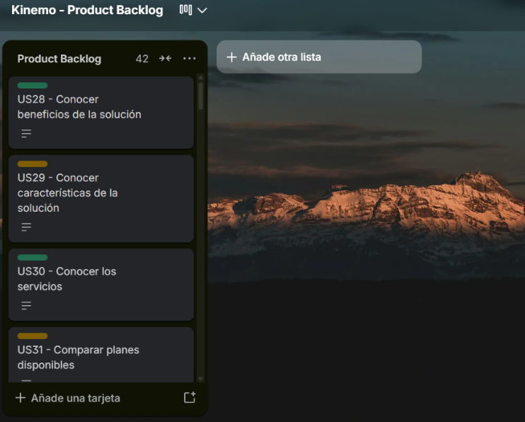

Link de Trello: https://trello.com/invite/b/6ac2a2ced29ee515d72506f0/ATTIe716a1812addf4f49367eec67a7e7640A7DDBD9C/kinemo-product-backlog

## Capítulo IV: Product Design

### 4.1. Style Guidelines

En esta sección se establecen los lineamientos visuales y de comunicación utilizados en Kinemo. Estos lineamientos permiten mantener una identidad consistente en los productos digitales del proyecto, definiendo criterios para el uso de la marca, tipografía y paleta de colores.

La propuesta visual de Kinemo busca transmitir innovación, tecnología y entretenimiento inmersivo. Para ello, se emplea una interfaz predominantemente oscura acompañada de tonos morados que permiten destacar los elementos principales y mantener una estética relacionada con la experiencia cinematográfica.

#### 4.1.1. General Style Guidelines

##### Branding

**Concepto de Marca**

Kinemo es una propuesta tecnológica orientada a mejorar la gestión de experiencias cinematográficas 4D. Su identidad visual busca representar conceptos como tecnología, movimiento, inmersión y modernidad mediante una estética minimalista y digital.

El sistema visual de la marca combina fondos oscuros con acentos morados, generando contraste entre el contenido y los principales elementos interactivos. Esta combinación permite mantener una apariencia moderna y coherente con el entorno cinematográfico en el que se desarrolla la propuesta.

**Logotipo Principal**

El logotipo de Kinemo está compuesto por un símbolo gráfico acompañado del nombre de la marca. Su diseño mantiene una composición simple y reconocible que facilita su integración dentro de la interfaz de la landing page.

El símbolo utiliza el color morado característico de Kinemo, mientras que el nombre emplea un tono claro para mantener un contraste adecuado sobre fondos oscuros. Esta combinación permite conservar la identidad visual utilizada en el resto de la interfaz.

---

##### Typography

Kinemo utiliza **Inter** como familia tipográfica principal en su interfaz. Esta tipografía fue seleccionada por su legibilidad en entornos digitales y por su apariencia moderna, permitiendo mantener consistencia entre títulos, textos descriptivos, botones, etiquetas y elementos de navegación.

La jerarquía tipográfica utiliza diferentes pesos y tamaños de Inter dependiendo de la importancia del contenido. Los títulos principales emplean pesos elevados para generar mayor impacto visual, mientras que los textos descriptivos utilizan pesos regulares que facilitan la lectura.

| Uso | Familia | Peso | Aplicación |
| --- | --- | --- | --- |
| **Hero / Display** | Inter | 800 | Mensaje principal de la landing page |
| **H1** | Inter | 700-800 | Títulos principales |
| **H2** | Inter | 700-800 | Títulos de secciones |
| **H3** | Inter | 600-700 | Títulos de tarjetas y componentes |
| **Body** | Inter | 400 | Descripciones y contenido general |
| **Labels** | Inter | 600-700 | Etiquetas y categorías |
| **Navigation** | Inter | 500-600 | Opciones de navegación |
| **Buttons** | Inter | 600-700 | Llamados a la acción |

Esta jerarquía permite diferenciar visualmente los distintos niveles de información y facilita el recorrido del usuario a través de las secciones de la plataforma.

---

##### Color Palette

La identidad visual de Kinemo utiliza una paleta predominantemente oscura con tonos morados como colores de acento. Los fondos oscuros permiten crear una apariencia asociada con el ambiente cinematográfico, mientras que los tonos morados destacan botones, etiquetas y otros elementos relevantes de la interfaz.

**Paleta Principal**

| Color | HEX | RGB | Uso Principal |
| --- | --- | --- | --- |
| **Fondo Principal** | `#0E0F17` | 14, 15, 23 | Fondo general de la interfaz |
| **Fondo de Tarjetas** | `#16171E` | 22, 23, 30 | Cards y contenedores |
| **Fondo Secundario** | `#20212C` | 32, 33, 44 | Elementos secundarios |
| **Morado Principal** | `#8B5CF6` | 139, 92, 246 | CTAs y elementos destacados |
| **Morado Claro** | `#A78BFA` | 167, 139, 250 | Acentos, etiquetas y estados activos |
| **Blanco** | `#FFFFFF` | 255, 255, 255 | Títulos y texto principal |

**Colores Complementarios**

| Color | HEX | Uso Principal |
| --- | --- | --- |
| **Estado Activo** | `#272338` | Fondos de elementos seleccionados o destacados |
| **Texto Secundario** | `#94A3B8` | Descripciones y contenido de menor jerarquía |
| **Bordes** | `#2D2F45` | Separadores y contornos de componentes |
| **Borde Activo** | `#3B385D` | Contornos de elementos activos |
| **Éxito** | `#22C55E` | Estados correctos o resueltos |
| **Advertencia** | `#EAB308` | Alertas y estados en progreso |

**Justificación Cromática**

La combinación de colores utilizada en Kinemo responde a las características visuales y funcionales de la plataforma:

- **Fondos oscuros:** permiten relacionar visualmente la interfaz con el ambiente de una sala de cine y ayudan a destacar el contenido principal.
- **Morado principal:** funciona como el color representativo de Kinemo y se utiliza para resaltar acciones, elementos interactivos y secciones importantes.
- **Morado claro:** complementa el color principal y permite generar diferentes niveles de énfasis.
- **Blanco:** se utiliza principalmente en títulos y textos que requieren alta visibilidad sobre fondos oscuros.
- **Gris azulado:** se emplea para información secundaria, evitando competir visualmente con los títulos y llamados a la acción.
- **Verde y amarillo:** permiten diferenciar estados funcionales dentro de los componentes de la plataforma.

El uso consistente de esta paleta permite mantener una identidad visual uniforme entre las diferentes secciones de Kinemo.

---

##### Communication Tone

La comunicación de Kinemo mantiene un tono profesional, tecnológico y directo. Los mensajes buscan explicar las capacidades de la plataforma de forma breve y comprensible, evitando descripciones excesivamente técnicas cuando no son necesarias.

La comunicación de la marca se centra principalmente en:

- La innovación aplicada a experiencias cinematográficas 4D.
- La facilidad de gestión de las salas.
- La sincronización de efectos y tecnología inmersiva.
- El monitoreo y análisis de información.
- La mejora de la experiencia cinematográfica.
- La presentación clara de los beneficios de la plataforma.

Los llamados a la acción utilizan expresiones breves y reconocibles, facilitando que el usuario comprenda rápidamente cuál es el siguiente paso dentro de la landing page.

---

##### General Visual Identity

La identidad visual de Kinemo mantiene una composición moderna y minimalista. Las interfaces priorizan espacios amplios, tarjetas claramente diferenciadas, bordes sutiles y una jerarquía visual basada en contraste, tamaño y peso tipográfico.

Los elementos más importantes utilizan el morado principal para captar la atención del usuario, mientras que los fondos y elementos secundarios mantienen tonalidades oscuras. De esta manera, el diseño evita una saturación visual excesiva y conserva una apariencia uniforme en toda la experiencia.

Las decisiones generales de diseño siguen los siguientes criterios:

- Uso consistente de la familia tipográfica Inter.
- Fondos oscuros como base de la interfaz.
- Morado como principal color de identidad y acción.
- Uso de blanco para información de alta jerarquía.
- Uso de tonos secundarios para descripciones y contenido complementario.
- Bordes y contenedores sutiles para organizar la información.
- Diseño visual coherente con un producto tecnológico orientado al entretenimiento cinematográfico.

#### 4.1.2 Web Style Guidelines

> _Pendiente — completar en `feature/style-guidelines`._

### 4.2. Information Architecture

La arquitectura de información de Kinemo define la forma en que el contenido y las funcionalidades se organizan, etiquetan y presentan dentro de sus productos digitales. Su objetivo es facilitar la comprensión de la plataforma y permitir que cada usuario encuentre las funcionalidades necesarias de acuerdo con el contexto en el que se encuentra.

Kinemo cuenta con dos interfaces principales: la **Landing Page**, orientada a presentar públicamente la propuesta de valor del producto, y la **Web Application**, orientada a la gestión y operación de las experiencias cinematográficas 4D.

La Landing Page utiliza una estructura principalmente lineal, donde el visitante puede conocer progresivamente la plataforma, el equipo, los planes disponibles y las alternativas de contacto. Por otro lado, la Web Application utiliza una organización modular, permitiendo acceder a diferentes funcionalidades relacionadas con la operación de las salas de cine.

---

#### 4.2.1. Organization Systems

Kinemo utiliza diferentes sistemas de organización dependiendo del producto digital y del tipo de información presentada.

##### Landing Page

La Landing Page emplea principalmente un **sistema de organización por tópicos**, donde cada sección agrupa información relacionada con un aspecto específico de Kinemo.

La estructura principal se organiza de la siguiente manera:

| Tópico | Descripción |
| --- | --- |
| **Home** | Presenta la propuesta de valor principal de Kinemo y las acciones iniciales disponibles para el visitante. |
| **Platform** | Expone las principales capacidades de la solución para la gestión de experiencias cinematográficas 4D. |
| **About Us** | Presenta al equipo responsable del desarrollo de Kinemo. |
| **Pricing** | Permite conocer y comparar los diferentes planes disponibles. |
| **Contact** | Presenta la llamada a la acción final para iniciar el contacto con Kinemo. |
| **Terms and Conditions** | Proporciona acceso a la información relacionada con las condiciones de uso del servicio. |

El contenido mantiene una organización jerárquica que comienza presentando qué es Kinemo, continúa explicando sus principales capacidades y finaliza con información comercial y de contacto.

**Home**

La sección inicial comunica de manera directa la propuesta de valor de Kinemo como tecnología orientada a experiencias cinematográficas 4D. Incluye los llamados a la acción **Get Started** y **Learn More**, permitiendo al visitante continuar su recorrido hacia las secciones principales.

**Platform**

Las capacidades principales de Kinemo se organizan en cuatro categorías:

- Effects Synchronization.
- Simplified Management Software.
- Maintenance Incident Control.
- Performance Analytics.

La sección complementa estas categorías mediante elementos visuales relacionados con la sincronización de salas y el seguimiento de incidencias.

**About Us**

Presenta a los integrantes responsables del desarrollo de Kinemo mediante tarjetas individuales que contienen fotografía, nombre e información de identificación académica.

**Pricing**

Organiza las alternativas comerciales de Kinemo en tres planes:

- Starter.
- Growth.
- Enterprise.

Esta estructura permite comparar visualmente las características y alcance de cada alternativa.

**Contact**

Representa el cierre del recorrido principal de la Landing Page. Su propósito es dirigir al visitante hacia una acción concreta relacionada con el inicio del servicio o contacto comercial.

---

##### Web Application

La Web Application utiliza un **sistema de organización jerárquico y modular**. Después de autenticarse, el usuario accede al Dashboard, desde donde puede ingresar a los diferentes módulos de la plataforma según las tareas que necesite realizar.

La estructura general identificada en la aplicación es:

| Módulo | Propósito |
| --- | --- |
| **Sign In** | Permite autenticar al usuario mediante correo electrónico y contraseña. |
| **Dashboard** | Funciona como punto central de acceso a las funcionalidades de la aplicación. |
| **Catalog** | Agrupa las funcionalidades relacionadas con la gestión del catálogo de contenido 4D. |
| **Scheduling** | Agrupa las funcionalidades relacionadas con la programación de funciones. |
| **Room Readiness** | Permite acceder a funcionalidades relacionadas con la preparación y disponibilidad de las salas. |
| **Maintenance** | Agrupa las funcionalidades relacionadas con el mantenimiento y seguimiento de incidencias. |
| **Subscription** | Permite acceder a las funcionalidades relacionadas con planes y suscripciones. |
| **Profile** | Presenta información relacionada con el usuario y su rol dentro de la plataforma. |
| **About** | Proporciona información complementaria sobre Kinemo. |

El Dashboard funciona como el nivel principal de la jerarquía después del inicio de sesión y presenta accesos a diferentes módulos mediante tarjetas.

En la interfaz se distinguen funcionalidades destinadas a la administración y operación de Kinemo. Entre los accesos mostrados se encuentran módulos relacionados con catálogo, programación, salas, ticketing, analítica, suscripción, control de asientos, ejecución y mantenimiento.

De esta manera, el usuario no necesita recorrer una secuencia lineal como en la Landing Page, sino que puede seleccionar directamente el módulo correspondiente a la tarea que desea realizar.

---

#### 4.2.2. Labeling Systems

El sistema de etiquetado de Kinemo utiliza términos breves y relacionados directamente con las funcionalidades que representan. Se busca evitar nombres ambiguos y mantener consistencia entre los enlaces de navegación, botones, módulos y secciones.

##### Landing Page

Las principales etiquetas utilizadas son:

| Etiqueta | Propósito |
| --- | --- |
| **Platform** | Identifica la sección donde se presentan las capacidades principales de Kinemo. |
| **About Us** | Identifica la sección donde se presenta el equipo del proyecto. |
| **Pricing** | Identifica la sección de planes y precios. |
| **Contact** | Identifica la sección destinada al contacto con Kinemo. |
| **Get Started** | CTA principal que dirige al visitante hacia el inicio del proceso de contacto. |
| **Learn More** | CTA secundario que permite conocer las funcionalidades de la plataforma. |
| **Most Popular** | Destaca visualmente el plan comercial recomendado. |
| **EN / ES** | Permite seleccionar el idioma de la interfaz. |
| **Terms and Conditions** | Permite acceder a las condiciones de uso correspondientes. |

##### Web Application

Dentro de la aplicación se utilizan etiquetas orientadas a las tareas que puede realizar el usuario.

| Etiqueta | Propósito |
| --- | --- |
| **Sign In** | Acción utilizada para iniciar sesión. |
| **Dashboard** | Identifica el punto principal de acceso a los módulos. |
| **Operations** | Agrupa accesos relacionados con las operaciones de las salas. |
| **Maintenance** | Identifica las funcionalidades relacionadas con mantenimiento. |
| **Analytics** | Identifica el acceso a información y análisis del funcionamiento de la plataforma. |
| **Catalog** | Identifica el módulo de gestión del catálogo 4D. |
| **Scheduling** | Identifica el módulo relacionado con programación. |
| **Room Readiness** | Identifica las funcionalidades de preparación de salas. |
| **Subscription** | Identifica la gestión de planes y suscripciones. |
| **Profile** | Identifica la información asociada al usuario autenticado. |
| **EN / ES** | Permite alternar el idioma de la aplicación. |

Las etiquetas mantienen una relación directa con las acciones y contenidos disponibles para reducir el esfuerzo necesario para comprender la interfaz.

Además, los módulos del Dashboard utilizan elementos visuales e iconos como apoyo a las etiquetas textuales, facilitando su reconocimiento.

---

#### 4.2.3. SEO Tags and Meta Tags

La estrategia SEO de Kinemo se aplica principalmente a la **Landing Page**, debido a que corresponde a la interfaz pública del producto y funciona como uno de los principales puntos de entrada para potenciales clientes interesados en soluciones tecnológicas para experiencias cinematográficas 4D.

Por otro lado, la **Web Application** posee un propósito principalmente operativo y requiere autenticación para acceder a sus funcionalidades. Por esta razón, su contenido interno no constituye el principal objetivo de posicionamiento en motores de búsqueda.

##### Landing Page

Para la Landing Page se consideran etiquetas orientadas a describir correctamente el contenido del sitio, facilitar su indexación y mejorar la forma en que Kinemo se presenta al compartir la página en plataformas externas.

Las principales etiquetas consideradas son:

- **Title:** identifica el sitio y comunica que Kinemo está relacionado con tecnología para cine 4D.
- **Description:** resume la propuesta de valor de Kinemo, incluyendo la gestión de asientos de movimiento, efectos sincronizados y analítica.
- **Keywords:** documenta términos relacionados con tecnología de cine 4D, gestión de salas y experiencias inmersivas.
- **Author:** identifica al equipo responsable del producto.
- **Robots:** establece las indicaciones de indexación y seguimiento para los motores de búsqueda.
- **Canonical:** identifica la URL principal de la Landing Page.
- **Open Graph:** define cómo se presenta Kinemo al compartir la página en plataformas compatibles.
- **Twitter Card:** proporciona información para generar una vista previa enriquecida al compartir el sitio en plataformas compatibles.

Una posible implementación dentro del `<head>` de la Landing Page es la siguiente:

<head>
    <!-- Basic Metadata -->
    <meta charset="UTF-8">
    <meta name="viewport" content="width=device-width, initial-scale=1.0">

    <title>Kinemo | 4D Cinema Technology</title>

    <!-- SEO Metadata -->
    <meta name="description" content="Kinemo centralizes motion seat control, synchronized environmental effects, maintenance monitoring and real-time analytics for immersive 4D cinema experiences.">
    <meta name="keywords" content="Kinemo, 4D cinema technology, 4D theater management, motion seats, synchronized cinema effects, immersive cinema technology">
    <meta name="author" content="Kinemo Team">
    <meta name="robots" content="index, follow">

    <!-- Canonical -->
    <link rel="canonical" href="LANDING_PAGE_URL">

    <!-- Open Graph -->
    <meta property="og:title" content="Kinemo | 4D Cinema Technology">
    <meta property="og:description" content="Technology for managing immersive 4D cinema experiences.">
    <meta property="og:type" content="website">
    <meta property="og:url" content="LANDING_PAGE_URL">
    <meta property="og:image" content="LANDING_PAGE_IMAGE_URL">
    <meta property="og:site_name" content="Kinemo">
    <meta property="og:locale" content="en_US">

    <!-- Twitter / X Card -->
    <meta name="twitter:card" content="summary_large_image">
    <meta name="twitter:title" content="Kinemo | 4D Cinema Technology">
    <meta name="twitter:description" content="Technology for managing immersive 4D cinema experiences.">
    <meta name="twitter:image" content="LANDING_PAGE_IMAGE_URL">
</head>

### 4.3 Landing Page UI Design

##### 4.3.1. Landing Page Wireframe

[Click here for Figma](https://www.figma.com/design/h8gZ1ryldnIq3f485Vx13T/Landing-Page?node-id=0-1&t=MqyMHgKjflZ9zmfu-1)

Los wireframes de la Landing Page de Kinemo definen la estructura fundamental de la interfaz, priorizando la organización del contenido y la jerarquía visual antes de aplicar elementos de diseño detallados. Se diseñaron utilizando elementos esquemáticos en escala de grises para facilitar la evaluación de la arquitectura de información sin distracciones visuales.

**1. Home (Hero Section)**

La interfaz del wireframe Home presenta una estructura en Z que guía la vista del usuario de manera natural. En la parte superior, un header fijo contiene el logotipo de Kinemo alineado a la izquierda, seguido de un menú de navegación principal con enlaces a "Platform", "Pricing" y "Contact". A la derecha del header se ubica un enlace de "Sign in" y un botón de llamado a la acción "Suscribe" con mayor énfasis visual.

El hero section ocupa aproximadamente el 60% del viewport inicial, dividido en dos columnas asimétricas. La columna izquierda contiene el kicker pequeño "4D Cinema Technology", seguido del titular principal "Lleva la experiencia 4D a tus salas de cine sin altos costos" en tipografía de gran tamaño, y un subtítulo descriptivo que indica: "Centralizamos el control de asientos de movimiento, efectos ambientales sincronizados y analíticas en tiempo real, sin reemplazar tu infraestructura actual." Debajo se posicionan dos botones CTA: uno primario "Empezar ahora" con tratamiento destacado y uno secundario "Conoce más".

El diseño es limpio, escaneable y enfocado en la conversión, guiando al usuario de manera natural desde el primer contacto hacia la acción principal.

---

**2. Plataforma (Platform Section)**

Inmediatamente debajo del hero, la sección de plataforma presenta el título principal "Todo lo que necesitas para gestionar tu sala inmersiva", acompañado de un layout de dos columnas. La columna izquierda muestra una tarjeta contenedora con cuatro ítems verticales estructurados con un icono cuadrado superior y texto descriptivo:

- **Sincronización de efectos:** Protocolo propietario con latencia sub-10ms que coordina asientos de movimiento, viento, aroma y vibración cuadro a cuadro.
- **Software de gestión simplificado:** Panel unificado e intuitivo para operar todas las salas de tu complejo desde un solo dispositivo.
- **Gestión de incidencias de mantenimiento:** Detección preventiva de fallos mecánicos e hidráulicos antes de que afecten la función.
- **Análisis de rendimiento:** Métricas detalladas de ocupación, consumo energético y retorno de inversión por sala.

La columna derecha reserva espacio para dos contenedores de imagen superpuestos en vertical (placeholders indicados con diagonales cruzadas) que ilustrarán el software y los dashboards de la plataforma.

---

**3. Planes (Pricing Section)**

La sección de "Pricing" adopta un layout centrado que facilita la comparación visual entre opciones de suscripción. El wireframe muestra una etiqueta superior pequeña "Pricing", seguido del titular principal "Planes sencillos y transparentes." y un párrafo descriptivo: "Todos los planes incluyen opciones de arrendamiento de hardware. La facturación anual supone un ahorro del 20%."

Debajo se presenta una grilla de tres columnas equitativas, cada una representada por una tarjeta de plan con un placeholder de imagen cuadrada (indicado con diagonales cruzadas) de aproximadamente 200×200px. Esta estructura permite al usuario escanear rápidamente las opciones disponibles y comparar las alternativas de suscripción para su cadena de cines con un espaciado generoso que facilita la legibilidad.

---

**4. Contacto / Sección Final (Call to Action y Suscripción)**

El wireframe de la sección de contacto y conversión presenta una etiqueta superior "Contact" y el título principal centrado: "¿Listo para transformar tu experiencia en el cine?", acompañado de un texto descriptivo: "Despliega Kinemo en tu cadena de cines hoy mismo con integración rápida, estabilidad de nivel empresarial y sincronización 4D inmersiva."

Incluye un bloque contenedor central destacado titulado "Inicia tu Suscripción" que integra un botón de acción principal ("Suscribe") centrado en la parte inferior del bloque.

El footer de la página incluye a la izquierda el logotipo "Kinemo" acompañado del texto de derechos de autor "© 2026 Kinemo - Todos los derechos reservados", y hacia la derecha los enlaces de navegación "Privacidad", "Términos" y "Contacto", estableciendo el cierre visual de la landing page sobre una franja horizontal de fondo sólido.

##### 4.3.2. Landing Page Mock-up

[Link de Landing Page Mock-up](https://www.figma.com/design/2kl9zH6WgBNDCJAPYMhC0v/Landing-Page-Mock-up?node-id=0-1&t=01NT4lXX92lQUrnf-1)

Los mockups de alta fidelidad de la Landing Page de **Kinemo** fueron desarrollados siguiendo el sistema de diseño definido para la plataforma. La propuesta utiliza una estética oscura y tecnológica, orientada al sector del entretenimiento inmersivo 4D. Se emplea la tipografía **Inter**, una paleta basada en tonos oscuros y morados, bordes sutiles, tarjetas con esquinas redondeadas e indicadores visuales para representar estados y métricas del sistema.

La interfaz utiliza como colores principales el fondo oscuro **#0E0F17**, las tarjetas **#16171E** y **#20212C**, el morado principal **#8B5CF6**, el morado claro **#A78BFA**, el texto blanco **#FFFFFF** y el texto secundario **#94A3B8**.

---

### 1. Home (Hero Section)

El mockup de la sección **Home** presenta la propuesta principal de Kinemo mediante una composición visual relacionada con la experiencia cinematográfica 4D. La imagen utilizada como fondo permite contextualizar el servicio desde el primer contacto con la Landing Page, mientras que un overlay oscuro facilita la lectura del contenido.

#### Header

- Fondo oscuro **#090A10** con una línea inferior sutil.
- Logotipo de **Kinemo** ubicado en la parte izquierda, compuesto por el símbolo de la marca y el nombre en color blanco.
- Menú de navegación con las opciones **Platform, About Us, Pricing** y **Contact**.
- Selector de idioma **EN / ES** ubicado en la parte derecha.
- Los enlaces mantienen una apariencia simple para facilitar el acceso directo a las principales secciones de la Landing Page.

#### Hero Section

- Imagen de fondo relacionada con una sala de cine equipada con asientos para una experiencia 4D.
- Overlay oscuro aplicado sobre la imagen para mejorar el contraste y la legibilidad.
- Etiqueta superior **"4D CINEMA TECHNOLOGY"**, presentada con un fondo oscuro y detalles en morado.
- Titular principal **"Bring the 4D experience to your cinema screens without high costs"**.
- La frase **"without high costs"** utiliza el color morado claro **#A78BFA** para generar énfasis visual.
- Descripción **"Centralize motion seat control, synchronized environmental effects, and real-time analytics without replacing your existing infrastructure."**
- Botón principal **"Get Started"**, utilizando el morado principal de Kinemo.
- Botón secundario **"Learn More"**, utilizando un fondo oscuro y borde sutil.

La sección busca comunicar desde el primer momento la propuesta de valor de Kinemo, destacando la posibilidad de incorporar y gestionar experiencias 4D sin necesidad de reemplazar completamente la infraestructura existente.

---

### 2. Plataforma (Platform Section)

La sección **Platform** presenta las principales funcionalidades de Kinemo mediante una estructura de dos columnas. Esta distribución permite mostrar las capacidades principales del sistema junto con una representación visual de información operativa.

#### Encabezado de sección

- Etiqueta **"PLATFORM"** en color morado claro.
- Título principal **"Everything you need to manage your immersive theater"**.
- Fondo oscuro que mantiene continuidad con el resto de la Landing Page.

#### Columna izquierda

La columna izquierda presenta cuatro tarjetas funcionales con fondo oscuro, bordes sutiles y esquinas redondeadas. Cada tarjeta representa una de las principales capacidades de Kinemo:

- **Effects Synchronization:** coordinación de los asientos de movimiento y efectos ambientales relacionados con la experiencia 4D.
- **Simplified Management Software:** panel centralizado orientado a facilitar la administración de las diferentes salas.
- **Maintenance Incident Control:** seguimiento de incidencias relacionadas con el funcionamiento de los equipos.
- **Performance Analytics:** presentación de información relacionada con ocupación, consumo y rendimiento de las salas.

Cada funcionalidad está acompañada por un icono que facilita su identificación visual.

#### Columna derecha

La columna derecha presenta dos módulos que representan información relacionada con la operación de la plataforma:

- **Live Synchronization:** muestra diferentes pantallas mediante indicadores como **OK** y **Alert**, acompañados por una representación gráfica de su actividad.
- **Recent Incidents:** muestra incidencias recientes junto con estados como **Resolved**, **In progress** y **Pending**.

Los estados utilizan diferentes colores acompañados por etiquetas textuales para facilitar su reconocimiento sin depender exclusivamente del color.

Esta organización permite representar cómo Kinemo centraliza diferentes funciones de supervisión y gestión dentro de una misma plataforma.

---

### 3. Nosotros / Equipo (About Us Section)

La sección **About Us** presenta a los integrantes responsables del desarrollo de Kinemo. Mantiene la misma identidad visual oscura y utiliza tarjetas individuales para organizar la información de cada miembro.

#### Encabezado

- Etiqueta superior **"ABOUT US"** en color morado claro.
- Título principal **"Meet the Team"**.
- Texto descriptivo **"The creators behind Kinemo, building next-generation technology for modern cinema spaces."**

#### Tarjetas del equipo

La sección utiliza una cuadrícula de cuatro tarjetas con fondo oscuro, bordes sutiles y esquinas redondeadas.

Cada tarjeta contiene:

- Fotografía circular del integrante.
- Borde morado alrededor de la fotografía.
- Nombre completo.
- Código de estudiante en color morado claro.

Los integrantes se distribuyen horizontalmente dentro de la sección, permitiendo identificar de forma clara a los miembros responsables del proyecto.

Las tarjetas mantienen una estructura visual uniforme para conservar la consistencia de la interfaz.

#### Video de presentación

Debajo de las tarjetas del equipo se incorpora un recurso audiovisual relacionado con la tecnología utilizada en experiencias cinematográficas con movimiento.

El video permite complementar la información presentada en la Landing Page mediante una referencia visual del funcionamiento de este tipo de tecnología en una sala de cine.

El recurso se integra dentro de un contenedor de gran tamaño alineado con las tarjetas superiores, manteniendo la organización visual de la sección.

---

### 4. Planes (Pricing Section)

La sección **Pricing** presenta los diferentes planes disponibles de Kinemo mediante tres tarjetas principales. La distribución permite comparar visualmente las características y precios de cada alternativa.

#### Encabezado de sección

- Etiqueta **"PRICING"** en color morado claro.
- Título principal **"Simple, transparent pricing"**.
- Banner informativo con el mensaje **"All plans include hardware leasing options with up to 20% savings"**.

#### Grid de planes

La información se organiza mediante una cuadrícula de tres columnas correspondiente a los planes **Starter**, **Growth** y **Enterprise**.

##### Starter — $490/mo

El plan **Starter** está orientado a operadores que comienzan a incorporar experiencias 4D y requieren las funciones principales de Kinemo.

Incluye:

- Hasta **3 pantallas conectadas**.
- Sincronización básica.
- Panel de control unificado.
- Soporte por correo electrónico.
- Reportes analíticos mensuales.

##### Growth — $1,190/mo

El plan **Growth** está orientado a operadores que requieren una mayor cantidad de pantallas y funcionalidades avanzadas.

Incluye:

- Hasta **12 pantallas conectadas**.
- Sincronización avanzada.
- Gestión de incidencias y telemetría.
- Soporte prioritario.
- Analítica en tiempo real.
- API de integración.

Este plan se diferencia visualmente mediante un borde morado y la etiqueta **"MOST POPULAR"**, permitiendo destacar la alternativa recomendada dentro de la sección.

##### Enterprise — Custom

El plan **Enterprise** está dirigido a grandes cadenas de cine que requieren una solución adaptada a una mayor cantidad de salas o ubicaciones.

Incluye:

- Pantallas conectadas ilimitadas.
- SLA garantizado del **99.9%**.
- Integración con sistemas personalizados.
- Customer Success Manager dedicado.
- On-site onboarding.
- Contratos flexibles.

Las tres tarjetas utilizan fondos oscuros, bordes sutiles, esquinas redondeadas y una jerarquía tipográfica que permite diferenciar el nombre del plan, precio, descripción y características incluidas.

---

### 5. Contacto / Call to Action y Footer

La sección final de la Landing Page funciona como un **Call to Action (CTA)** orientado a incentivar al usuario a establecer contacto con Kinemo y conocer las alternativas disponibles para implementar la solución.

#### Call to Action

La sección utiliza un contenedor central con fondo oscuro, borde sutil y esquinas redondeadas, manteniendo la identidad visual establecida en las secciones anteriores.

Está compuesta por:

- Etiqueta superior **"CONTACT"** en color morado claro.
- Título principal **"Ready to transform your cinema experience?"**.
- Texto descriptivo **"Talk to our team and discover how Kinemo can elevate your cinema screens."**
- Botón principal **"Get Started"**, utilizando el color morado **#8B5CF6**.
- Texto complementario relacionado con la aceptación de los **Terms & Conditions**.
- Enlace **"Need custom enterprise solutions? Contact sales"**, dirigido a clientes que requieren soluciones empresariales personalizadas.

La organización centralizada de estos elementos permite dirigir la atención hacia la acción principal sin agregar información innecesaria.

#### Footer

El footer mantiene un fondo oscuro similar al utilizado en la barra de navegación, proporcionando continuidad visual entre el inicio y el cierre de la Landing Page.

Incluye:

- Nombre y logotipo de **Kinemo** en la parte izquierda.
- Texto **"© 2026 Kinemo · All rights reserved"**.
- Enlace **"terms and conditions"** ubicado en la parte derecha.

De esta manera, la sección final cierra el recorrido de la Landing Page mediante una llamada a la acción clara y mantiene disponible el acceso a la información legal correspondiente.

---

### Consideraciones de Diseño Responsivo

La Landing Page utiliza una estructura adaptable para mantener la correcta visualización de sus componentes en diferentes tamaños de pantalla.

Las principales consideraciones son:

- El contenido se organiza mediante contenedores con un ancho máximo aproximado de **1200px**.
- Las secciones mantienen espacios amplios para diferenciar visualmente cada bloque de contenido.
- Las tarjetas de Platform, About Us y Pricing utilizan estructuras basadas en **CSS Grid** y **Flexbox**.
- Las estructuras de varias columnas pueden reorganizarse verticalmente cuando disminuye el espacio disponible.
- Los botones utilizan áreas de interacción amplias y estados *hover* para proporcionar retroalimentación visual.
- Las imágenes se adaptan al espacio disponible sin generar desplazamiento horizontal.
- Los elementos visuales mantienen bordes redondeados de aproximadamente **8px y 16px**, de acuerdo con el sistema de diseño.
- La interfaz utiliza texto blanco para la información principal y **#94A3B8** para la información secundaria.
- El color **#8B5CF6** y su variante **#A78BFA** se utilizan para destacar acciones, etiquetas y elementos importantes.

### Identidad Visual

La propuesta visual busca mantener una apariencia tecnológica y consistente con el concepto de **entretenimiento inmersivo 4D**.

El uso de fondos oscuros permite relacionar visualmente la interfaz con el ambiente de una sala de cine, mientras que los tonos morados funcionan como elementos de identidad y permiten destacar las principales acciones.

Las tarjetas, indicadores de estado, botones, módulos de información y recursos audiovisuales mantienen una composición uniforme durante todo el recorrido de la Landing Page.

De esta manera, el diseño mantiene una identidad visual consistente entre las secciones **Home, Platform, About Us, Pricing** y **Contact**, facilitando que el usuario reconozca la estructura y las acciones disponibles.

### 4.4 Web Applications UX/UI Design

#### 4.4.1 Web Applications Wireframes

> _Pendiente — completar en `feature/web-app-ux`._

#### 4.4.2 Web Applications Wireflow Diagrams

> _Pendiente — completar en `feature/web-app-ux`._

#### 4.4.3 Web Applications Mock-ups

> _Pendiente — completar en `feature/web-app-ux`._

#### 4.4.4 Web Applications User Flow Diagrams

> _Pendiente — completar en `feature/web-app-ux`._

### 4.5 Web Applications Prototyping

> _Pendiente — completar en `feature/web-app-prototyping`._

### 4.6 Domain-Driven Software Architecture

### 4.6.1. Design-Level EventStorming

El Design-Level EventStorming permitió al equipo refinar el modelo de dominio identificado durante el modelado inicial de Kinemo 4D. La sesión se enfocó en revisar las funcionalidades del dominio, agruparlas según sus responsabilidades y establecer límites claros entre las diferentes áreas del negocio.

Durante esta actividad se analizaron los eventos, comandos, consultas y responsabilidades asociadas a las principales funcionalidades de la solución. A partir de este refinamiento se identificaron y delimitaron los Bounded Contexts que representan las diferentes áreas del dominio de Kinemo 4D.

Como resultado del proceso de refinamiento, se identificaron los siguientes nueve Bounded Contexts:

1. **BC01 — Movie & Sensory Content Management**  
   Gestiona el registro y administración de las películas 4D y su contenido sensorial asociado, incluyendo la configuración de efectos, intensidades y archivos necesarios para su reproducción.

2. **BC02 — Scheduling & Calendar**  
   Gestiona la programación de las funciones 4D, considerando horarios, disponibilidad, conflictos de programación, reprogramación y cancelación de funciones.

3. **BC03 — Room & Resource Readiness**  
   Gestiona la preparación y disponibilidad de las salas para las funciones 4D, incluyendo el bloqueo de salas por mantenimiento y su posterior liberación.

4. **BC04 — Ticketing Integration**  
   Gestiona la integración con el sistema externo de boletería para sincronizar la información necesaria de las funciones y la ocupación de las salas.

5. **BC05 — Seat Allocation & Control**  
   Gestiona la asignación y control de las butacas asociadas a las funciones 4D, incluyendo la actualización de sus estados y la activación de las butacas vendidas.

6. **BC06 — 4D Execution & Synchronization**  
   Gestiona la ejecución de las funciones 4D y la sincronización de los efectos sensoriales con la película. También contempla la pausa, reanudación, desviaciones de sincronización y situaciones de emergencia durante la ejecución.

7. **BC07 — Resource Testing & Maintenance**  
   Gestiona las pruebas de los canales y componentes del sistema 4D, el registro de incidencias y las actividades de mantenimiento correctivo y preventivo de los recursos.

8. **BC08 — Operational Analytics & Reporting**  
   Gestiona la recopilación de métricas operativas y la generación de dashboards y reportes relacionados con la operación de las funciones y el mantenimiento.

9. **BC09 — Subscription & Service Management**  
   Gestiona los planes de suscripción del servicio, incluyendo la selección del plan, contratación, procesamiento del pago, activación, renovación y cambio de plan.

El refinamiento también permitió establecer las principales relaciones entre los Bounded Contexts mediante los eventos y comandos identificados durante la sesión. De esta manera, los cambios producidos en un contexto pueden desencadenar acciones en otro contexto cuando existe una dependencia dentro del dominio.

Por ejemplo, el evento **“Película 4D Registrada”** en el BC01 permite iniciar la programación de una función 4D en el BC02. Asimismo, el evento **“Función 4D Programada”** permite solicitar la verificación de la preparación de la sala en el BC03. De manera similar, la actualización de la ocupación proveniente del BC04 permite gestionar la activación de las butacas vendidas en el BC05.

En la ejecución de una función, el BC06 puede generar eventos relacionados con incidencias de hardware que son gestionados por el BC07. Posteriormente, los resultados de la ejecución y del mantenimiento pueden ser utilizados por el BC08 para generar métricas y reportes operativos. Finalmente, el BC09 permite gestionar la suscripción que habilita el acceso a los servicios de Kinemo 4D.

La siguiente imagen evidencia el resultado del Design-Level EventStorming realizado por el equipo:

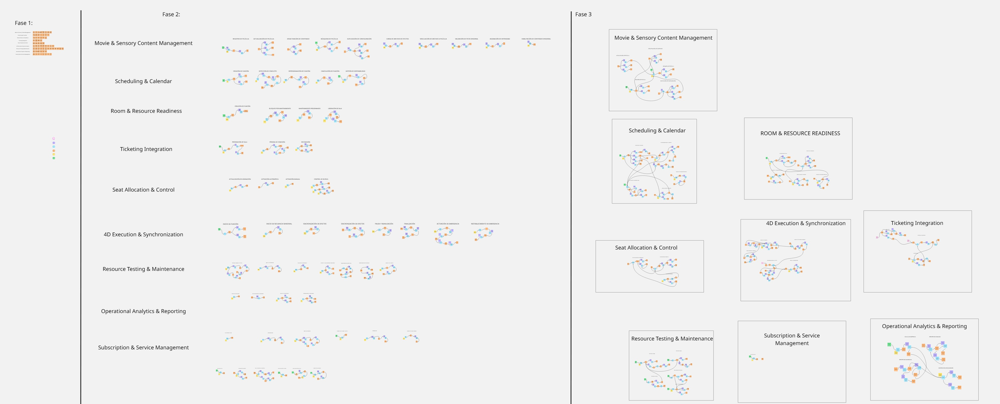

#### 4.6.2. Software Architecture Context Diagram

El **Context Diagram** representa a **Kinemo 4D** como un único sistema central, mostrando los actores que interactúan con la solución y los sistemas externos con los que se integra. Este diagrama se elaboró aplicando la notación **C4 Model**, permitiendo visualizar el alcance de Kinemo 4D y sus principales relaciones con el entorno, sin mostrar todavía la estructura interna de la solución.

Los actores identificados son:

- **Gerente**: responsable de administrar la operación de Kinemo 4D, incluyendo la gestión de películas y contenido sensorial, programación de funciones, consulta de información operativa y gestión del servicio.
- **Técnico**: responsable de las actividades técnicas relacionadas con la preparación, pruebas, mantenimiento y atención de incidencias de los recursos 4D.

Asimismo, Kinemo 4D mantiene integración con los siguientes sistemas externos:

- **Sistema Externo de Boletería**: proporciona información relacionada con las funciones, ventas y ocupación de las salas.
- **Hardware 4D**: ejecuta los efectos sensoriales y las acciones físicas asociadas a las funciones 4D.
- **Pasarela de Pagos**: procesa los pagos asociados a las suscripciones del servicio.
- **Servicio de Facturación Electrónica**: permite gestionar la emisión de comprobantes relacionados con las suscripciones.
- **Almacenamiento de Archivos**: permite almacenar los archivos multimedia y contenido sensorial utilizados por las películas 4D.
- **Servicio de Notificaciones**: permite enviar alertas y notificaciones relacionadas con la operación, mantenimiento y suscripciones.

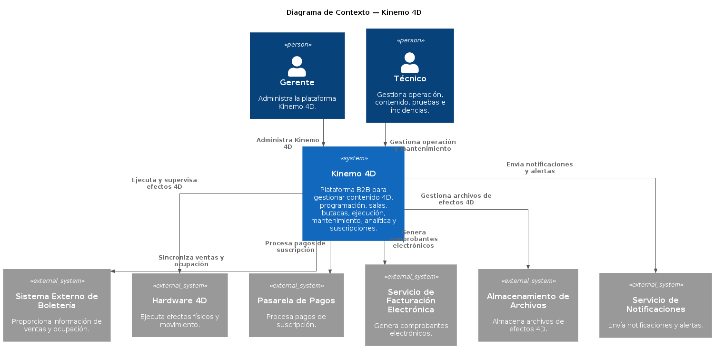

Como se observa en el diagrama, **Kinemo 4D centraliza la interacción entre el Gerente y el Técnico y los servicios externos necesarios para soportar la operación de la plataforma**. Esta vista permite identificar claramente el límite del sistema y sus principales dependencias externas, sin entrar todavía en el detalle de los Containers o Bounded Contexts que conforman la solución.#### 4.6.3. Software Architecture Container Diagrams

El **Container Diagram** detalla los elementos de alto nivel que conforman la arquitectura de software de Kinemo 4D, las principales responsabilidades de cada container, las decisiones tecnológicas adoptadas y la manera en que estos containers se comunican entre sí. Cada container representa una unidad de despliegue independiente dentro de la solución.

La solución está compuesta por:

- **Landing Page B2B**: sitio de presentación de Kinemo 4D que comunica la propuesta de valor del servicio y permite consultar los planes de suscripción disponibles. Constituye el punto de entrada para el Gerente y el Técnico.

- **Web Application**: aplicación web utilizada por el Gerente y el Técnico para acceder a las funcionalidades de gestión y operación de Kinemo 4D, según las responsabilidades de cada actor.

- **RESTful API**: punto de entrada para las solicitudes provenientes de la aplicación web. Centraliza el acceso a las funcionalidades del sistema y dirige las solicitudes hacia el Bounded Context correspondiente.

- **9 Bounded Contexts** como containers independientes, cada uno encargado de un área específica del dominio de Kinemo 4D:
  **BC01 — Movie & Sensory Content Management**, **BC02 — Scheduling & Calendar**, **BC03 — Room & Resource Readiness**, **BC04 — Ticketing Integration**, **BC05 — Seat Allocation & Control**, **BC06 — 4D Execution & Synchronization**, **BC07 — Resource Testing & Maintenance**, **BC08 — Operational Analytics & Reporting** y **BC09 — Subscription & Service Management**.

  Cada Bounded Context mantiene su propia base de datos, siguiendo el patrón **Database per Service**, con el objetivo de mantener la autonomía de datos y reducir el acoplamiento entre los diferentes contextos del dominio.

- **Sistemas externos**: Kinemo 4D se integra con el **Sistema Externo de Boletería**, **Hardware 4D**, **Pasarela de Pagos**, **Servicio de Facturación Electrónica**, **Almacenamiento de Archivos** y **Servicio de Notificaciones**, según las necesidades de cada Bounded Context.

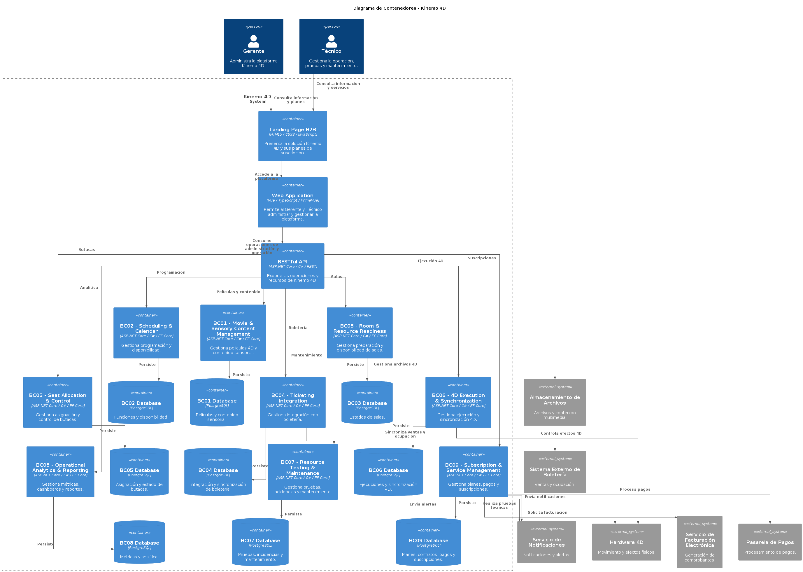

La comunicación entre los actores y la solución se inicia desde el **Landing Page B2B**, desde donde el **Gerente** y el **Técnico** acceden a la plataforma. El Landing Page se comunica con la **Web Application**, y esta utiliza la **RESTful API** como punto de entrada hacia los diferentes Bounded Contexts.

A nivel interno, cada Bounded Context encapsula las responsabilidades de un área específica del dominio y mantiene su propia persistencia. Las relaciones entre los contextos se basan en las interacciones identificadas durante el **Design-Level EventStorming**, permitiendo que los eventos producidos en un contexto puedan desencadenar acciones en otro cuando existe una dependencia funcional.

Por ejemplo, el **BC01 — Movie & Sensory Content Management** permite registrar una película 4D y su contenido sensorial, lo que permite al **BC02 — Scheduling & Calendar** iniciar la programación de una función. Asimismo, una función programada permite al **BC03 — Room & Resource Readiness** verificar la preparación de la sala.

De manera similar, el **BC04 — Ticketing Integration** proporciona información de ocupación que permite al **BC05 — Seat Allocation & Control** gestionar el estado de las butacas vendidas. Durante la ejecución, el **BC06 — 4D Execution & Synchronization** interactúa con el **BC07 — Resource Testing & Maintenance** cuando se presentan incidencias relacionadas con los recursos 4D. Finalmente, los resultados de la ejecución y del mantenimiento pueden ser utilizados por el **BC08 — Operational Analytics & Reporting** para generar métricas y reportes operativos.

El **BC09 — Subscription & Service Management** gestiona la suscripción del servicio y se relaciona con los demás contextos para habilitar las funcionalidades correspondientes según el estado de la suscripción.

De esta manera, el Container Diagram permite visualizar la distribución de responsabilidades, las principales decisiones tecnológicas, las relaciones entre los Bounded Contexts y las dependencias con los sistemas externos que forman parte del ecosistema de Kinemo 4D.

#### 4.6.4. Software Architecture Components Diagrams

Para cada uno de los **9 Bounded Contexts** identificados como containers, se elaboró el **Component Diagram** correspondiente. Cada diagrama muestra la descomposición interna del Bounded Context en componentes responsables de exponer las operaciones, ejecutar la lógica de aplicación, aplicar las reglas del dominio y gestionar la persistencia de información.

De acuerdo con las responsabilidades de cada contexto, se identificaron componentes como **Controllers**, **Application Services**, **Domain Services**, **Repositories** y **External Services**, según las necesidades de interacción con otros Bounded Contexts o sistemas externos.

A continuación se presenta el detalle de los componentes definidos para cada Bounded Context.

#### BC01 — Movie & Sensory Content Management

El **MovieSensoryController** expone las operaciones relacionadas con la gestión de películas y contenido sensorial. El **MovieCommandService** gestiona las operaciones de registro, actualización y desactivación de películas, mientras que el **MovieQueryService** permite realizar consultas y búsquedas sobre el catálogo. El **SensoryContentService** gestiona la carga, vinculación, validación y habilitación del contenido sensorial. El **MovieSensoryDomainService** aplica las reglas de negocio relacionadas con las películas y el contenido sensorial, y el **MovieSensoryRepository** gestiona la persistencia y recuperación de la información.

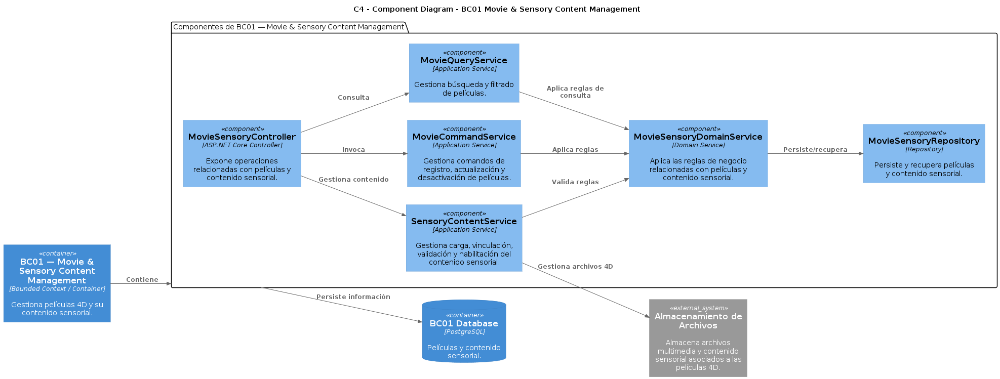

#### BC02 — Scheduling & Calendar

El **SchedulingController** expone las operaciones relacionadas con la programación de funciones 4D. El **SchedulingCommandService** gestiona las operaciones de programación, reprogramación y cancelación de funciones, mientras que el **AvailabilityService** permite consultar la disponibilidad necesaria para la programación. El **SchedulingDomainService** aplica las reglas de negocio relacionadas con horarios y disponibilidad, y el **SchedulingRepository** gestiona la persistencia de las funciones programadas.

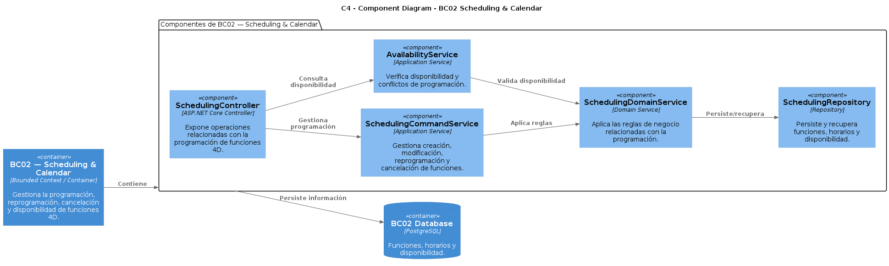

#### BC03 — Room & Resource Readiness

El **RoomReadinessController** expone las operaciones relacionadas con la preparación y disponibilidad de las salas. El **RoomPreparationService** gestiona las actividades necesarias para verificar la preparación de una sala, mientras que el **RoomBlockingService** permite bloquear una sala cuando no se encuentra disponible. El **RoomReleaseService** gestiona la liberación de las salas una vez finalizadas las restricciones correspondientes. El **RoomReadinessRepository** gestiona la persistencia de la información relacionada con el estado y preparación de las salas.

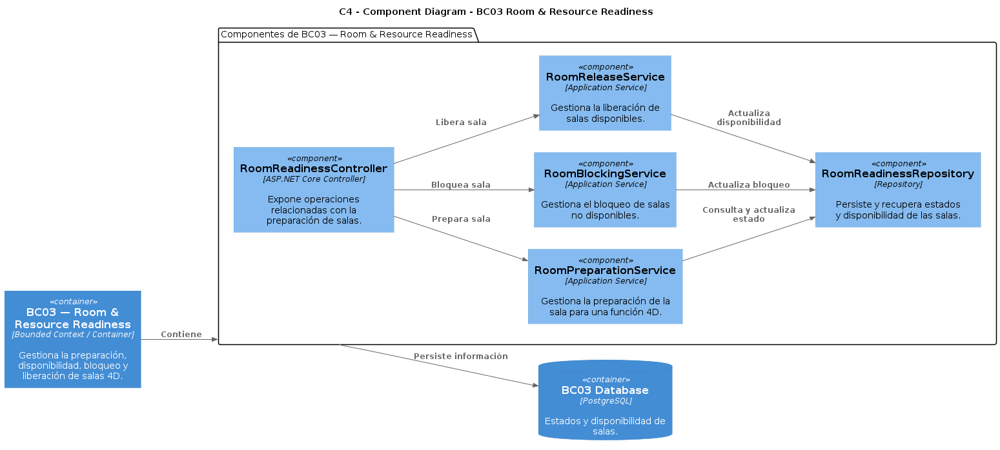
#### BC04 — Ticketing Integration

El **TicketingController** expone las operaciones relacionadas con la integración con el sistema externo de boletería. El **TicketingSyncService** gestiona la sincronización de la información proveniente del sistema de boletería, mientras que el **TicketingConnectionMonitor** permite supervisar el estado de la conexión con dicho sistema. El **OccupancyService** procesa la información relacionada con la ocupación de las salas y el **TicketingRepository** gestiona la persistencia de la información de integración.

Como dependencia externa, el **Sistema Externo de Boletería** proporciona la información necesaria para mantener actualizada la ocupación de las funciones.

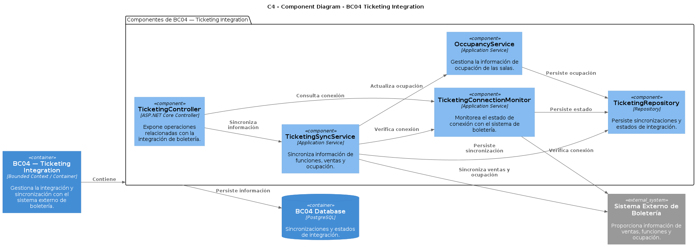

#### BC05 — Seat Allocation & Control

El **SeatController** expone las operaciones relacionadas con la asignación y control de las butacas. El **SeatAllocationService** gestiona la asignación de butacas para las funciones, mientras que el **SeatActivationService** permite activar las butacas que corresponden a los boletos vendidos. El **SeatControlService** gestiona el estado operativo de las butacas y el **SeatRepository** administra la persistencia de la información relacionada con su asignación y estado.

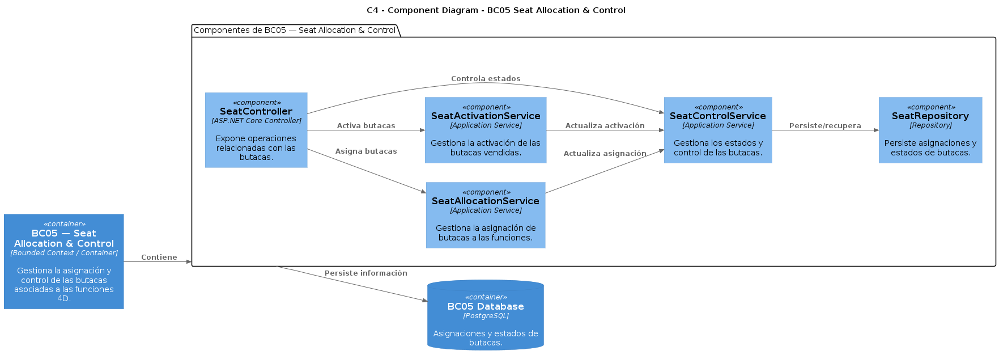

#### BC06 — 4D Execution & Synchronization

El **ExecutionController** expone las operaciones relacionadas con la ejecución de las funciones 4D. El **ExecutionService** gestiona el inicio, pausa, reanudación y finalización de la ejecución, mientras que el **SynchronizationService** controla la sincronización entre la película y los efectos sensoriales. El **EmergencyExecutionService** gestiona las situaciones de emergencia que pueden interrumpir la ejecución. El **Hardware4DGateway** encapsula la comunicación con el hardware encargado de ejecutar los efectos físicos y el **ExecutionRepository** gestiona la persistencia de la información relacionada con la ejecución.

Como sistema externo, el **Hardware 4D** recibe las instrucciones necesarias para ejecutar los efectos sensoriales durante una función.

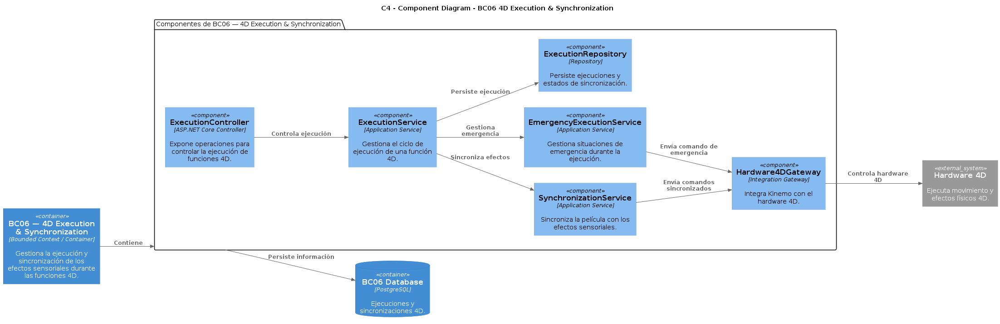

#### BC07 — Resource Testing & Maintenance

El **MaintenanceController** expone las operaciones relacionadas con las pruebas, mantenimiento e incidencias de los recursos 4D. El **ChannelTestingService** gestiona las pruebas de los canales y componentes del sistema, mientras que el **IncidentService** permite registrar y gestionar las incidencias identificadas. El **MaintenanceService** gestiona las actividades de mantenimiento y el **EquipmentService** administra la información relacionada con los equipos. El **HardwareMaintenanceGateway** encapsula la comunicación con los recursos de hardware y el **MaintenanceRepository** gestiona la persistencia de las pruebas, incidencias y actividades de mantenimiento.

Como dependencia externa, el **Hardware 4D** permite realizar las pruebas y actividades técnicas necesarias sobre los recursos físicos.

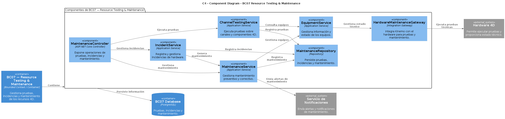

#### BC08 — Operational Analytics & Reporting

El **AnalyticsController** expone las operaciones relacionadas con la consulta de información operativa y generación de reportes. El **OperationalMetricsService** gestiona el cálculo y consolidación de métricas relacionadas con la operación de las funciones y el mantenimiento. El **DashboardService** permite obtener la información necesaria para los dashboards, mientras que el **IncidentReportService** gestiona la información relacionada con las incidencias. El **DashboardExportService** permite generar y exportar reportes operativos y el **AnalyticsRepository** gestiona la persistencia y consulta de la información utilizada para los análisis.

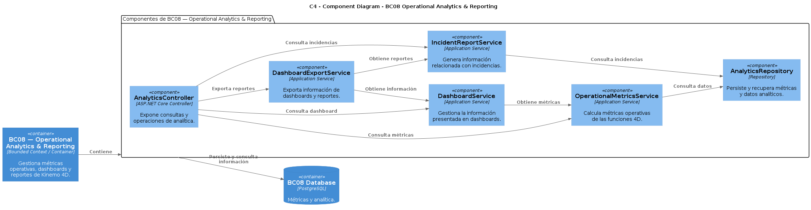

#### BC09 — Subscription & Service Management

El **SubscriptionController** expone las operaciones relacionadas con la gestión de las suscripciones del servicio. El **SubscriptionPlanService** gestiona la información de los planes disponibles, mientras que el **SubscriptionService** administra la contratación, activación, renovación y cambio de plan. El **SubscriptionPaymentService** gestiona el procesamiento de los pagos asociados a las suscripciones. El **SubscriptionDomainService** aplica las reglas de negocio relacionadas con el ciclo de vida de las suscripciones y el **SubscriptionRepository** gestiona su persistencia.

Como dependencias externas, el **Payment Gateway Adapter** encapsula la comunicación con la **Pasarela de Pagos**, permitiendo procesar los pagos de las suscripciones. Asimismo, el contexto puede interactuar con el **Servicio de Facturación Electrónica** para gestionar los comprobantes correspondientes.

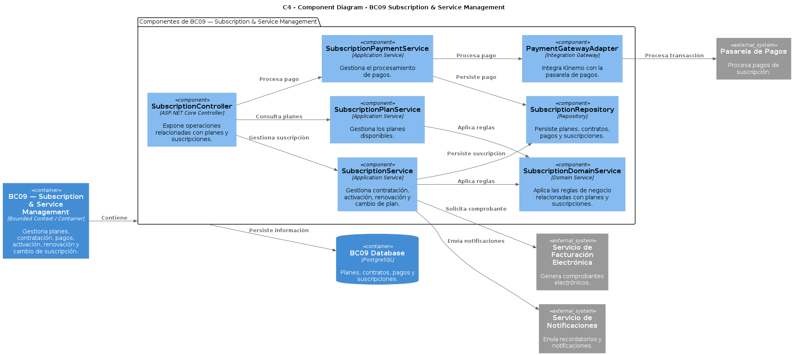

En conjunto, los Component Diagrams permiten visualizar cómo cada Bounded Context se descompone internamente en componentes con responsabilidades específicas, manteniendo una separación clara entre la exposición de operaciones, la lógica de aplicación, las reglas del dominio, la persistencia y las integraciones externas. Esta descomposición contribuye a mantener la autonomía de cada contexto y facilita su evolución y despliegue independiente.

### 4.7 Software Object-Oriented Design

Esta sección presenta el diseño orientado a objetos del sistema Kinemo 4D mediante diagramas de clases UML. Cada diagrama representa la estructura de un Bounded Context, identificando sus principales clases, atributos, métodos y relaciones, con el propósito de definir las responsabilidades de los componentes y facilitar la implementación del sistema.

#### 4.7.1. Class Diagrams

**BC01 – Movie & Sensory Content Management**

Descripción: Gestiona las películas disponibles en Kinemo y el contenido sensorial asociado a cada una. Permite registrar, modificar, activar o desactivar películas, clasificarlas por género, asociar contenido sensorial y administrar las pistas de efectos utilizadas durante las experiencias 4D.  
Su responsabilidad reúne lo que anteriormente se encontraba separado en Movie Catalog Management y Sensory Content & Experience Management. En el proyecto original ambos procesos contemplaban películas, archivos sensoriales, pistas y configuraciones de efectos.

**BC02 – Scheduling & Calendar**

Descripción: Administra la programación de las funciones 4D. Permite crear, modificar, reprogramar y cancelar funciones, así como comprobar conflictos de horarios y la disponibilidad necesaria para ejecutar cada función.  
El agregado principal es Show, ya que representa la función 4D y controla su ciclo de vida.

**BC03 – Room & Resource Readiness**

Descripción: Administra el estado operativo de las salas utilizadas para experiencias 4D. Permite inspeccionar una sala, determinar si se encuentra disponible, bloquearla temporalmente, liberarla después de una intervención y gestionar los recursos necesarios para una función. El agregado principal es Room.

**BC04 – Ticketing Integration**

Descripción: Administra la comunicación entre Kinemo y el sistema externo de boletería. Se encarga de establecer y supervisar la conexión, sincronizar información de ventas y ocupación, registrar fallas y reintentos de sincronización y mantener una representación interna de la ocupación de cada función.  
En el diseño previo del proyecto, ticketing connections ya se encontraba definido como el agregado principal de este contexto.

**BC05 – Seat Allocation & Control**

Descripción: Administra las butacas que participarán en una función 4D. Utiliza los datos de ocupación provenientes de la boletería para determinar cuáles butacas fueron vendidas y deben habilitarse, cuáles deben permanecer inactivas y qué intervenciones manuales realiza el personal operativo. El agregado principal es SeatAllocation.

**BC06 – 4D Execution & Synchronization**

Descripción: Administra la ejecución de una experiencia 4D durante una función. Controla el inicio, pausa, reanudación y finalización de la ejecución, así como la sincronización entre la película y los efectos sensoriales.  
También incorpora la parada de emergencia, por lo que Emergency Management deja de existir como contexto separado y pasa a formar parte del ciclo de ejecución. El agregado principal es ShowExecution.

**BC07 – Resource Testing & Maintenance**

Descripción: Gestiona el ciclo técnico de los equipos que intervienen en las experiencias 4D. Permite registrar equipos, probar canales de efectos, reportar incidencias, controlar su vida útil y gestionar órdenes de mantenimiento preventivo y correctivo. Aquí se consolidan los antiguos contextos Testing & Calibration y Maintenance & Incident Management.

**BC08 – Operational Analytics & Reporting**

Descripción: Concentra información proveniente de diferentes procesos operativos para proporcionar métricas, dashboard y reportes que ayuden al administrador a supervisar el funcionamiento de Kinemo.  
Este contexto está principalmente orientado a Queries y Read Models, por lo que no es necesario inventar un Aggregate Root únicamente para cumplir una estructura. En el informe anterior ya estaba orientado a métricas, reportes y exportación.

**BC09 – Subscription & Service Management**

Descripción: Administra la relación comercial entre Kinemo y las cadenas de cine. Gestiona planes disponibles, contratación, pagos, activación, estado y límites de una suscripción, además de renovación y cambio a planes superiores. El agregado principal es Subscription.  
El Statement menciona explícitamente Subscriptions and Payment Management como uno de los subdominios habituales en soluciones SaaS.

### 4.8 Database Design

#### 4.8.1 Database Diagrams

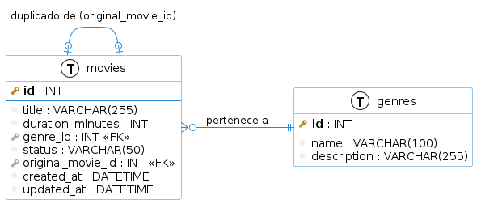

## 1. Movie Catalog Management

La base de datos del módulo **Movie Catalog Management** se encuentra estructurada alrededor del agregado principal `movies`, el cual representa y centraliza la información base de las películas 4D registradas en el sistema.

Este agregado almacena atributos fundamentales como `title` y `duration_minutes`, y utiliza el Value Object `status` para gestionar la transición de estados del flujo de *Desactivación de Contenido*, permitiendo clasificar la disponibilidad del recurso en estados como *Activo*, *Inactivo* o *Bloqueado para Programación*.

Para dar soporte a la operativa estructurada del catálogo, el modelo incorpora características y entidades complementarias:

*   **Trazabilidad Autorreferencial:** El agregado `movies` implementa una relación recursiva mediante el atributo `original_movie_id`. Esta estructura da soporte directo al flujo de *Duplicación de Configuración*, permitiendo registrar y modificar copias de una cinta manteniendo intacta la trazabilidad histórica hacia la película de origen.
*   **Entidad `genres`:** Funciona como una entidad de soporte que normaliza la clasificación del contenido. Al separar los géneros en su propia estructura relacional, se elimina la redundancia de datos y se agiliza significativamente la ejecución del flujo de *Búsqueda de Película* mediante filtros estructurados.

> Las relaciones establecidas a través de las claves foráneas (`genre_id`, `original_movie_id`) garantizan la integridad referencial del esquema, asegurando que este Bounded Context administre su propia fuente de verdad de manera normalizada y desacoplada del resto de los módulos del sistema.

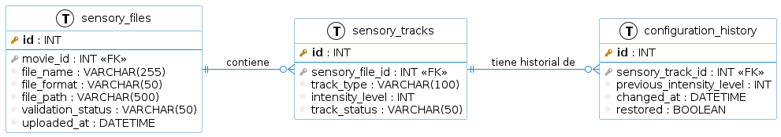

## 2. Sensory Content & Experience Management

La base de datos del módulo **Sensory Content & Experience Management** se encuentra estructurada alrededor del agregado principal `sensory_files`, el cual gestiona de manera centralizada la subida y administración del "Archivo de Efectos 4D".

Esta entidad utiliza el Value Object `validation_status` para administrar la transición de estados correspondiente al flujo de *Carga de Archivo de Efectos*, controlando etapas críticas como *Cargado*, *Rechazado* o *Vinculado*. Asimismo, integra el atributo `movie_id`, el cual actúa como clave foránea para establecer una conexión referencial con el catálogo de películas.

A partir de este agregado raíz, el modelo se expande en entidades especializadas para soportar el nivel granular de la experiencia sensorial:

*   **Entidad `sensory_tracks`:** Representa la "Pista Sensorial" individual, permitiendo que un mismo archivo agrupe múltiples pistas (ej. viento, movimiento, agua). Esta entidad emplea el atributo `track_status` para dirigir el ciclo de vida en el flujo de *Validación de Pista Sensorial* (*Validada*, *Rechazada*, *Habilitada para Ejecución*). Por su parte, el campo `intensity_level` da soporte directo al flujo de *Asignación de Intensidad*, almacenando el parámetro operativo validado por el técnico.
*   **Entidad `configuration_history`:** Funciona como una tabla de soporte y auditoría para el flujo de *Restablecimiento de Configuración*. Al almacenar un registro histórico de los cambios aplicados en los niveles de intensidad (`previous_intensity_level`), esta entidad provee al sistema la capacidad de emitir recomendaciones basadas en el uso y permite al técnico de mantenimiento revertir o restablecer la configuración a un estado anterior validado.

> Finalmente, las relaciones establecidas mediante las claves foráneas (`movie_id`, `sensory_file_id`, `sensory_track_id`) garantizan la estricta integridad referencial del modelo, asegurando un diseño normalizado que mantiene el desacoplamiento estructural frente a otros Bounded Contexts del sistema.

---

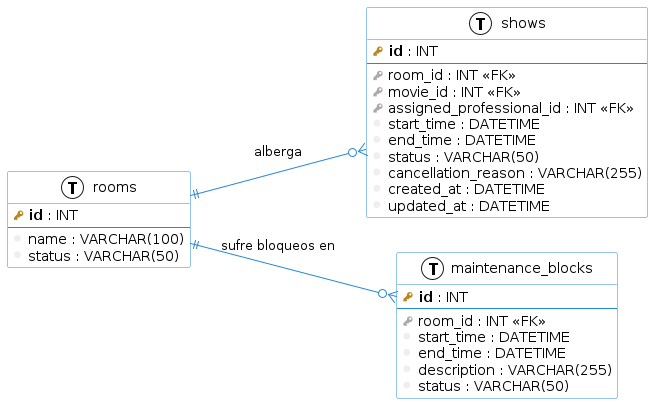 

## Capítulo V: Product Implementation, Validation & Deployment

### 5.1 Software Configuration Management

#### 5.1.1 Software Development Environment Configuration

A continuación se detallan las herramientas y plataformas utilizadas por el equipo durante el ciclo de vida del proyecto, indicando su propósito, tipo de actividad y ruta de referencia.

A continuación se detallan las herramientas y plataformas utilizadas por el equipo durante el ciclo de vida del proyecto, indicando su propósito, tipo de actividad y ruta de referencia.

| Producto | Propósito | Tipo de actividad | Ruta de referencia |
|---|---|---|---|
| UXPressia | Elaboración de User Personas, Empathy Maps, User Journey Maps, User Task Matrix e Impact Maps | Requirements Management | https://uxpressia.com/w/v8FzI |
| Figma | Diseño de Wireframes, Mock-ups y Prototipos del Landing Page y Web Application | UX/UI Design | https://www.figma.com/design/h8gZ1ryldnlq3f485Vx13T/Landing-Page |
| Figma (Mock-up) | Mock-ups de alta fidelidad del Landing Page | UX/UI Design | https://www.figma.com/design/2kl9zH6WgBNDCJAPYMhC0v/Landing-Page-Mock-up |
| FigJam | Elaboración de Wireflows y User Flows | UX/UI Design | https://www.figma.com/figjam/ |
| Miro | Sesiones de Big Picture EventStorming y Design-Level EventStorming | Domain Modeling | https://miro.com/app/board/uXjVHm4VBp8= |
| LucidChart | Diagramas de arquitectura de software (C4 Model) y diagramas de clases UML | Software Architecture | https://www.lucidchart.com/ |
| Structurizr | Diagramas C4 Model como código (opcional) | Software Architecture | https://structurizr.com/ |
| PlantUML | Diagramas UML y de base de datos como código | Software Architecture | https://plantuml.com/ |
| GitHub | Almacenamiento y control de versiones del código fuente y del Project Report | Version Control | https://github.com/kinemo-cinema |
| Git | Sistema de control de versiones distribuido | Version Control | https://git-scm.com/ |
| Visual Studio Code | Entorno de desarrollo integrado (IDE) para Landing Page y Web Application | Software Development | https://code.visualstudio.com/ |
| Visual Studio 2022 | IDE para el desarrollo del RESTful API en ASP.NET Core | Software Development | https://visualstudio.microsoft.com/ |
| Node.js + npm | Entorno de ejecución y gestor de paquetes para el frontend (Vue) | Software Development | https://nodejs.org/ |
| Vue CLI / Vite | Herramienta de scaffolding y build del proyecto Vue | Software Development | https://cli.vuejs.org/ |
| PrimeVue | Biblioteca de componentes UI para la Web Application | Software Development | https://primevue.org/ |
| .NET SDK 8 | Framework para el desarrollo del RESTful API | Software Development | https://dotnet.microsoft.com/ |
| Swagger / OpenAPI | Documentación interactiva de los Endpoints del RESTful API | Documentation | https://swagger.io/ |
| Trello | Gestión del Product Backlog y Sprint Backlog | Project Management | https://trello.com/b/6ac2a2ced29ee515df2506f0 |
| Microsoft Stream | Publicación de videos de exposición, Needfinding y validación | Documentation | https://stream.microsoft.com/ |
| Clipchamp | Edición de videos de exposición y evidencias | Documentation | https://clipchamp.com/ |
| GitHub Pages | Despliegue del Landing Page | Deployment | https://pages.github.com/ |

#### 5.1.2 Source Code Management

El proyecto Kinemo gestiona su código fuente mediante **GitHub**, bajo la organización pública `kinemo-cinema`, con un repositorio independiente por cada producto de software.

| Producto | Repositorio |
|---|---|
| Landing Page | https://github.com/kinemo-cinema/landing-page-kinemo |
| Frontend Web Application | https://github.com/kinemo-cinema/kinemo-cinema-frontend |
| RESTful API (Web Services) | Pendiente — se implementará en TB1 |
| Project Report | https://github.com/kinemo-cinema/kinemo-cinema-report |

**Workflow: GitFlow**

El equipo aplica **GitFlow** como modelo de ramificación, compuesto por:

- **main**: rama principal, contiene únicamente versiones estables y desplegadas (*release-ready*).
- **develop**: rama de integración continua, base para el desarrollo activo de *features*.
- **feature/&lt;nombre-descriptivo&gt;**: una rama por cada funcionalidad, creada a partir de `develop` y fusionada de vuelta a `develop` al completarse. Ejemplos usados por el equipo: `feature/landing-hero-section`, `feature/landing-contact-form`.
- **hotfix/&lt;nombre-descriptivo&gt;**: para correcciones urgentes sobre `main`.

**Convención de nombres de feature branches:**

`feature/<kebab-case-descriptivo-de-la-tarea>`, alineado con el título de la *Task* correspondiente en el Sprint Backlog.

**Semantic Versioning:**

Los *Releases* siguen el formato `MAJOR.MINOR.PATCH` (ej. `1.0.0` para el primer release del Landing Page en AV1).

**Conventional Commits:**

Todos los mensajes de commit siguen el formato `<tipo>(<alcance opcional>): <descripción>`, usando tipos como `feat`, `fix`, `docs`, `style`, `refactor`, `test` y `chore`.

Ejemplos:
- `feat(landing): add hero section with two-column layout`
- `fix(landing): correct broken link in pricing section`
- `docs(readme): update chapter 5 with sprint 1 evidence`

#### 5.1.3 Source Code Style Guide & Coding Conventions

El equipo adopta nomenclatura en inglés para todos los elementos de código, en los siguientes lenguajes y bajo las siguientes referencias:

- **HTML/CSS**: Google HTML/CSS Style Guide.
- **JavaScript**: Google JavaScript Style Guide y MDN JavaScript Guidelines.
- **Vue**: Vue Style Guide (oficial).
- **C# / ASP.NET Core**: Microsoft C# Coding Conventions y ASP.NET Core Engineering Guidelines.
- **Gherkin** (usado en los Acceptance Criteria del Capítulo III): Gherkin Conventions for Readable Specifications.

**Convenciones específicas del equipo:**

- Componentes Vue en `PascalCase` (`HeroSection.vue`, `ContactForm.vue`).
- Variables y funciones en `camelCase`; constantes en `UPPER_SNAKE_CASE`.
- Clases C# en `PascalCase`; parámetros y variables locales en `camelCase`, siguiendo las convenciones de Microsoft.
- No se permiten mutaciones de términos técnicos en español (ej. no usar "deployar", "testear"; usar "deploy", "test" en su forma original en inglés).

#### 5.1.4 Software Deployment Configuration

Para el despliegue de los productos de software de Kinemo se definió la siguiente configuración:

**Landing Page — GitHub Pages**

El Landing Page, desarrollado con HTML5, CSS3 y JavaScript puro, se despliega mediante **GitHub Pages** a partir de la rama `main` del repositorio `landing-page-Kinemo`. Los pasos realizados son:

1. Acceder al repositorio en GitHub y dirigirse a **Settings → Pages**.
2. En **Source**, seleccionar la rama `main` y la carpeta `/ (root)`.
3. Guardar los cambios; GitHub genera automáticamente la URL pública `https://kinemo-cinema.github.io/landing-page-Kinemo/`.
4. Verificar el despliegue accediendo a la URL y comprobando que el contenido del Landing Page carga correctamente.

El despliegue de la Web Application (Vue + PrimeVue) y del RESTful API (ASP.NET Core) se realizará en la entrega TB1, utilizando un proveedor Cloud (Vercel/Netlify para el frontend y MonsterASP.NET o Azure para el backend).

### 5.2 Landing Page, Services & Applications Implementation

#### 5.2.1 Sprint 1 (AV1)

##### 5.2.1.1 Sprint Planning 1

| Sprint # | Sprint 1 |
|---|---|
| Date | 2026-08-24 |
| Time | 08:00 PM |
| Location | Reunión virtual vía Discord |
| Prepared By | Llamozas Diaz, Edson Diego |
| Attendees | Llamozas Diaz, Edson Diego / Flores Chavez, Fabricio / Huamanchumo Chicchon, Felipe Marcelo / Trigoso Garrido, Cristian Joseph / Correa Rodriguez, Andrea Khristina |
| Sprint n-1 Review Summary | No aplica — este es el primer Sprint del proyecto. |
| Sprint n-1 Retrospective Summary | No aplica — este es el primer Sprint del proyecto. |
| Sprint 1 Goal | Nuestro objetivo es lanzar la página de destino B2B de Kinemo. Creemos que ofrece a los posibles gestores de cadenas de cines una forma clara y autónoma de conocer la oferta e iniciar una conversación comercial. Esto quedará confirmado cuando los visitantes puedan consultar la propuesta de valor y los precios, y enviar una solicitud de demostración o de presupuesto en menos de tres pasos. |
| Sprint 1 Velocity | 12 Story Points |
| Sum of Story Points | 12 Story Points |

##### 5.2.1.2 Aspect Leaders and Collaborators

La siguiente tabla muestra la asignación de líderes (L) y colaboradores (C) por cada aspecto del Landing Page durante el Sprint 1. Esta organización se alinea con la selección de tareas del Sprint Backlog y con la evidencia de commits registrada en GitHub.

| Team Member | GitHub Username | Hero Section | Platform Section | Pricing Section | Team Section | Contact Form | Repo & Deployment |
|---|---|---|---|---|---|---|-------------------|
| Llamozas Diaz, Edson Diego | DiegoLlamozas | C | C | C | C | C | C                 |
| Huamanchumo Chicchon, Felipe Marcelo | Daiko-07 | L | L | L | L | L | C                 |
| Correa Rodriguez, Andrea Khristina | Elmiau2341 | C | C | C | C | C | C                 |
| Trigoso Garrido, Cristian Joseph | Crzzz30 | C | C | C | C | C | C                 |
| Flores Chavez, Fabricio | Ferdwar | C | C | C | C | C | C                 |

##### 5.2.1.3 Sprint Backlog 1

El Sprint Backlog 1 comprende las User Stories del Landing Page (US28, US29, US30, US31 y US32) priorizadas en el Product Backlog, descompuestas en tareas técnicas. La asignación de tareas refleja la evidencia de commits registrada en el repositorio `landing-page-kinemo`.

| Sprint # | Sprint 1 |
|---|---|
| **User Story** | **Work-Item / Task** | | | | |
| **Story ID** | **Story Title** | **Task ID** | **Task Title** | **Task Description** | **Estimation (Hours)** | **Assigned To** | **Status** |
| US28 | Conocer beneficios de la solución | T01 | Maquetar Hero Section | Implementar la sección Hero con titular, subtítulo, CTAs y placeholder de imagen hero. | 6 | Huamanchumo Chicchon, Felipe Marcelo | Done |
| US29 | Conocer características de la solución | T02 | Maquetar Platform Section | Implementar la sección Platform con bloques interactivos de características y placeholders de imagen. | 8 | Huamanchumo Chicchon, Felipe Marcelo | Done |
| US30 | Conocer los servicios | T03 | Maquetar Pricing Section | Implementar la sección Pricing con grilla de tres planes y tarjetas informativas. | 6 | Huamanchumo Chicchon, Felipe Marcelo | Done |
| US31 | Comparar planes disponibles | T04 | Maquetar Team Section | Implementar la sección Team con información del equipo y foto representativa. | 4 | Huamanchumo Chicchon, Felipe Marcelo | Done |
| US32 | Acceder a la Web Application | T05 | Maquetar Contact Form | Implementar la sección de contacto con formulario de captura de datos y CTAs. | 8 | Huamanchumo Chicchon, Felipe Marcelo | Done |
| — | — | T06 | Configurar repositorio y despliegue | Crear repositorio en GitHub, configurar GitFlow, GitHub Pages y README inicial. | 4 | Llamozas Diaz, Edson Diego | Done |

**Total de horas estimadas:** 36 horas.

> **Nota:** Las tareas T01 a T05 fueron lideradas por `Daiko-07` (6 commits registrados). La tarea T06 fue liderada por `DiegoLlamozas` (1 commit registrado). Los demás integrantes del equipo colaboraron en el diseño, revisión y validación de contenido, cuyos aportes se evidencian en el repositorio del Project Report.
**Total de horas estimadas:** 36 horas.

##### 5.2.1.4 Development Evidence for Sprint Review

Durante el Sprint 1 se implementó la primera versión del Landing Page de Kinemo. El repositorio `landing-page-kinemo` registró **7 commits en total** (6 en `main`, 7 en todas las ramas), distribuidos en las semanas del 13 de septiembre, 27 de septiembre y 4 de octubre de 2026.

**Gráfico de commits por semana (Landing Page):**

**Gráfico de frecuencia de código (Landing Page):**

| Repository | Branch | Commit Id | Commit Message | Commit Message Body | Committed on (Date) |
|---|---|---|---|---|---|
| kinemo-cinema/landing-page-kinemo | main | `[pendiente]` | `feat(landing): implement hero, platform, pricing and team sections` | Implementación inicial de las secciones principales del Landing Page. | 2026-09-13 |
| kinemo-cinema/landing-page-kinemo | main | `[pendiente]` | `feat(landing): implement contact form and CTAs` | Implementación del formulario de contacto con validaciones básicas. | 2026-09-27 |
| kinemo-cinema/landing-page-kinemo | main | `[pendiente]` | `chore: update assets and documentation` | Actualización de assets y documentación del Landing Page. | 2026-10-04 |

##### 5.2.1.5 Execution Evidence for Sprint Review

Durante el Sprint 1 se logró la implementación completa de la primera versión del Landing Page de Kinemo, compuesta por las siguientes secciones:

1. **Hero Section** — Presenta la propuesta de valor de Kinemo ("Lleva la experiencia 4D a tus salas de cine sin altos costos") con CTAs "Empezar ahora" y "Conoce más".
2. **Platform Section** — Describe las cuatro funcionalidades clave: Sincronización de efectos, Software de gestión simplificado, Gestión de incidencias de mantenimiento y Análisis de rendimiento.
3. **Pricing Section** — Presenta los tres planes de suscripción: Starter ($490/mes), Growth ($1,190/mes) y Enterprise (Custom).
4. **Team Section** — Muestra la información de los integrantes de la startup VonNeuman New Men.
5. **Contact Section** — Incluye el formulario de captura de datos para solicitar una demostración.

**Evidencia visual:** Las capturas de pantalla de cada sección se encuentran en el `README.md` del repositorio `landing-page-Kinemo` y en el informe (Figuras 4.3.1 y 4.3.2).

**Video de navegación:** El video que ilustra la visualización y navegación lograda en este Sprint se encuentra publicado en Microsoft Stream con el siguiente enlace: `[PENDIENTE — URL del video]`.

##### 5.2.1.6 Services Documentation Evidence for Sprint Review

Durante el Sprint 1 **no se implementaron Web Services**. El alcance de este Sprint se limitó exclusivamente al desarrollo y despliegue del Landing Page. La implementación del RESTful API está planificada para el Sprint 2 (TB1).

Por lo tanto, no se cuenta con Endpoints documentados con OpenAPI para este Sprint.

##### 5.2.1.7 Software Deployment Evidence for Sprint Review

Durante el Sprint 1 se realizó el despliegue del Landing Page utilizando **GitHub Pages**. El proceso consistió en:

1. **Creación del repositorio** `landing-page-Kinemo` en la organización `kinemo-cinema` de GitHub.
2. **Configuración de GitFlow** con las ramas `main` y `develop`.
3. **Desarrollo de las secciones** del Landing Page en ramas `feature/` independientes, fusionadas a `develop` y posteriormente a `main`.
4. **Activación de GitHub Pages** desde la configuración del repositorio (Settings → Pages), seleccionando la rama `main` y la carpeta raíz.
5. **Verificación del despliegue** accediendo a la URL pública.

**URL del Landing Page desplegado:** `https://kinemo-cinema.github.io/landing-page-Kinemo/`

##### 5.2.1.8 Team Collaboration Insights during Sprint

Resumen general del período:

- **5 autores** han realizado push de **6 commits a `main`** y **7 commits a todas las ramas**.
- **2 Pull Requests fusionados**, **0 Pull Requests abiertos**.
- **0 issues** cerrados o nuevos.
- **5 archivos modificados** en `main` con **539 adiciones** y **540 eliminaciones**.

**Top committers (Landing Page):**

| # | GitHub Username | Commits |
|---|---|---|
| 1 | Daiko-07 | 6 |
| 2 | DiegoLlamozas | 1 |

**Repositorio del Project Report (`kinemo-cinema-report`)**

Resumen general del período:

- **5 autores** han realizado push de **25 commits a `main`** y **94 commits a todas las ramas**.
- **13 Pull Requests fusionados**, **1 Pull Request abierto**.
- **0 issues** cerrados o nuevos.
- **5 archivos modificados** en `main` con **682 adiciones** y **0 eliminaciones**.

**Top committers (Project Report):**

| # | GitHub Username | Commits |
|---|---|---|
| 1 | DiegoLlamozas | 25 |
| 2 | Elmiau2341 | 24 |
| 3 | Daiko-07 | 24 |
| 4 | Crzzz30 | 15 |
| 5 | Ferdwar | 6 |

**Contribuidores (Project Report):**

**Actividad semanal de commits (Project Report):**

**Repositorio del Frontend (`kinemo-cinema-frontend`)**

Resumen general del período:

- **5 autores** han realizado push de **131 commits a todas las ramas**.
- **13 Pull Requests fusionados**, **13 Pull Requests activos**.
- **0 issues** cerrados o nuevos.
- **1 commit en `main`** (la rama `main` aún no ha sido fusionada con `develop`, por lo que el trabajo consolidado se encuentra en `develop`).

**Top committers (Frontend):**

| # | GitHub Username | Commits |
|---|---|---|
| 1 | DiegoLlamozas | 93 |
| 2 | Ferdwar | 23 |
| 3 | Crzzz30 | 12 |
| 4 | Daiko-07 | 2 |
| 5 | Elmiau2341 | 1 |

**Código agregado (Code Frequency - Frontend):**

**Pulse - Frontend:**

- **Semana del 27 de septiembre de 2026:** 1,727 adiciones (primera implementación de la Web Application).

**Conclusión del Sprint 1**

La colaboración del equipo se evidencia a través de la distribución del trabajo entre los cinco integrantes. El repositorio del Landing Page concentró el esfuerzo principal del Sprint 1, con `Daiko-07` como líder del desarrollo del Landing Page y `DiegoLlamozas` a cargo de la configuración del repositorio y despliegue. En paralelo, el repositorio del Project Report registró contribuciones significativas de todos los integrantes, con `DiegoLlamozas`, `Elmiau2341` y `Daiko-07` como principales contribuidores del informe. El repositorio del frontend, aunque activo desde antes del cierre del Sprint 1, aún mantiene su trabajo consolidado en la rama `develop`, pendiente de integración con `main` para el siguiente hito.

#### 5.2.2 Sprint 2 (TB1)

#### 5.2.2 Sprint 2 (TB1)

##### 5.2.2.1 Sprint Planning 2

| Sprint # | Sprint 2 |
|---|---|
| Date | 🔴 [NEED REAL DATA — e.g. 2026-09-21] |
| Time | 🔴 [NEED REAL DATA — e.g. 08:00 PM] |
| Location | 🔴 [NEED REAL DATA — e.g. Reunión virtual vía Discord] |
| Prepared By | 🔴 [NEED REAL DATA — likely Llamozas Diaz, Edson Diego] |
| Attendees | Llamozas Diaz, Edson Diego / Flores Chavez, Fabricio / Huamanchumo Chicchon, Felipe Marcelo / Trigoso Garrido, Cristian Joseph / Correa Rodriguez, Andrea Khristina |
| Sprint n-1 Review Summary | Durante el Sprint 1 se completó el Landing Page B2B de Kinemo, con las secciones Hero, Platform, Pricing, Team y Contact Form implementadas y desplegadas en GitHub Pages. El equipo validó la propuesta de valor y los precios con el público objetivo. |
| Sprint n-1 Retrospective Summary | El equipo identificó como oportunidades de mejora: (1) distribuir mejor las tareas de desarrollo para evitar la concentración de commits en un solo integrante, (2) iniciar la integración entre frontend y backend de forma temprana, y (3) mantener la documentación actualizada conforme avanza el Sprint. |
| Sprint 2 Goal | Nuestro objetivo es lanzar la primera versión funcional de la Web Application de Kinemo integrada con el RESTful API. Creemos que ofrece al personal operativo y gerentes de cadenas de cine una herramienta centralizada para gestionar la programación de funciones, la configuración de efectos y el seguimiento del mantenimiento de las salas. Esto quedará confirmado cuando los usuarios puedan iniciar sesión, consultar el catálogo de películas 4D y visualizar la programación diaria de funciones desde la Web Application desplegada. |
| Sprint 2 Velocity | 🔴 [NEED REAL DATA — estimated 25–30 Story Points] |
| Sum of Story Points | 🔴 [NEED REAL DATA — estimated 25–30 Story Points] |

##### 5.2.2.2 Aspect Leaders and Collaborators

La siguiente tabla muestra la asignación de líderes (L) y colaboradores (C) por cada aspecto de la Web Application durante el Sprint 2. Esta organización se alinea con la evidencia de commits registrada en el repositorio `kinemo-cinema-frontend`.

| Team Member | GitHub Username | Authentication | Movie Catalog | Scheduling | Seat Management | Effects & Sync | Maintenance | API Integration |
|---|---|---|---|---|---|---|---|---|
| Llamozas Diaz, Edson Diego | DiegoLlamozas | L | L | L | C | C | C | L |
| Flores Chavez, Fabricio | Ferdwar | C | C | L | L | C | C | C |
| Trigoso Garrido, Cristian Joseph | Crzzz30 | C | C | C | C | L | L | C |
| Huamanchumo Chicchon, Felipe Marcelo | Daiko-07 | C | C | C | C | C | C | C |
| Correa Rodriguez, Andrea Khristina | Elmiau2341 | C | C | C | C | C | C | C |

> **Nota sobre la evidencia de commits:** Los aspectos de mayor actividad en el Sprint 2 se concentraron en `DiegoLlamozas` (93 commits), `Ferdwar` (23 commits) y `Crzzz30` (12 commits), según los analíticos de GitHub Insights del repositorio `kinemo-cinema-frontend`.

##### 5.2.2.3 Sprint Backlog 2

El Sprint Backlog 2 comprende las User Stories del Web Application (US01–US27) priorizadas en el Product Backlog, junto con las Technical Stories del RESTful API (US33–US38), descompuestas en tareas técnicas.

| Sprint # | Sprint 2 |
|---|---|
| **User Story** | **Work-Item / Task** | | | | |
| **Story ID** | **Story Title** | **Task ID** | **Task Title** | **Task Description** | **Estimation (Hours)** | **Assigned To** | **Status** |
| US01 | Registrar película 4D | T07 | Implementar formulario de registro de películas | Crear el formulario en Vue para registrar películas con validaciones. | 6 | Llamozas Diaz, Edson Diego | Done |
| US03 | Consultar catálogo | T08 | Implementar vista de catálogo de películas | Crear la vista de listado de películas con filtros por género y estado. | 6 | Llamozas Diaz, Edson Diego | Done |
| US07 | Programar función | T09 | Implementar formulario de programación de funciones | Crear la interfaz para programar funciones con validación de conflictos de horario. | 8 | Flores Chavez, Fabricio | Done |
| US09 | Visualizar resumen diario de funciones | T10 | Implementar vista de programación diaria | Crear la vista de funciones del día ordenadas cronológicamente. | 5 | Flores Chavez, Fabricio | Done |
| US10 | Consultar estado de butacas | T11 | Implementar vista de estado de butacas | Crear la vista de mapa de butacas con estados (disponible, habilitada, fuera de servicio). | 6 | Flores Chavez, Fabricio | Done |
| US13 | Iniciar secuencia de efectos | T12 | Implementar control de inicio de secuencia de efectos | Crear la interfaz para iniciar la sincronización entre película y efectos. | 8 | Trigoso Garrido, Cristian Joseph | Done |
| US17 | Probar canal de efectos | T13 | Implementar vista de prueba de efectos | Crear la interfaz para probar individualmente los canales de efectos. | 6 | Trigoso Garrido, Cristian Joseph | Done |
| US20 | Registrar falla de equipo | T14 | Implementar formulario de registro de incidencias | Crear el formulario para reportar fallas en componentes con nivel de severidad. | 6 | Trigoso Garrido, Cristian Joseph | Done |
| US26 | Visualizar dashboard operativo | T15 | Implementar dashboard de métricas operativas | Crear el dashboard con gráficos de uso de salas e incidencias registradas. | 8 | Llamozas Diaz, Edson Diego | Done |
| US33 | Consultar películas mediante API | T16 | Implementar endpoint GET /movies | Implementar el endpoint para consultar el catálogo de películas con soporte para filtros. | 5 | Llamozas Diaz, Edson Diego | Done |
| US34 | Registrar una película mediante API | T17 | Implementar endpoint POST /movies | Implementar el endpoint para registrar nuevas películas con validación de datos. | 5 | Llamozas Diaz, Edson Diego | Done |
| US35 | Consultar funciones mediante API | T18 | Implementar endpoint GET /shows | Implementar el endpoint para consultar las funciones programadas. | 4 | Llamozas Diaz, Edson Diego | Done |
| US36 | Registrar una incidencia mediante API | T19 | Implementar endpoint POST /incidents | Implementar el endpoint para registrar incidencias de mantenimiento. | 4 | Llamozas Diaz, Edson Diego | Done |
| US37 | Consultar estado de una sala mediante API | T20 | Implementar endpoint GET /rooms/{id} | Implementar el endpoint para consultar el estado de una sala específica. | 4 | Llamozas Diaz, Edson Diego | Done |
| US38 | Consultar estado de suscripción mediante API | T21 | Implementar endpoint GET /subscription | Implementar el endpoint para consultar el estado de la suscripción. | 5 | Llamozas Diaz, Edson Diego | Done |
| — | — | T22 | Configurar integración frontend-backend | Configurar Axios en el frontend para consumir el RESTful API y manejar CORS. | 6 | Llamozas Diaz, Edson Diego | Done |
| — | — | T23 | Desplegar Web Application y API | Configurar el despliegue del frontend (Vercel/Netlify) y del backend (MonsterASP.NET/Azure). | 6 | Llamozas Diaz, Edson Diego | Done |

**Total de horas estimadas:** 107 horas.

##### 5.2.2.4 Development Evidence for Sprint Review

Durante el Sprint 2 se implementó la primera versión funcional de la Web Application de Kinemo y del RESTful API. El repositorio `kinemo-cinema-frontend` registró **131 commits en todas las ramas**, con **1,727 adiciones** en la semana del 27 de septiembre de 2026, según los analíticos de GitHub Insights.

**Gráfico de commits por semana (Frontend):**

**Gráfico de frecuencia de código (Frontend):**

| Repository | Branch | Commit Id | Commit Message | Commit Message Body | Committed on (Date) |
|---|---|---|---|---|---|
| kinemo-cinema/kinemo-cinema-frontend | develop | 🔴 [NEED REAL DATA] | `feat(auth): implement user authentication flow` | Implementación del flujo de autenticación con JWT. | 2026-09-27 |
| kinemo-cinema/kinemo-cinema-frontend | develop | 🔴 [NEED REAL DATA] | `feat(catalog): add movie catalog view with filters` | Implementación de la vista de catálogo de películas con filtros. | 2026-09-28 |
| kinemo-cinema/kinemo-cinema-frontend | develop | 🔴 [NEED REAL DATA] | `feat(scheduling): add show scheduling form` | Implementación del formulario de programación de funciones. | 2026-09-29 |
| kinemo-cinema/kinemo-cinema-frontend | develop | 🔴 [NEED REAL DATA] | `feat(seats): add seat map view` | Implementación del mapa de butacas con estados. | 2026-09-30 |
| kinemo-cinema/kinemo-cinema-frontend | develop | 🔴 [NEED REAL DATA] | `feat(dashboard): add operational metrics dashboard` | Implementación del dashboard de métricas operativas. | 2026-10-01 |
| kinemo-cinema/kinemo-cinema-frontend | develop | 🔴 [NEED REAL DATA] | `feat(api): integrate frontend with RESTful API` | Integración del frontend con el RESTful API mediante Axios. | 2026-10-03 |
| 🔴 [NEED REAL DATA] | — | 🔴 [NEED REAL DATA] | `feat(api): implement movies and shows endpoints` | Implementación de los endpoints del RESTful API. | 🔴 [NEED REAL DATA] |

> **Instrucción:** Reemplazar cada `🔴 [NEED REAL DATA]` con los datos reales obtenidos al ejecutar `git log --oneline --all` en los repositorios `kinemo-cinema-frontend` y del RESTful API.

##### 5.2.2.5 Execution Evidence for Sprint Review

Durante el Sprint 2 se logró la implementación de la primera versión funcional de la Web Application de Kinemo, compuesta por las siguientes vistas principales:

1. **Login / Authentication** — Pantalla de inicio de sesión con autenticación vía JWT.
2. **Movie Catalog** — Vista de catálogo de películas 4D con filtros por título y género.
3. **Scheduling** — Vista de programación de funciones con validación de conflictos de horario.
4. **Seat Map** — Vista de mapa de butacas con estados (disponible, habilitada, fuera de servicio).
5. **Effects Control** — Interfaz para iniciar, pausar y detener la secuencia de efectos.
6. **Maintenance** — Formulario de registro de incidencias y seguimiento de mantenimiento.
7. **Dashboard** — Dashboard con métricas operativas de uso de salas e incidencias.

**Evidencia visual:** Las capturas de pantalla de cada vista se encuentran en el Anexo B.

**Video de navegación:** El video que ilustra la visualización y navegación lograda en este Sprint se encuentra publicado en Microsoft Stream con el siguiente enlace: 🔴 [NEED REAL DATA — URL del video].

##### 5.2.2.6 Services Documentation Evidence for Sprint Review

Durante el Sprint 2 se implementó la primera versión del RESTful API de Kinemo, documentada con OpenAPI/Swagger. Los Endpoints implementados son los siguientes:

| Endpoint | Verbo HTTP | Acción | Parámetros | Response |
|---|---|---|---|---|
| `/api/v1/movies` | GET | Consultar catálogo de películas | `?genre=`, `?status=` | 200 OK — Lista de películas |
| `/api/v1/movies` | POST | Registrar nueva película | Body con datos de película | 201 Created — Película registrada |
| `/api/v1/movies/{id}` | GET | Consultar película por ID | `id` en path | 200 OK — Película encontrada |
| `/api/v1/shows` | GET | Consultar funciones programadas | `?date=`, `?roomId=` | 200 OK — Lista de funciones |
| `/api/v1/shows` | POST | Programar nueva función | Body con datos de función | 201 Created — Función programada |
| `/api/v1/incidents` | POST | Registrar incidencia | Body con datos de incidencia | 201 Created — Incidencia registrada |
| `/api/v1/rooms/{id}` | GET | Consultar estado de sala | `id` en path | 200 OK — Estado de la sala |
| `/api/v1/subscription` | GET | Consultar estado de suscripción | — | 200 OK — Estado de suscripción |

**Documentación Swagger/OpenAPI desplegada:** 🔴 [NEED REAL DATA — URL del Swagger desplegado]

**Repositorio del RESTful API:** 🔴 [NEED REAL DATA — URL del repositorio]

**Capturas de pantalla:** Las imágenes de la documentación interactiva de Swagger se incluyen en el Anexo B.

##### 5.2.2.7 Software Deployment Evidence for Sprint Review

Durante el Sprint 2 se realizó el despliegue de la primera versión funcional de la Web Application y del RESTful API. El proceso consistió en:

**Web Application (Vue + PrimeVue)**

1. **Configuración del proyecto** para producción (`npm run build`).
2. **Despliegue en Vercel/Netlify** conectado al repositorio `kinemo-cinema-frontend`.
3. **Configuración de variables de entorno** para apuntar al RESTful API desplegado.
4. **Verificación del despliegue** accediendo a la URL pública.

**RESTful API (ASP.NET Core + C#)**

**URLs de despliegue:**

**Capturas de pantalla:** Las imágenes del proceso de despliegue se incluyen en el Anexo B.

##### 5.2.2.8 Team Collaboration Insights during Sprint

Durante el Sprint 2, todos los integrantes del equipo participaron activamente en el desarrollo de la Web Application y del RESTful API. A continuación se presentan los analíticos obtenidos directamente desde **GitHub Insights** para el período del Sprint 2.

### Repositorio del Frontend (`kinemo-cinema-frontend`)

Resumen general del período:

- **5 autores** han realizado push de **131 commits a todas las ramas**.
- **13 Pull Requests fusionados**, **13 Pull Requests activos**.
- **0 issues** cerrados o nuevos.
- **1 commit en `main`** (la rama `main` aún no ha sido fusionada con `develop`, por lo que el trabajo consolidado se encuentra en `develop`).

**Pulse - Frontend:**

**Top committers (Frontend):**

| # | GitHub Username | Commits |
|---|---|---|
| 1 | DiegoLlamozas | 93 |
| 2 | Ferdwar | 23 |
| 3 | Crzzz30 | 12 |
| 4 | Daiko-07 | 2 |
| 5 | Elmiau2341 | 1 |

**Commits por semana (Frontend):**

| Semana | Commits |
|---|---|
| 2026-09-27 | 1 |

**Frecuencia de código (Frontend):**

- **Semana del 27 de septiembre de 2026:** 1,727 adiciones (primera implementación de la Web Application).

### Repositorio del RESTful API

### Conclusión del Sprint 2

La colaboración del equipo durante el Sprint 2 se evidencia a través de la distribución del trabajo en el repositorio del frontend. `DiegoLlamozas` lideró la implementación de la Web Application y la integración con el RESTful API (93 commits), seguido de `Ferdwar` (23 commits) y `Crzzz30` (12 commits), quienes se enfocaron en los módulos de programación de funciones, mapa de butacas y control de efectos. Los demás integrantes (`Daiko-07` y `Elmiau2341`) colaboraron en el diseño y validación de las vistas, así como en la redacción del informe.

El Sprint 2 cumplió con los objetivos planteados en el Sprint Planning 2: se desplegó la primera versión funcional de la Web Application, se implementó el RESTful API con sus endpoints principales, y se integró el frontend con el backend. Como deuda técnica, la rama `main` del frontend aún no ha sido fusionada con `develop`, lo cual se resolverá antes de la entrega TB1.
#### 5.2.3 Sprint 3 (AV2)

> _A completar a partir de la entrega AV2. Misma estructura que Sprint 1._

#### 5.2.4 Sprint 4 (TB2)

> _A completar a partir de la entrega TB2. Misma estructura que Sprint 1._

### 5.3 Validation Interviews

#### 5.3.1 Diseño de Entrevistas

> _Bloqueado — depende de tener un producto/prototipo validable (a partir de AV2)._

#### 5.3.2 Registro de Entrevistas

> _Bloqueado — depende de 5.3.1._

#### 5.3.3 Evaluaciones según heurísticas

> _Bloqueado — depende de 5.3.2. Usar el formato del Anexo D del enunciado._

### 5.4 Video About-the-Product

> _A completar a partir de AV2 (primera versión), versión final en TB2._

## Conclusiones

### Conclusiones y recomendaciones

> _Pendiente — sección acumulable, versión final en TB2._

### Video About-the-Team

> _A completar a partir de AV2 (primera versión), versión final en TB2._

## Bibliografía

- López, A. (2018, 6 de noviembre). *¿Cuáles son los cines con mayor participación en el país?* Mercado Negro. https://www.mercadonegro.pe/marketing/cuales-son-los-cines-con-mayor-participacion-en-el-pais/

- UVK Multicines. (s. f.). Nuestros cines. Recuperado el 8 de septiembre de 2026, de https://uvk.pe/cines

- Wikipedia contributors. (s. f.). UVK Multicines. En Wikipedia, la enciclopedia libre. Recuperado el 8 de septiembre de 2026, de https://es.wikipedia.org/wiki/UVK_Multicines
  Boxoffice Pro. (2018, January 24). One of the nation's largest cinema chains, family-run B&B Theaters, announces multi-site integration of MediaMation's MX4D. https://www.boxofficepro.com

CJ 4DPLEX. (n.d.). 4DX. Retrieved September 9, 2026, from https://www.cj4dx.com

D-BOX Technologies Inc. (n.d.). The ultimate guide to moving cinema seats. Retrieved September 9, 2026, from https://www.d-box.com

D-BOX Technologies Inc. (n.d.). Why cinemas are choosing D-BOX motion seats. Retrieved September 9, 2026, from https://www.d-box.com

MediaMation, Inc. (n.d.). MX4D theatres. Retrieved September 9, 2026, from https://www.mediamation.com/mx4d-theatres/

Whitten, S. (2024, June 2). Shaking seats and piped-in fog: How 4DX is carving out a niche moviegoing market. CNBC. https://www.cnbc.com

## Anexos

### Anexo A. Videos de Exposiciones

| Entrega | Título del video | Enlace |
|---|---|---|
| AV1 | `[Pendiente]` | `[Pendiente]` |